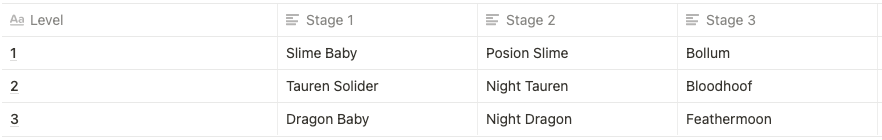

# 🚩 Cave Explore

Adventurers could start Cave Explore after locking the apostle team. (**Once confirmed, the team will be locked for 24 hours**)&#x20;

### How to participate

There is not enough COO for the apostle team to survive in the cave, so apostles must obtain enough COO in AFK mode for Cave Explore.

Once starting a new Cave Explore, the corresponding COO will be deducted from the user's account.

If you try to explore for several times in one day, it will cost double COO than last time.

### Monster and Rewards

There are 3 levels for the apostle team to conquer. There are 3 stages at each level. The final stage in each level is boss with the stronger ability and also, rare materials!

.png>)

Apostle teams could collect Monster Bones from every monster and Monster Spirit from the boss.

Monster Bones and Monster Spirit are ERC-1155 assets that could be used as the fundamental materials to forge equipment.

### Element Counter

The level of the counter element will provide a corresponding bonus to ATK. Each resource level will increase by 0.3% ATK for the apostle team(Which could be decided by DAO).

Counter: wood counters soil, soil counters water, water counters fire, fire counters gold, and gold counters wood.

The element attribute of monsters will be changed every week.

### Special Mechanism

* The HP will be recovered 100% after finishing the boss stage.
* A critical hit will bring 200% ATK.
* Damage is calculated by (My ATK/10 - opposite DEF/100)

### What's the next?

* Rogue-Like Gameplay: After each stage, there will be an enhancement that the apostle team could select.
* Career System: The diversity of apostles means different apostles could have different usages. Choose a career for your apostles to maximize their advantages.
* Equipment System: Using materials and resources tokens to forge new weapons. It will make apostles have stronger abilities.
* Hard Mode: In the hard mode, the difficulty of the adventure will increase sharply, of course, this also means better rewards
