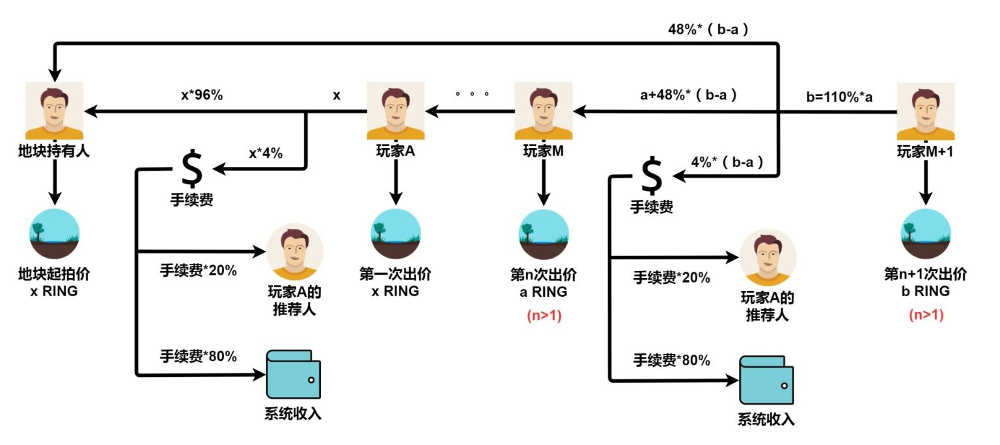
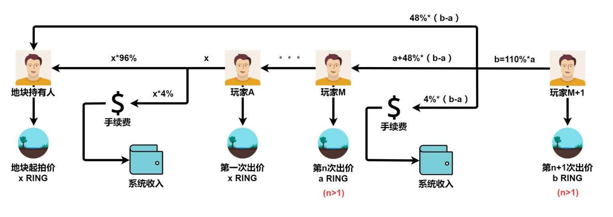

# 分红

为了补偿和激励那些牺牲了 [KTON](../../getting-started/tokens/kton.md) 流动性来参与治理的玩家，进化星球将根据治理者在总资金池中的持股比例，向治理者支付治理分红。

分红通过状态通道，按每笔交易进行分发。这意味着，进化星球内消费行为发生，分红自动结算，并通过链上的状态通道发送到治理者的账户。治理者需要主动向智能合约发送交易请求，以便收取分红（RING）到钱包地址。

分红并不是像常规交易一样进行分配的，因为每一笔支出交易产生的分红，都可能以非常小额的金额分配给成千上万的受益人。与分红的金额相比，燃料费是庞大的。然而，利用状态通道，分红可以积累起来，累积到一定程度后一次性收取。

从 DeFi 的角度来看，这种治理模式看起来像一个拥有独特储量的采矿池。你把你的 KTON 质押在池里，作为回报，你将获得 RING 作为奖励。不同的是，在一个常规池中，你获得的奖励，是在固定算法设定的速度下释放的项目代币，其价值主要由投机决定；而在这里，你获得的奖励是游戏的收入。你的经济回报实际上与项目的成功有关。

## 拍地分成

1. 每次出价都是上一次出价的 1.1 倍，不包含第一次出价。
2. 被超越的竞价用户取回原竞价款。
3. 两次出价差价部分的 4% 作为官方收取的手续费。
4. 差价部分扣除手续费之后会平分给地主和上一个玩家。
5. 没有推荐人的情况下，手续费直接流向系统收入。
6. 有推荐人的情况下，推荐人的奖励是手续费的 20%，剩余 80% 流向系统收入。

## 详细分析

前提条件： n &gt; 1

玩家 M，第 n 次出价： a

玩家 M+1，第 n+1 次出价： b

两次出价差价：b - a

1. 出价规则：b = a \* 1.1【注：第 n+1 次出价是第 n 次出价的 1.1 倍】
2. 手续费：fee = \( b-a \) \* 4%【注：两次出价差价部分的 4%】
3. 地主得到：\( b - a \) \* 96% \* ½【注：差价部分扣除手续费之后的一半给地主】
4. 玩家 M 得到：a + \[ \( b - a \) \* 96% \* ½ \]【注：拿回失败的竞标款 a 和差价部分扣除手续费之后的一半】
5. 推荐人奖励：手续费 \* 20%【注：推荐人的奖励金额为手续费的 20%】
6. 在没有推荐人的情况下，手续费直接流向系统收入。

## 举例说明

