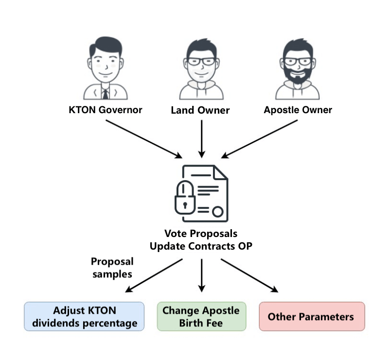

# Governance

Evolution Land is designed to be DAO. Many game parameters should be voted and determined by players who have their interests staked. They will decide how the game will evolve.

By Establishing a credible voting mechanism and thus forming a scalable blockchain voting system, the rights of the users of the Evolution Land can be guaranteed.

We will discuss with the Evolution Land residents to build a public management model. The residents will use the voting system to express their appeal and participate in the Evolution Land management. The Evolution Land residents participate in the decision-making of the Evolution Land by using their power to vote.

## Governor and Voting Power

Anyone who has a stake in the game has a say in the governance process. They have various influence levels normalized as Voting Power.

| Demographic | Voting Power \(VP\) |
| :--- | :--- |
| [Land](../../getting-started/game-entities/land.md) Owners | Each Land = 100 VP |
| [Apostle](../../getting-started/game-entities/apostle/) Owners | Each Apostle = 1 VP |
| [KTON](../../getting-started/tokens/kton.md) stakers | Each staked KTON = 10 VP |

[KTON](../../getting-started/tokens/kton.md) stakers refers to those who stake KTON into governance locking contract. Voting Power generates from those locked KTON. Once staked, the user needs to wait 14 days before he can withdraw these KTONs. Every time a user makes a new deposit, it will extend its lock time.

As Voting Power originated from tokens, they have natural blockchain network constraints. Governors can only vote for matters on this particular [continent](../../getting-started/game-entities/continent.md). This essentially helps create independent economic entities, which are like countries.

## Governor Portal

Please visit [https://gov.evolution.land](https://gov.evolution.land) to participate in the governance process. You can stake/un-stake your KTON, view your accumulated Voting Power via possessing Lands, Apostles, and staked KTONs. More importantly, you will view or initiate proposals and use your power to express your opinions.

