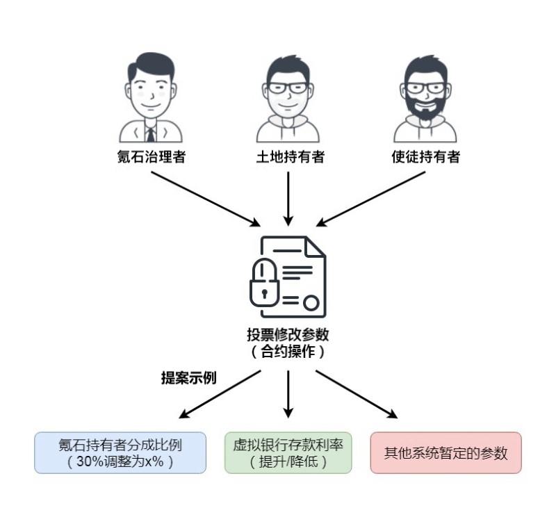

# 治理

进化星球将致力于区块链游戏的开发，运营，整合，最终形成区块链游戏生态和去中心化自治社区（DAO）。DAO 不单是设计目的，也是愿景，进化星球会围绕一系列共识规则、系统不变量和定律开始和展开，系统将会被设计成可以自我演化的，可扩展的，开放的系统。

游戏将初始设定最基础的规则，随着游戏进度的深入、模块的拓展，游戏的规则将由 DAO 全体社区成员决定，自我进化，每个用户既是玩家也是游戏的设计者。

## 治理权与投票权重

任何与游戏有利害关系的人在治理过程中都有发言权。他们有不同程度的影响力，标准化为投票权。

| 人群                                                       | 投票权（VP）          |
| :--------------------------------------------------------- | :-------------------- |
| [土地](../../getting-started/game-entities/land.md)持有者  | 每块土地 = 100 VP     |
| [使徒](../../getting-started/game-entities/apostle/)持有者 | 每个使徒 = 1 VP       |
| [KTON](../../getting-started/tokens/kton.md) 质押者        | 每个质押 KTON = 10 VP |

[KTON](../../getting-started/tokens/kton.md) 质押者指的是那些将 KTON 质押于治理锁定合同中的人。投票权来自那些锁定的 KTON。一旦锁定，用户需要等待 14 天才能取回这些 KTON。每次用户进行新的存款，都会延长锁定时间。

由于投票权来源于通证，他们有天然的区块链网络约束。治理者们只能对特定[大陆](../../getting-started/game-entities/continent.md)的事务投票。这基本上有助于建立独立的经济实体，就像国家一样。

## 治理站点

请访问 [https://gov.evolution.land](https://gov.evolution.land) 参与治理。你可以质押/解冻你的 KTON，查看你通过持有土地和使徒或质押 KTON 累积获得的投票权。更重要的是，你将可以查看或提出建议，并行使你的权力来表达你的意见。

## 质押奖励

KTON 质押者除了获取治理投票权，还可以获得质押奖励。该奖励是以 [RING](../../getting-started/tokens/ring.md) 的形式发放，进化星球会不定期的将收入的 30% 分配到治理的质押奖励池，每次奖励将在 7 日内分发完毕，分发比例按照用户的质押持仓比以及时间平均计算，用户可以在治理页面观察自己的奖励收入情况，也可以随时提取奖励。

注意，只有 KTON 质押者才有权利分享奖励，土地和使徒拥有者只有治理权，无法分享该奖励。

## 提案和投票规则(以太坊大陆)

进化星球使用外链 [snapshot.page](https://snapshot.page/#/evoland.eth) 来进行提案和投票，新的提案要求用户至少持有 100 VP 的投票权才可以显示。每个提案在创建后拥有如下两个关键属性
* 开始和结束时间：在开始时间之前，提案的状态是 Pending, 结束时间之后，提案的状态为 Closed，只有在开始和结束时间之间的 Active 状态时用户可以进行投票。

* 快照：是以链上的区块号唯一标识的，用户的计票权也是采用的这个快照时间点的票数。

在治理站点用户所看到的是当前所拥有的投票权，该投票权并不代表用户对所有提案都拥有相同的计票。而是表示用户在当前最高区块所拥有的计票权。当用户的质押资产发生变化或者土地和使徒资源发生转移并不影响某个提案所指定的快照的投票权的变化。

用户对单个提案进行投票时，不可以将选票分割，每个地址持有的投票权只能全部投入单个选项，在提案处于Active状态时可以随时修改所投的选项。

每次提案或者投票都是一次签名，该签名会被提交到ipfs链上保存，不会影响用户的资产安全并且不产生交易手续费。

