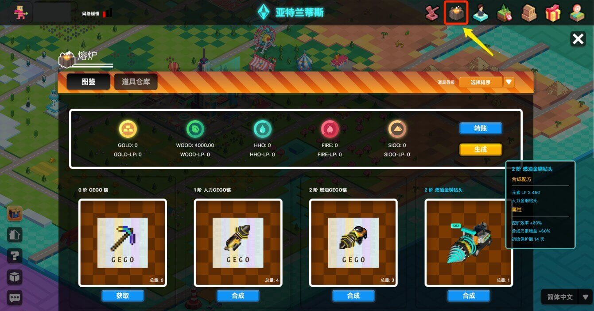
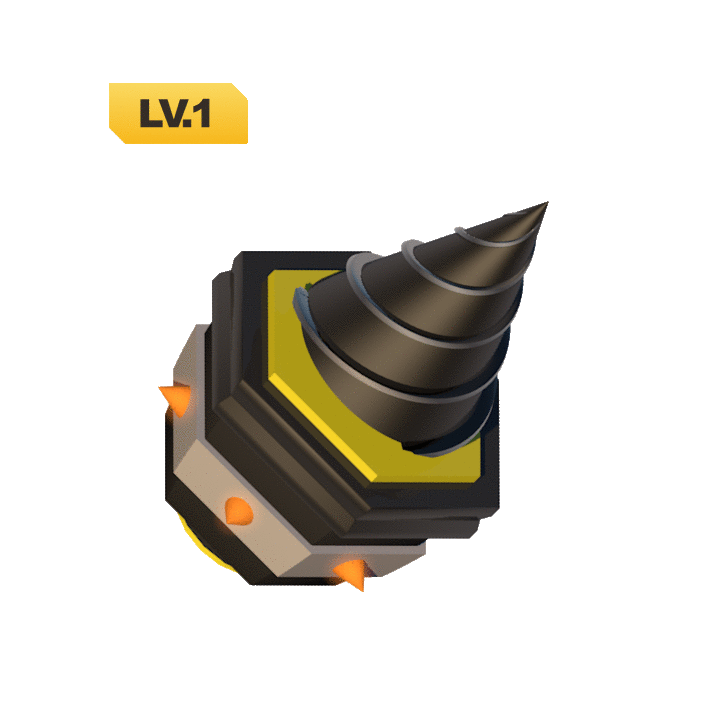
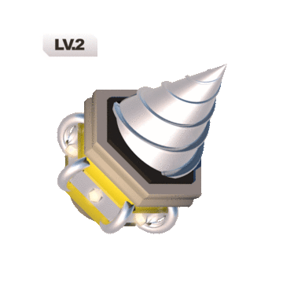
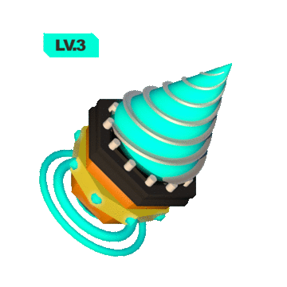
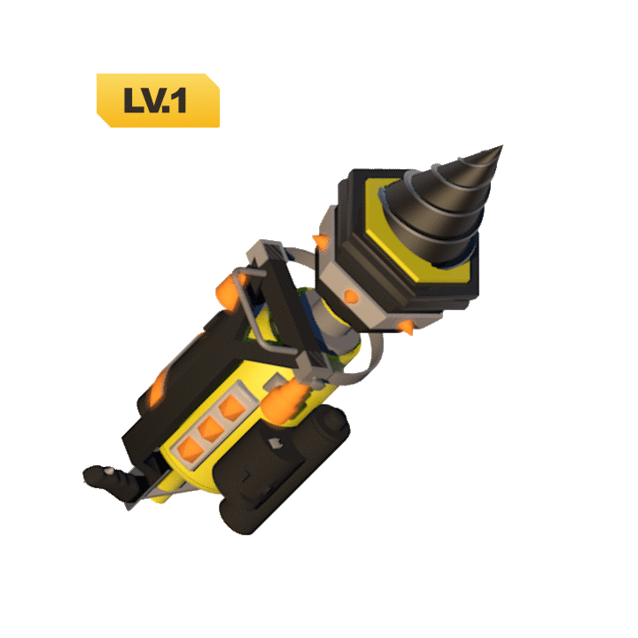
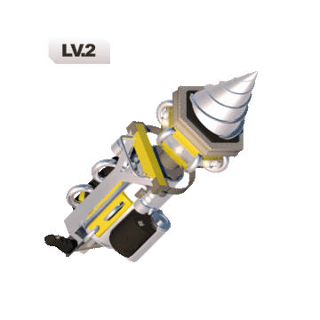
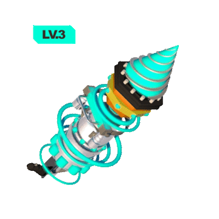
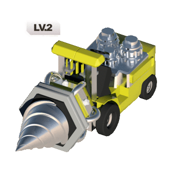
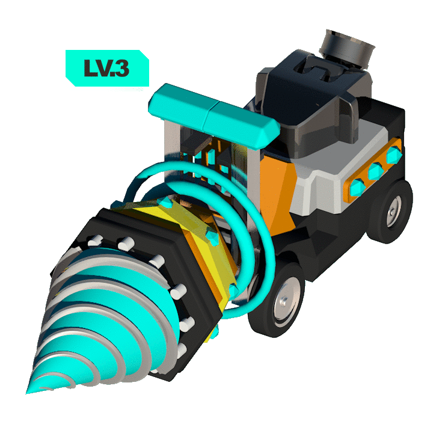

# 熔炉

**熔炉是一个通用的 NFT 合成系统，可以将多种 NFT 和 FT 合成成为一种新的 NFT，创建 GameFi 游戏规则及经济体系，将其与外部 DeFi 体系、进化星球以及星际资产标准整合，捕获价值回哺 RING/KTON/元素及进化星球游戏。**

## 术语

* **NFT**：Non-fungible Token，非标资产或者非同质化资产，比如谜恋猫、进化星球使徒、土地。
* **FT**：Fungible Token，标准化、同质化资产或代币，比如 RING。
* **合成资产**：Synthetic Asset，由 2 种或多种资产通过合约合成（锁定、销毁）后 mint（创造）出来的新的资产，合成资产可以是可逆的（销毁合成资产取回原来的资产）。
* **NFT 合成资产**：在合成资产中，成分资产构成中包含 NFT，则合成后的资产即具有 NFT 属性，即不可替换。
* **主成分 NFT**：在图纸中一般有一个主要的成分 NFT 作为主成分/主零件，配合若干个辅助资产进行熔炼新的 NFT。这个主要的成分 NFT 成为主成分 NFT。
* **图纸**：成分资产配比及合成资产生成方式的规则设定。
* **GameFi**：游戏化的 DeFi 应用。
* **使徒**：进化星球中的人形 Avatar。
* **元素**：金木水火土，进化星球中从土地中开采的元素资源 FT。

> **合成**
  
  将所需要的道具放置在熔炉系统中进行合成操作，即可提升道具的阶，阶的提升可以显著提升道具的加成效果。

> **拆解**
  
  目前的钻头为可拆解模式，类似质押锁仓模式，NFT 拆解后可取回所有成分资产。

> **功率**
  
  功率实际上是指进化星球赋予的该种 NFT 合成资产的功用。
  
  功率的计算由基础功率和可变功率相加获得。当一个道具在进行最优操作时即可发挥最大效用，如使用水元素加成钻头升阶后，再挖水元素，即可获得可变功率加成。

> **GameFi**
 
  与 DeFi 体系结合的方式，合成过程中除了需要提供元素，进行高阶合成时成分资产中要求需要 Uniswap 中特定流动性池 LP 通证，即使用流动性证贡献来铸造 NFT。

> **流动性池**
  
  由 Uniswap 单元素流动性池：
  
  GOLD-RING LP: Uniswap: GOLD | RING
  
  WOOD-RING LP: Uniswap: WOOD | RING
  
  HHO-RING LP: Uniswap: HHO | RING
  
  FIRE-RING LP: Uniswap: FIRE | RING
  
  SIOO-RING LP: Uniswap: SIOO | RING
  
  以上几种 LP 都可以作为流动性贡献凭证。除此之外，Zapper 也可以提供单币购买LP的模式，目前正在开发中。

在熔炼系统中，用户可以根据图纸，选择将多种不同资产，包括 NFT 和 FT 合成新的 NFT 资产。在视觉上，提供新的视觉效果特效。

| 阶级/等级 |                     ​铸铁钻头（LV.1）                     |                      镍钢钻头（LV.2）                       |                        金钢钻头（LV.3）                         |                       GEGO（LV.1）                        |
| :-------- | :-------------------------------------------------------: | :---------------------------------------------------------: | :-------------------------------------------------------------: | :-------------------------------------------------------: |
| **0 阶**  |  |  |  |  |
| **1 阶**  |  |  |  |  |
| **2 阶**  |  |  |  |  |

进化星球同时可以赋予外部 NFT 功能加成，如拥有 DEGO 的玩家可以将其引入进化星球，并和进化星球的原生钻头同样地进行升阶、挖矿等。

## 规则玩法

**合成NFT资产的用途**
* NFT 挖矿
* 成为高阶合成 NFT 的成分 NFT
* 其他外部应用中的功用

**土地**
* 新增 5 个道具栏
  
  

**使徒**（稍晚开发）
* 增加宠物道具栏
* 新增道具道具栏
  *注：已经部署了道具的道具位上，一般无法再由他人放置道具。但在满足道具替换规则的情况下，可以进行道具替换。*

**道具替换规则**
* A 道具：新的，打算进行部署的道具
* B 道具：已经部署在装备栏上的道具

**A 道具替换/强占 B 道具在满足以下任一情况下可以发生**（并且 B 道具不在保护期内）
* A 道具阶 > B 道具阶
* A 道具阶 = B 道具阶
  * A 道具等级 > B 道具等级

## 钻头

### 钻头 NFT 获取途径

钻头的获取通过宝箱（盲盒玩法）发放，宝箱获取通过空投或者购买获得。开启宝箱有一定几率获得不同等级的钻头以及其他代币奖励，包括 RING。

### 宝箱分类

分为「鎏金宝箱」和「曜银宝箱」，两者售价不同，开出钻头的等级及几率不同。

|          | 初始售价  | 最终价格   | 钻头爆率（含 1 个）                      | RING 爆率                      |
| :------- | :-------- | :--------- | :--------------------------------------- | :----------------------------- |
| 鎏金宝箱 | 1000 RING | 10000 RING | 2 级钻头 90% / 3 级钻头 10%              | 50% 几率返回支付的 RING 的一半 |
| 曜银宝箱 | 100 RING  | 1000 RING  | 1 级钻头 90% / 2 级钻头 9% / 3 级钻头 1% | 50% 几率返回支付的 RING 的一半 |

社交任务活动期间，宝箱以固定的初始价格售卖，社交活动结束后，宝箱售价每天增加 2.6%，在 30 天后到达最终价格，不再变动，以该价格继续销售。宝箱售卖的收入与进化星球游戏中其他收入一样进入各个分配池。

### 钻头的使用方法

钻头可以放置在地块的道具栏中，选择一种元素进行挖掘，与使徒不同的是，钻头并不能自己获得元素，需要依赖地块上正在工作的使徒，以使徒获得元素的收益为基数，获得加成部分的收益；此外，钻头也可以放置在其他人的地块上。

### 钻头的阶与级

钻头等级设置为 1 级，2 级，3 级，且低等级钻头无法向高等级转换，为钻头先天属性，升阶无法提高钻头等级。

钻头等阶设置为 0 阶，1 阶，2 阶，3 阶（稍晚开发），可以通过熔炉合成出高阶钻头，显著提升钻头功率。

不同阶、级的钻头功率及合成需求如下表：

| 钻头               | 基础功率 | 可变功率 | 合成需求    | 保护期（天） |
| :----------------- | :------- | :------- | :---------- | :----------- |
| **0 阶**           |          |          |             |              |
| （0 阶）1 级       | 1.0%     |          |             | 0            |
| （0 阶）2 级       | 5.0%     |          |             | 0            |
| （0 阶）3 级       | 12.0%    |          |             | 0            |
|                    |          |          |             |              |
| **1 阶**           |          |          |             |              |
| （1 阶）1 级       | 2.5%     | 2.5%     | 500 元素    | 7            |
| （1 阶）2 级       | 6.0%     | 6.0%     | 500 元素    | 7            |
| （1 阶）3 级       | 12.5%    | 12.5%    | 500 元素    | 7            |
|                    |          |          |             |              |
| **2 阶**           |          |          |             |              |
| （2 阶）1 级       | 14.0%    | 14.0%    | 450 元素 LP | 14           |
| （2 阶）2 级       | 34.0%    | 34.0%    | 450 元素 LP | 14           |
| （2 阶）3 级       | 60.0%    | 60.0%    | 450 元素 LP | 14           |
|                    |          |          |             |              |
| **3 阶**（开发中） |          |          |             |              |
| （3 阶）1 级       | 53.0%    | 53.0%    | 600 元素 LP | 28           |
| （3 阶）2 级       | 131.0%   | 131.0%   | 600 元素 LP | 28           |
| （3 阶）3 级       | 232.0%   | 232.0%   | 600 元素 LP | 28           |

其中功率加成的基数为每日钻头放置的地块上所有使徒挖掘该的元素总和，即若地块上有 5 个使徒，3 个使徒每日产出 5 火元素，2 个使徒每日产出 2 水元素，则放置一个 2 阶 3 级的火钻头每日可获得 5 * (60 + 60)% = 6 火元素。

钻头被新部署到道具栏时，享有一定时间的保护期。该保护期为一个全局可治理变量，道具主人也可通过消耗某种道具药水来延长自己某一个道具的保护期（稍晚时间开发）。在保护期内，道具替换规则不生效。

### 钻头的数量安排

钻头不设置硬顶总量，根据空投和销售的状况发放，三个等级的钻头比例通过宝箱开启时的爆率决定。