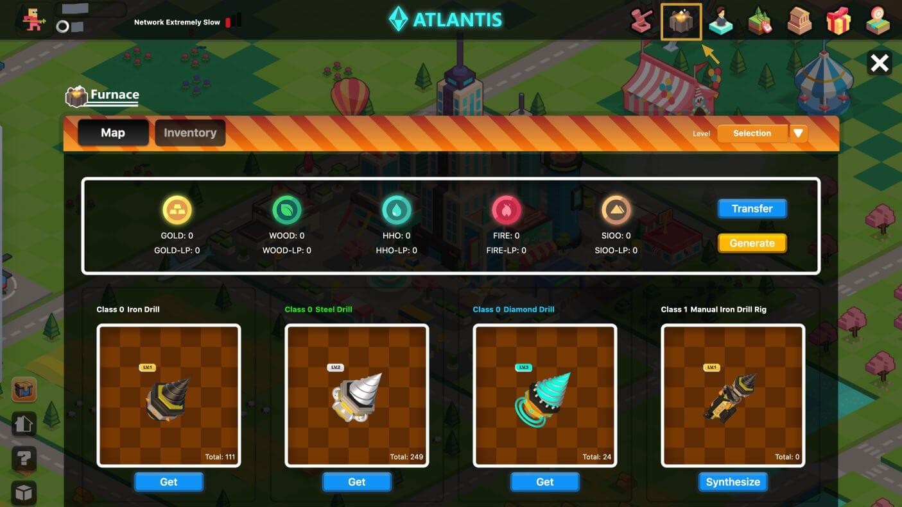
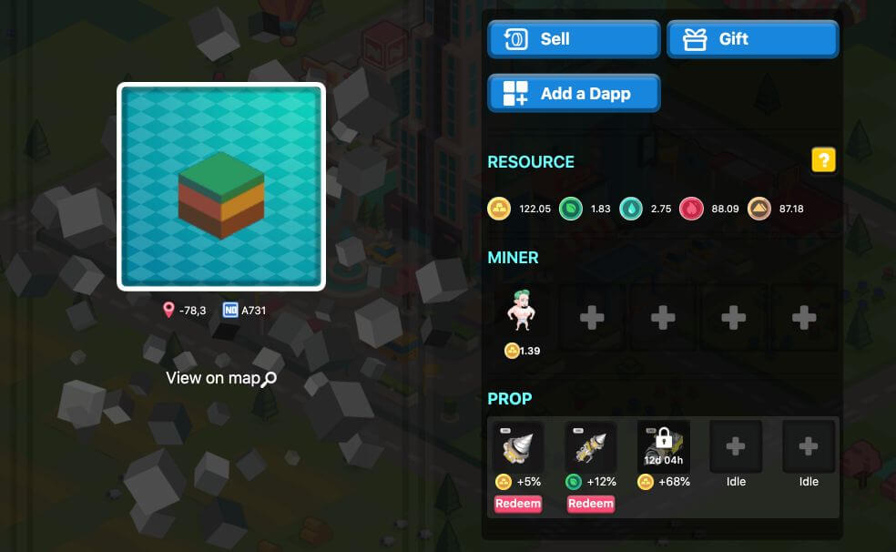

# The Furnace

**The Furnace is an NFT minting system that can be used to synthesize a variety of NFTs and FTs into new ones, in order to create new GameFi opportunities and enhance the ingame tokenonics.**

## Glossary:

* **NFT**: Non-Fungible Token. A non-interchangeable or heterogenous low liquidity asset, for example: CryptoKitties, Axies, Evolution Land Apostles, Land, or Mining Implements; typically adhering to a standard such as ERC721 or ERC1155
* **FT**: Fungible Token. An interchangeable or homogenous token or asset, such as RING, typically adhering to a standard such as ERC20, TRC20, or BEP20.
* **Synthetic Asset**: An asset created by synthesizing two or more existing assets via smart contract. When a synthetic asset is burned, it will disintegrate into the original assets.
* **Synthetic NFT**: A Synthetic Asset comprised of at least one NFT, and possessing some attributes of an NFT.
* **Supercharged NFT**: A Synthetic NFT that has been fused and imbued with the power of one or more other assets, while retaining its primary NFT characteristics.
* **Formula**: Rules governing asset ratios and synthetic asset generation methods.
* **Apostle**: A humanoid avatar within Evolution Land.
* **Resource**: GOLD, WOOD, HHO, FIRE and SIOO; mined from the land.
* **Synthesis**: Placing the required props in the Furnace system for synthesis operations can increase their class, and significantly enhance their effects.
* **Dismantling**: After Synthesis, Drill assets become locked in DeFi; but they can also be dismantled, and the component assets retrieved.
* **Efficiency**: A measure of how functional a prop or Synthetic NFT is; calculated by adding the assets base efficiency rating to its variable efficiency rating. When a prop or Synthetic NFT is operating optimally, it will have a maximum efficiency. For example, performing Synthesis on a mining drill with HHO tokens will increase its class, and grant a variable efficiency bonus when mining HHO afterwards.
* **GameFi**: As a GameFied decentralized finance (DeFi) system, players are required to obtain and provide resources for the furnace during the synthesis process; some of which are liquidity pool (LP) tokens. Actually, using LP tokens during synthesis is the only way to achieve the highest level of bonuses and efficiency ratings for Synthetic and Hybrid Synthetic NFTs.
* **Qualifying Liquidity Pool Tokens**:
  * GOLD-RING LP: Uniswap: GOLD | RING
  * WOOD-RING LP: Uniswap: WOOD | RING
  * HHO-RING LP: Uniswap: HHO | RING
  * FIRE-RING LP: Uniswap: FIRE | RING
  * SIOO-RING LP: Uniswap: SIOO | RING
  All the LP token pairs listed above on Uniswap qualify as contribution vouchers. Additionally, in future, Zapper will provide an easy to use system for purchasing qualified LP tokens with a single token.

## Gameplays

Using the Furnace, players can choose to combine a variety of different assets, including NFTs and FTs, into new assets according to various formulas. During synthesis, original assets will undergo functional and stylistic enhancement which will be reflected in the attributes of new asset.

The Evolution Land Furnace will also work with NFTs from our partners or other external ecosystems, for example: players who hold DEGO can perform syntheses and mining in the same ways as the original mining drills.

### What's the purpose of synthetic NFT assets?

1. NFT mining
2. Mint a required component of a Supercharged NFT
3. Functions in other external applications

### Land

5 new inventory
  

### Apostle (under development)

1. Increase pet inventory
2. New item bar
    *Note: If a lands prop slot is occupied, it is generally not possible for other players to place their own; however, if certain conditions are met, substitution and replacement is possible.*

### Prop replacement rules
  
Prop A: New, props to be deployed

Prop B: Props that have been deployed on the equipment bar
  
* **The replacement of prop A/prop B can happen under any of the following conditions**(if prop B is not within the protection period):
  * Class of prop A is higher than class of prop B
  * Class of prop A is equal to class of prop B
     * Level of prop A is higher than level of prop B

## Drill NFT

### How do I obtain Mining Drills?

Drills are obtained through chests (blind box gameplay), and chests are obtained through airdrops or purchases. Some chests have a higher likelihood than others of containing premium mining drills and other token rewards; including RING.  

### Treasure Chest

Treasure Chests are separated into Gold and Silver categories, with pricing that reflects higher or lower probabilities of obtaining premium items and rewards.

|              | Initial Price | Final Price | Probability                                        | RING Drop Probability                       |
| :----------- | :------------ | :---------- | :------------------------------------------------- | :------------------------------------------ |
| Gold Chest   | 1000 RING     | 10000 RING  | Steel drill 90% / Diamond drill 10%                | 50% probability to obtain half of paid RING |
| Silver Chest | 100 RING      | 1000 RING   | Iron drill 90% / Steel drill 9% / Diamond drill 1% | 0%                                          |

Purchasing Treasure Chests directly offers a higher probability of receiving premium Drills. During the airdrop event the Treasure Chests will be sold starting at a fixed initial price, but after that, the cost will increase by 2.6% every day. After 30 days, the ceiling price will be reached and will then remain fixed.

### How do I use the Mining Drills?

A Drill can be set on the prop slot of a piece of land and used for mining a single resource. Unlike Apostles, Drills cannot obtain resources by themselves; they rely on Apostles who then obtain a bonus income. In additional to allowing placement of Drills on a player's own land, they can also be placed on others land (5% profit will be paid to land's owner, percentage could be decided by DAO).

### What are the levels of classification for Mining Drills?

Drill levels are fixed at 1, 2, and 3; and low-level drills cannot be Synthesized into higher-level drills. Drill Level is an inherent attribute of each one, and upgrades will not affect it.

Drill classes can be 0, 1, 2, and 3 (to be developed later), and higher-class drills can be Synthesized with the Furnace, significantly enhancing their efficiency.

The efficiency and formulas for different drills are as follows:

| Drill       | Base Efficiency | Variable Efficiency | Formula                               | Protection Days |
| :---------- | :-------------- | :------------------ | :------------------------------------ | :-------------- |
| **Class 0** |                 |                     |                                       |                 |
| Level 1     | 1.0%            |                     |                                       | 0               |
| Level 2     | 5.0%            |                     |                                       | 0               |
| Level 3     | 12.0            |                     |                                       | 0               |
|             |                 |                     |                                       |                 |
| **Class 1** |                 |                     |                                       |                 |
| Level 1     | 2.5%            | 2.5%                | 500 resource token + Class 0 Drill    | 7               |
| Level 2     | 6.0%            | 6.0%                | 500 resource token + Class 0 Drill    | 7               |
| Level 3     | 12.5%           | 12.5%               | 500 resource token + Class 0 Drill    | 7               |
|             |                 |                     |                                       |                 |
| **Class 2** |                 |                     |                                       |                 |
| Level 1     | 14.0%           | 14.0%               | 450 resource token LP + Class 1 Drill | 14              |
| Level 2     | 34.0%           | 34.0%               | 450 resource token LP + Class 1 Drill | 14              |
| Level 3     | 60.0%           | 60.0%               | 450 resource token LP + Class 1 Drill | 14              |
|             |                 |                     |                                       |                 |
| **Class 3** |                 |                     |                                       |                 |
| Level 1     | 53.0%           | 53.0%               | 600 resource token LP + Class 2 Drill | 28              |
| Level 2     | 131.0%          | 131.0%              | 600 resource token LP + Class 2 Drill | 28              |
| Level 3     | 232.0%          | 232.0%              | 600 resource token LP + Class 2 Drill | 28              |

The base efficiency bonus is the sum of the resources excavated by all the apostles on the land where the drill is placed. For example, if there are 5 apostles working on the land, 3 apostles produce 5 FIRE per day, and 2 apostles produce 2 HHO per day, setting a FIRE enhanced class 2 level 3 drill will bring you 5*(60+60)%=6 FIRE per day.

When a Drill(higher than class 0) is deployed to inventory, it enjoys a certain period of protection; during which, the item replacement rule is suppressed. This grace period is a globally manageable variable, and at some point in the future, the Drill owner will be able to consume a certain potion to extend it.

### Total Drill Supply

The Drill supply does not have a hard cap and will be issued according to airdrop events and sales status. The probability of receiving a higher level Drill is determined by the category of the chest.