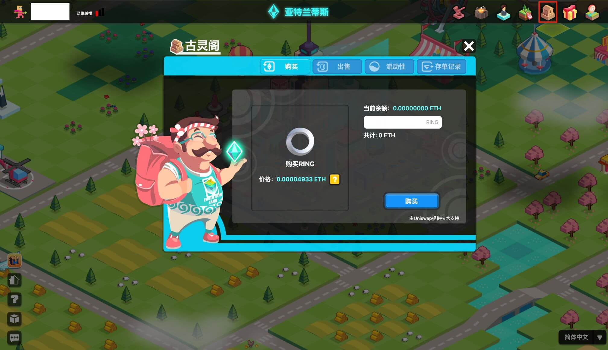

# 古灵阁

## 代币兑换服务

古灵阁是游戏内的银行服务，供用户交换代币，例如用 ETH 购买 RING 或资源，或出售 KTON 以获得 TRON 。古灵阁银行提供的代币交换服务由大陆底层网络上的流动性提供商提供支持，例如亚特兰蒂斯大陆（Ethereum）的 Uniswap 和拜占庭大陆（Tron）的 Justswap。

* [亚特兰蒂斯大陆上的古灵阁（以太坊）](https://www.evolution.land/land/1/bank/buy-ring)
* [拜占庭大陆上的古灵阁（波场）](https://www.evolution.land/land/2/bank/buy-ring)

支持交换的通证有：

* [RING](../../getting-started/tokens/ring.md) \(online\)
* [KTON](https://github.com/evolutionlandorg/docs/tree/1854bb0eeddc78bdd38a34385a8e31ef15c866e1/advanced/trading/getting-started/tokens/kton.md) \(online\)
* [GOLD](https://github.com/evolutionlandorg/docs/tree/1854bb0eeddc78bdd38a34385a8e31ef15c866e1/advanced/trading/getting-started/tokens/resource/README.md#gold)
* [WOOD](https://github.com/evolutionlandorg/docs/tree/1854bb0eeddc78bdd38a34385a8e31ef15c866e1/advanced/trading/getting-started/tokens/resource/README.md#wood)
* [HHO](https://github.com/evolutionlandorg/docs/tree/1854bb0eeddc78bdd38a34385a8e31ef15c866e1/advanced/trading/getting-started/tokens/resource/README.md#hho)
* [FIRE](https://github.com/evolutionlandorg/docs/tree/1854bb0eeddc78bdd38a34385a8e31ef15c866e1/advanced/trading/getting-started/tokens/resource/README.md#fire)
* [SIOO](https://github.com/evolutionlandorg/docs/tree/1854bb0eeddc78bdd38a34385a8e31ef15c866e1/advanced/trading/getting-started/tokens/resource/README.md#sioo)

资源的流动池也即将上线，敬请期待。

## KTON 铸造服务

古灵阁曾为用户提供一个接口，为用户提供质押 RING 来获得 KTON 的服务。随着达尔文主网上线，这种铸造能力已经转移到那里。古灵阁银行不再提供这种服务。

未来当达尔文大陆部署到达尔文网络上时，该大陆上的古灵阁银行可能会提供这项服务。

## 对外交换

你也可以在去中心化或中心化流动性供应商处进行代币交易。上述所有代币均可在去中心化流动性提供商处交易，例如：

* [Uniswap](https://info.uniswap.org/token/0x9469d013805bffb7d3debe5e7839237e535ec483) on Ethereum
* [Justswap](https://justswap.io/#/scan/detail/trx/TL175uyihLqQD656aFx3uhHYe1tyGkmXaW) on Tron 
* 其他

只需访问他们的网站，就可以与其他热门代币互换。

在一些流动性良好的中心化交易所，也可以交易 RING。查看[列表](https://docs.evolution.land/v/simplified-chinese/tutorials/atlantis-ethereum/how-to-buy-sell-ring#zhong-xin-hua-jiao-yi-suo)

在一些流动性良好的中心化交易所，也可以交易 KTON。查看列表[列表](https://docs.evolution.land/v/simplified-chinese/getting-started/tokens/kton#cex)

