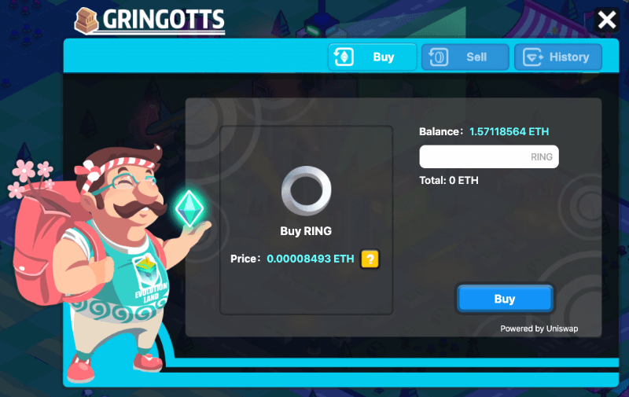

# Gringott Bank

## Token Swap Services

Gringott Bank is the in-game banking service for users to exchange tokens, such as buy RING or resources tokens with ETH or sell KTON for TRON. The token swap service Gringott Bank provides is powered by liquidity providers on the continent's underlying network, such as Uniswap on the Atlantis continent \(Ethereum\) and Justswap on the Byzantine continent \(Tron\).

* [Gringott Bank on the Atlantis Continent \(Ethereum\)](https://www.evolution.land/land/1/bank/buy-ring)
* [Gringott Bank on the Byzantine Continent \(Tron\)](https://www.evolution.land/land/2/bank/buy-ring)

The tokens supported for swap are:

* [RING](../../getting-started/tokens/ring.md) \(online\)
* [KTON](https://github.com/evolutionlandorg/docs/tree/d2e7f922cd713a9a4eb0f511d26569ec99613c1d/advanced/trading/getting-started/tokens/kton.md) \(online\)
* [GOLD](https://github.com/evolutionlandorg/docs/tree/d2e7f922cd713a9a4eb0f511d26569ec99613c1d/advanced/trading/getting-started/tokens/resource/README.md#gold)
* [WOOD](https://github.com/evolutionlandorg/docs/tree/d2e7f922cd713a9a4eb0f511d26569ec99613c1d/advanced/trading/getting-started/tokens/resource/README.md#wood)
* [HHO](https://github.com/evolutionlandorg/docs/tree/d2e7f922cd713a9a4eb0f511d26569ec99613c1d/advanced/trading/getting-started/tokens/resource/README.md#hho)
* [FIRE](https://github.com/evolutionlandorg/docs/tree/d2e7f922cd713a9a4eb0f511d26569ec99613c1d/advanced/trading/getting-started/tokens/resource/README.md#fire)
* [SIOO](https://github.com/evolutionlandorg/docs/tree/d2e7f922cd713a9a4eb0f511d26569ec99613c1d/advanced/trading/getting-started/tokens/resource/README.md#sioo)

Resource liquidity pools will be online soon.

## KTON Minting Service

Gringott Bank used to provide an interface for users to stake RING to mint commitment token KTON. With the launch of the mainnet of Darwinia Network, this minting capability has been moved there. Gringott Bank no longer provides this service anymore.

When Darwinia continent is launched on the Darwinia Network, Gringott Bank on that continent might provide this service.

## External Exchanges

You can also trade tokens at external decentralized or centralized exchanges or liquidity providers. All the above tokens are tradeable at decentralized liquidity providers such as:

* [Uniswap](https://info.uniswap.org/token/0x9469d013805bffb7d3debe5e7839237e535ec483) on Ethereum
* [Justswap](https://justswap.io/#/scan/detail/trx/TL175uyihLqQD656aFx3uhHYe1tyGkmXaW) on Tron 
* and many more

You can just viist their websites to swap the tokens against any other popular tokens.

RING is also traded at some centralized exchanges with decent liquidity. Find out the [list](https://docs.evolution.land/tutorials/atlantis-ethereum/how-to-buy-sell-ring#cex) here.

KTON is also traded at some centralized exchanges with decent liquidity. Find out the [list](https://docs.evolution.land/getting-started/tokens/kton#cex) here.

