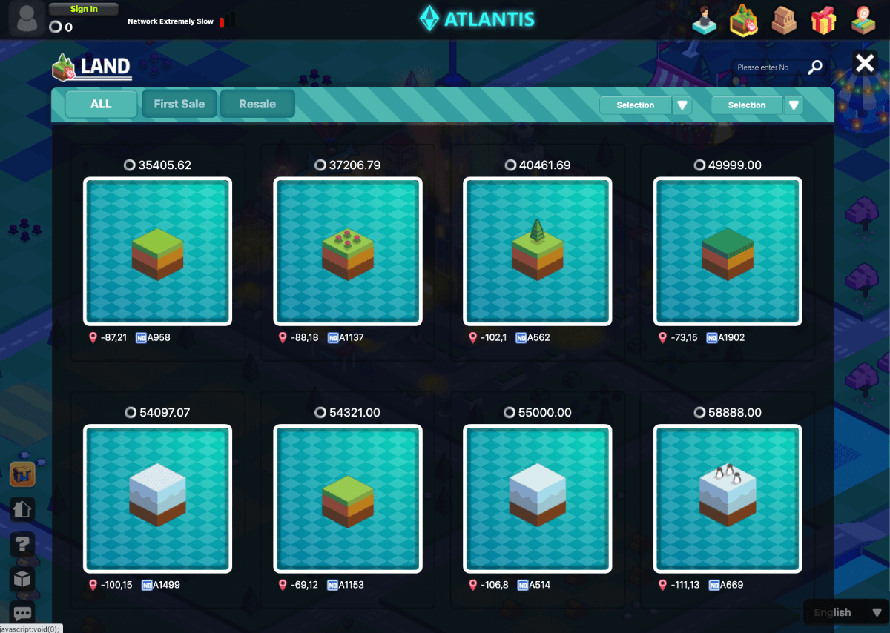
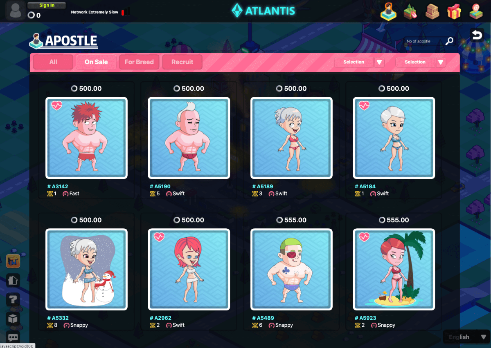
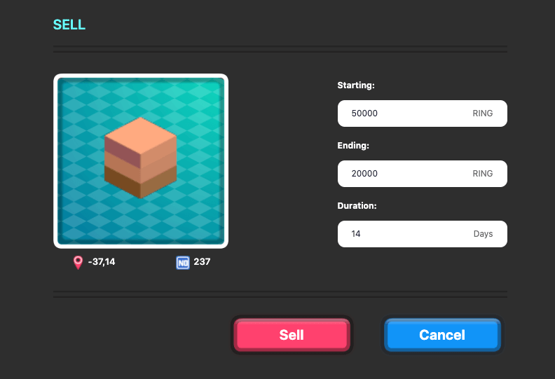

# NFT Market

NFT market is where you trade NFT assets. Each NFT asset is unique. Each trade differs as well. You can trade your NFT in Evolution Land built-in NFT market or any external NFT market as you prefer.

## Evolution Land NFT Market

Evolution Land in-game NFT market provides Auction System, give you flexibility to sell your asset at a fixed price or use Dutch Auction or Reversed Dutch Auction. You can trade your NFT assets without leaving the system. Evolution Land provide a all-in-one experience.

### Land NFT Market

In the Land market, you can browse, search and filter for your desired Lands. View Land detail and find out their price as well as resource reserves. You can purchase the Land using RING token.

### Apostle NFT Market

In the Apostle market, you can browse, search and filter for your desired Apostles. View Apostle detail and find out their price as well as apperance and talents. You can purchase the Apostle using RING token.

### Apostle Job Market

Apostle owners can put his Apostles on the Job Market to mine for others for a specific period with a daily wages, if hirer accepts the offer.   These job listingd can be found at the Apostle NFT Market.

### Apostle Dating Market

Apostle owners can put his Apostles on the Dating Market to find partners to breed for a auctioned fee.  If winning bidder will breed with the Apostle and receive the child.

### Auction System

#### Optimized Dutch Auction

A Dutch auction is a public offering auction structure in which investors place a bid for the amount they are willing to buy in terms of quantity and price. The auction price on an item is lowered until it gets a bid. The first bid made is the winning bid and results in a sale. This is in contrast to typical options, where the price rises as bidders compete.

In Evolution Land, the seller can set a pair of starting price and ending price and the price change duration. According to the price change period, the auction price will change from the starting price to the ending price linearly. Therefore you can use these parameters to create various auction types:

1. Fixed price sale: Set starting price equal to ending price, price change period set to anything other than 0.
2. Classic Auction \(price rise over time\): Set ending price higher than starting price for a limited period.
3. Dutch Auction \(price lowers over time\): Set ending price lower than starting price for a limited period.

#### Initial Land Offering Auction

When Lands are first created by [Eve](../../), an Initial Offering Auction event is held. First 10 Lands are auctioned through a revised Dutch auction with an arbitrary starting price with ending price 1/10. After those 10 lands are sold, new Lands are auctioned one by one with starting price of average sale price of the previous 10 Lands.

This revised Dutch auction lowers its price over time just like a typical one, but it does not end when receiving a bid. Instead it enters reverse Dutch auction mode. The bidder wins the Land only when no one else bids at a fixed increase \(10%\) within 30 minutes. Each time someone bids higher, the previous bidder will receive full refund and the 10% premium will be shared among these parties:

1. 4% of the premium will be charged as handling fee.
2. The remainder will be divided equally between the landlord and the previous bidder.
3. In the absence of a referee, the handling fee flows directly to the system revenue.
4. If there is a referee, the referrer's reward is 20% of the handling fee, and the remaining 80% flows to the system revenue.

## External NFT Market

NFT assets are stored directly in your cryptocurrency wallet. You can trade them at external NFT market freely. These markets divided into decentralized and centralized markets.

#### Decentralized NFT Market \(external\)

Your NFT assets goes to auction smart contracts developed by these markets. They are truestless. These are the markets we would recommend:

* [OpenSea](https://opensea.io/collection/evolutionland)
* [Rarible](https://app.rarible.com/collection/0x14a4123da9ad21b2215dc0ab6984ec1e89842c6d/collectibles)
* [Enjin](https://enjinx.io/eth/marketplace)

#### Centralized NFT Market \(external\)

You interact with these markets just like any other centralized crypto exchanges. You send your assets to their wallets secured by the entity who operates the market. You are exposed to centralized risks. When you have decentralized exchanges within Evolution Land or others, we wouldn't recommend any centralized NFT markets.

