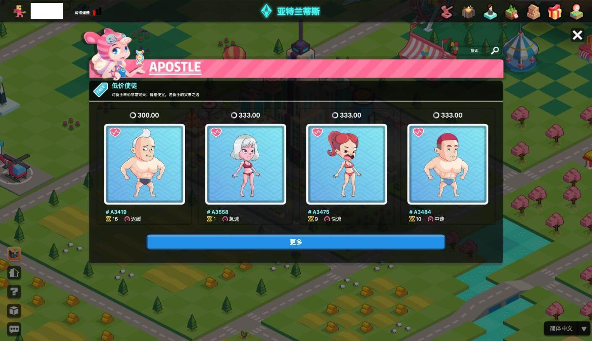
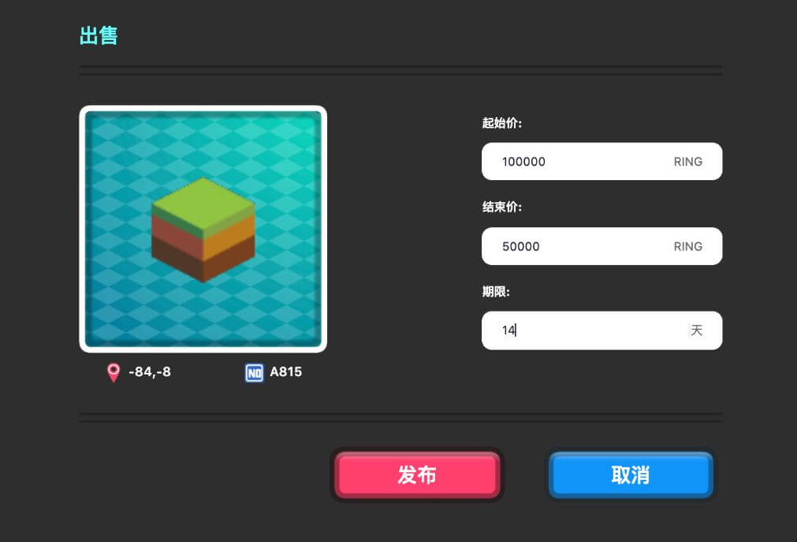

# NFT 市场

NFT 市场是你交易 NFT 资产的地方。每个 NFT 资产都是独一无二的。每一种贸易也各不相同。你可以在进化星球内置 NFT 市场或任何外部 NFT 市场中交易你的NFT。

## 进化星球 NFT 市场

进化星球游戏内 NFT 市场提供拍卖系统，玩家有足够的灵活性，可以以固定价格出售资产，或使用荷兰式拍卖，或使用反向荷兰式拍卖。你可以在不离开游戏系统的情况下交易你的 NFT 资产。进化星球提供了一个全方位的体验。

### 地块 NFT 市场

在地块市场中，你可以浏览、搜索和筛选你想要的地块，查看地块详情，了解其价格以及资源储量。你可以使用 RING 购买地块。

### 使徒 NFT 市场

在使徒市场，你可以浏览，搜索和筛选你想要的使徒，查看使徒的细节，价格，以及外观和才能。你可以用 RING 购买使徒。

### 使徒打工市场

玩家可以把他的使徒放到打工市场出租，只要雇主接受报价，使徒就可以在限定的期限内以日薪的方式为雇主挖矿。这些列表可以在使徒 NFT 市场找到。

### 使徒相亲市场

玩家可以把使徒放在相亲市场上，以拍卖的方式寻找伴侣使徒来进行繁殖。成功拍卖的玩家将让自己的使徒与拍卖下来的使徒进行繁殖，并获得使徒的孩子。

### 拍卖系统

#### 优化荷兰式拍卖

荷兰式拍卖是一种公开发售的拍卖结构，在这种结构中，投资者以他们愿意购买的数量和价格出价。一件物品的拍卖价格会一直降低，直到有人出价。首个竞拍者将会获得赢得这次拍卖。这与典型方案形成了鲜明对比，即随着竞买人的竞争，价格会上涨。

在进化星球中，卖方可以设定一对起始价格和结束价格，以及价格变动持续时间。根据价格变化周期，拍卖价格从起始价格到结束价格呈线性变化。因此，您可以使用这些参数创建各种拍卖类型：

1. 固定价格销售：设置相同的起始价格和结束价格，价格变化期设置为 0 以外的任何值。
2. 经典拍卖（价格随时间上涨）：在有限的时间内，设定结束价格高于起始价格。
3. 荷兰式拍卖（价格随着时间的推移而降低）：在限定的时间内，将结束价格设置为低于起始价格。

#### 创世地块拍卖

在 [Eve](../../) 首次创造土地时，举行了创世地块拍卖活动。前 10 块土地通过修改后的荷兰拍卖会进行拍卖，起始价任意，终止价为1/10。（First 10 Lands are auctioned through a revised Dutch auction with an arbitrary starting price with ending price 1/10.）10 块土地拍卖完成后，将以前 10 块土地的平均售价为起拍价，逐笔拍卖新的土地。

修改后的荷兰式拍卖会和典型的荷兰式拍卖一样，随着时间的推移价格降低，但它不会在收到出价时结束。相反，它进入反向荷兰式拍卖模式。只有在 30 分钟内没有其他人以固定价格（10%）出价的情况下，投标人才能赢得土地。每次有人出价更高，先前的出价者将获得全额退款，10% 的溢价将由这些当事人分摊：

1. 溢价的 4% 将被作为手续费。
2. 剩余部分将在地主和前一投标人之间平均分配。
3. 在没有引荐人的情况下，手续费直接流入系统收入。
4. 如果有引荐人，引荐人的奖励是手续费的 20%，剩下的 80% 流入系统收入。

## 外部 NFT 交易市场

NFT 资产直接存储在你的加密货币钱包中。你可以在外部 NFT 市场自由交易。这些市场分为去中心化交易市场和中心化交易市场。

#### 去中心化 NFT 交易市场（外部）

你的 NFT 资产用于拍卖这些市场开发的智能合约。它们是去信任的。以下是我们推荐的市场：

* [OpenSea](https://opensea.io/collection/evolutionland)
* [Rarible](https://app.rarible.com/collection/0x14a4123da9ad21b2215dc0ab6984ec1e89842c6d/collectibles)
* [Enjin](https://enjinx.io/eth/marketplace)

#### 中心化 NFT 交易市场（外部）

你与这些市场的交易就像任何其他集中的加密交易一样。你把你的资产送到他们的钱包里，由市场运作的实体担保。你面临着中心化的风险。当你在进化星球或其他任何地方有去中心化的交易时，我们不建议任何中心化的 NFT 交易市场。

