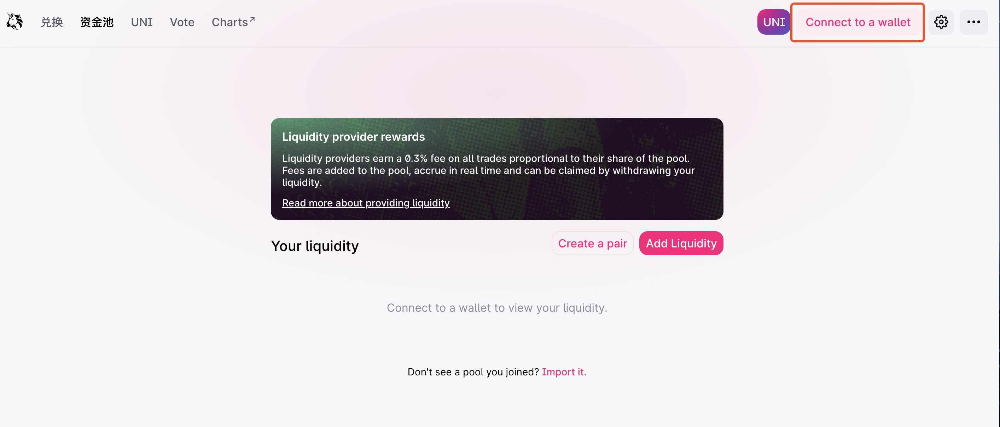
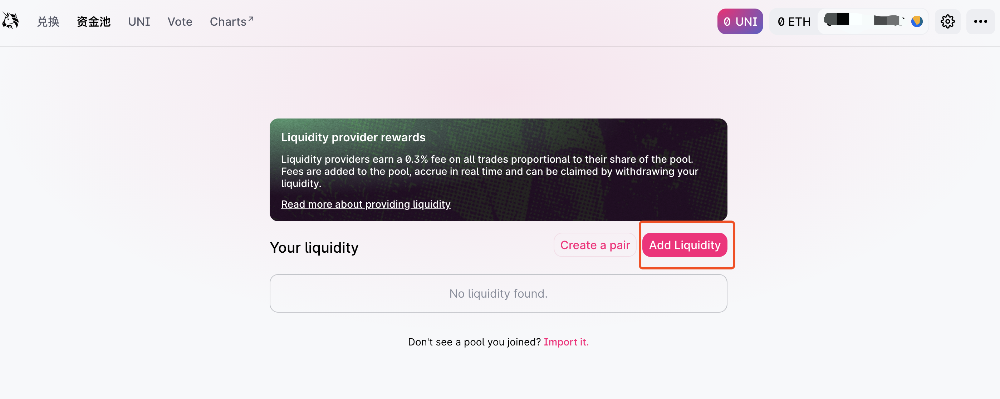
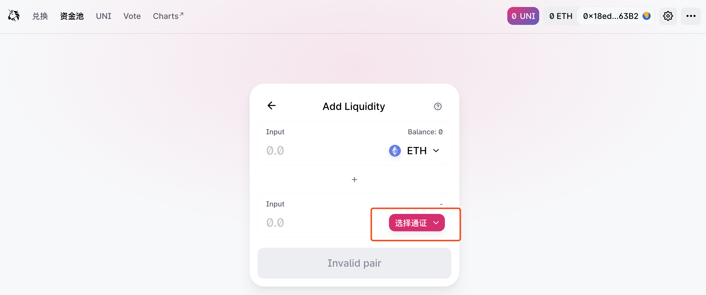
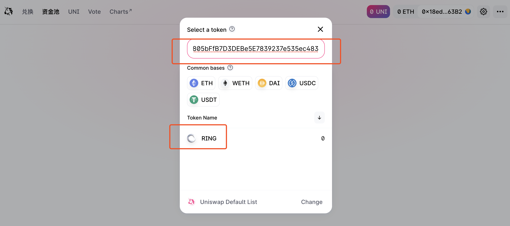
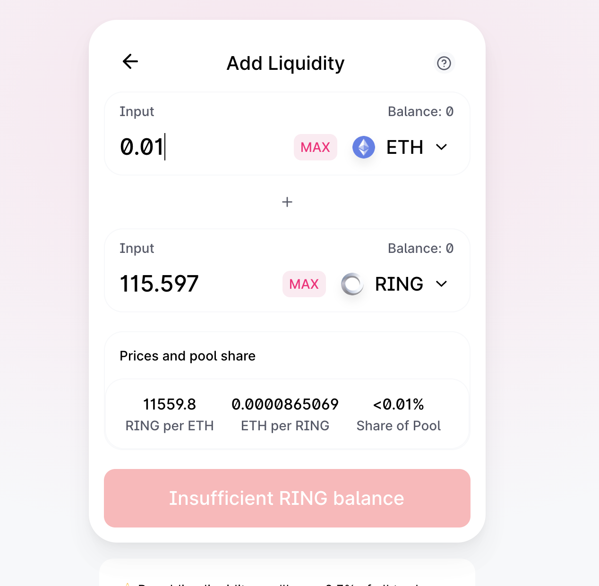
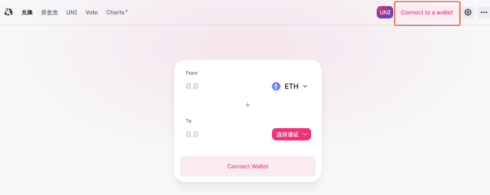
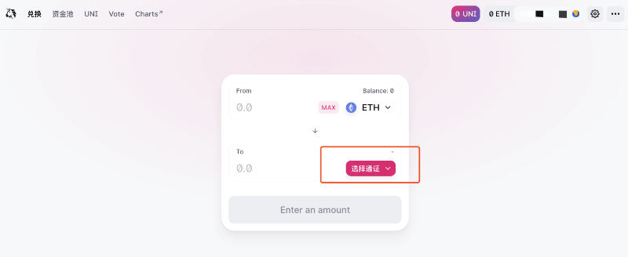
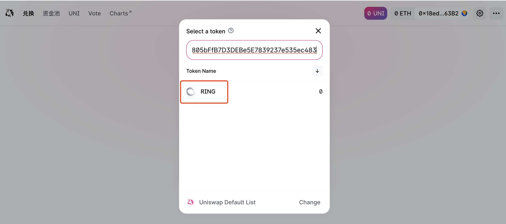

# Uniswap

## 如何在 Uniswap 中为 RING 注入流动性？

* 打开 Uniswap 官网：[https://app.uniswap.org/\#/pool](https://app.uniswap.org/#/pool)
* 点击右上角「Connect」，登陆 Metamask，确认签名后将成功连接至 Metamask 钱包。 登陆成功后右上角会显示您目前登陆 Uniswap 的地址。记得确认地址无误哦。

* 选择并点击「Add Liquidity」

* 选择并点击「Select a token」，输入 RING 的合约地址，点击选择 RING。如图，此时 Deposit 为 ETH 和 RING，即将存入一定数量的 ETH 和 RING 以增加流动性。
  * ⚠️ 流动性提供者向流动池中增加流动性时，不能只向交易对的一方提供流动性。
  * 注：RING 的合约地址为：0x9469d013805bffb7d3debe5e7839237e535ec483

* 填入希望存入的 ETH 或 RING 数量（填写一种即可，另一种会根据目前的比例自动算出）。如图是希望注入 0.01 ETH 和相应的 115.597 RING 来增加流动性。
  * 「Exchange Rate」 是目前的兑换比例
  * 「Current Pool Size」是目前池子中 Token 的数量
  * 「Your Pool Share」是目前占流动性的份额，将按照这个比例给予相应的手续费分成。

* 点击「Transaction Details」，确认交易详情无误后，点击「Add Liquidity」，跳转 Metamask，确认交易后将成功注入流动性。    

## 如何使用 Uniswap 购买/出售 RING？

* 打开 Uniswap 官网： [https://app.uniswap.org/\#/swap](https://app.uniswap.org/#/swap)
* 点击右上角「Connect」，登陆 Metamask。确认签名后，将成功连接至 Metamask 钱包。 登陆成功后右上角会显示您目前登陆Uniswap 的地址。记得确认地址无误哦。

* 在「Swap」界面下点击「Select a token」，输入 RING 的合约地址，点击选择 RING。 如图，此时 Input 为 ETH，Output 为 RING，即将以一定数量的 ETH 购买获得 RING。
  * 注：RING 的合约地址为：0x9469d013805bffb7d3debe5e7839237e535ec483

* 输入希望购买的数量，如图为是按照目前的比例，用 0.01 个 ETH 可以购买 115.917 个 RING。
* 点击「Transaction Details」，可查看交易详情。
* （交易过程中将收取 0.3% 的手续费，显示的价格中已经扣除手续费，这些手续费将分给流动性提供者。）

* 确认交易详情无误后，点击「Swap」，跳转 Metamask，确认交易后将获得相应数量的 RING。

## 如何使用 Uniswap 出售 RING？

只需要将上述购买步骤中的 Input 与 Output 中的币种进行互换，即 Input 选择 RING，Output 选择 ETH，即可轻松完成 RING 的出售。

 

