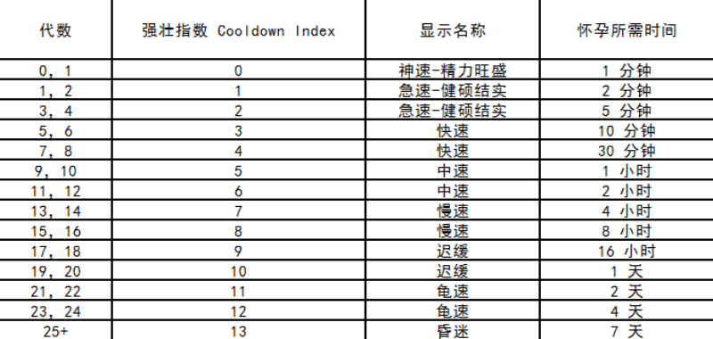

# 生育繁衍

使徒可以进行繁衍，并遗传基因给后代。初代使徒的代数为 0，他们的后代 +1 位，为 1 代，以此类推。[人口](population.md)依靠生育不断增长。

## 伦理

生育下一代使徒需要 2 个使徒作为父母。目前符合常识的关系可以进行生育，但是今后有条件会放开一些激进的生育场景。

### 性别

* 男 + 女 = 生育成功
* 男 + 男 = 无法生育
* 女 + 女 = 无法生育

在将来，男+男以及女+女组合或许可以进行生育。将会解锁一个隐藏性状身体部位的“彩虹纹身”。但是这种生育将会花费较高费用（需要特殊的手术，在医生职业的配合下），而且失败（死胎）几率也比较高。

### 种族

在亚特兰蒂斯大陆上的使徒皆为“人类”；在拜占庭大路上的使徒皆为“异形”。他们分属不同种族，跨种族生育不被支持。

### 近亲

兄弟姐妹及直系父母子女间不允许生育。

### 骡子使徒

使徒的基因“繁殖能力”决定了使徒是否能够进行繁衍，绝大部分情况下使徒都有繁衍能力，但有某些特例使徒则无繁殖能力，俗称“骡子”使徒。比如：

* 同性：较大概率流产，中概率出生，拥有特殊彩虹标志，但全为骡子
* 跨种族：大概率流产，小概率出生，但全为骡子
* 直系近亲：小概率流产，大概率出生，中概率为骡子
* 自定义使徒：本身为骡子，无法生育

以上特例繁殖在后续版本中增加，开始时不允许。

## 强壮指数（繁育时间）

使徒拥有一项指标：强壮指数。它决定了使徒怀孕生育所需的时间。即两个使徒决定生育后到产出新一代使徒所需的时间。在怀孕期间不可进行新的生育及从事其他工作。每生育一次后代，强壮指数升一档，生育所花费的时间也越长。

使徒的初始强壮指数由其代数决定，如下表所述。

## 使徒的家谱

根据使徒父代和子代关系，可向上及向下追溯，根据这些信息生成图形化的血缘（家谱图）。

（成就）标记显示：有成就的使徒，在头像旁会显示有特定的统一标记。

## 基因工程算法

基因工程算法决定来自父母使徒的两个基因如何生成下一代基因。包含了遗传、交叉和变异等基因位操作。同时基因中含有显性和隐形基因，决定该基因是否对使徒外貌性状及天赋能力进行显性表达。隐形基因可能被继承并在后代中有机会表达。基因发生变异时，将有机会获得更稀有的基因。

为保持遗传的神秘感和不确定性，基因实验室将为闭源合约。

