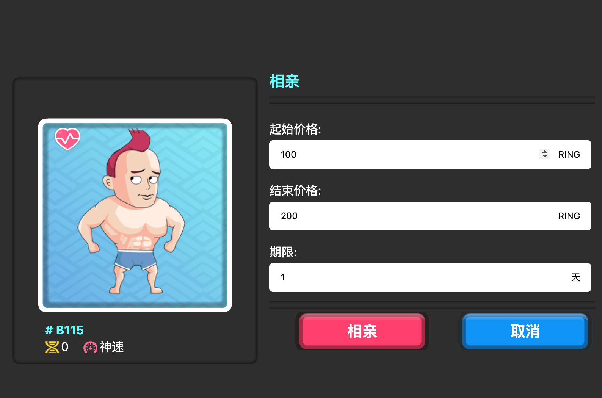

# 生育市场

生活中，如果你的圈子很小，你也许会去一些约会网站结识更多的人。使徒也是这样。如果玩家没有多余的使徒用于相亲，可以把使徒放到相亲市场上，并设定一个相亲价格。

价格的设定方式是拍卖。你可以设置起始价格、结束价格和拍卖期限。[了解更多有关拍卖的信息](../../../advanced/trading/nft-market.md#auction-system)

也会有一些玩家看中某个使徒的长相或基因，并因此出价相亲。

如果相亲成功，两个使徒繁育出来的孩子使徒归出价成功者所有，被相亲使徒的拥有者获得付款。

