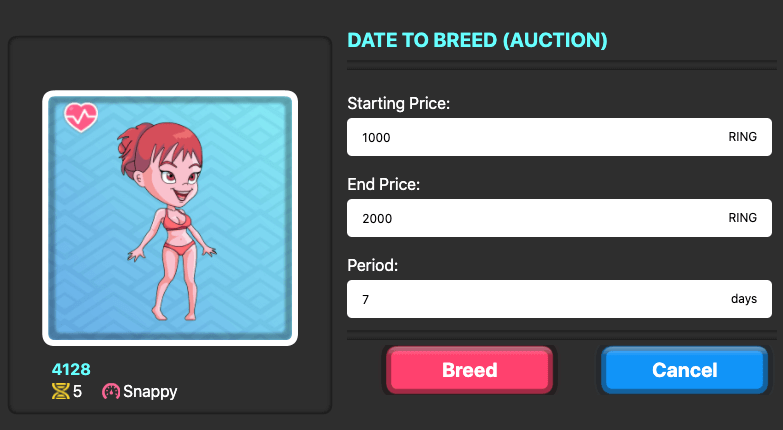

# Dating Market

Well, if your circle is small, you may go to some dating site to meet more people. This is the same thing for Apostles. If the owner does not have Apostles to breed, he can put his Apostle's profile at the market and set a breeding price. The price is an auction. You set a starting price and ending price and the duration of the auction.  Learn more about [how Auction works](/advanced/trading/nft-market#auction-system).

If someone else likes your looks or admire your genes, he can pay for the breeding. The child will go to the winning bidder, and you received the payment.

