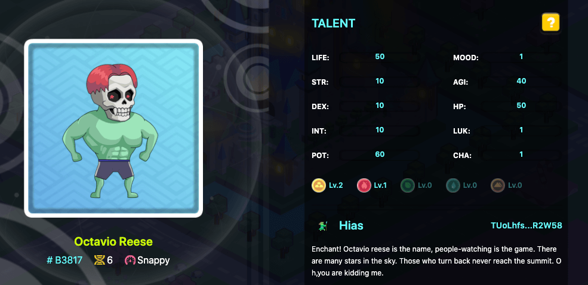

# Skills

## 使徒的能力

使徒的能力由先天天赋和后天努力构成，即能力等于先天天赋加上后天天赋加成。

先天天赋由基因决定，一旦生成后原则上无法变更（但不排除将来开发高级基因工厂可对先天天赋基因进行修改）包括：

- 常规天赋：
  - 力量、敏捷、灵巧、耐力（生命值）、智力、魅力、运气
- 特殊天赋：
  - 寿命：从进行任何一种操作开始计时，包括工作、生育等等
  - 心情波动：类似性格，导致输出的波动范围变化
  - 潜力：决定了使徒各项天赋的上限
  - 元素偏好：一种或多种，影响工作或战斗的效果
  - 学习能力（即装备栏）：最多可以装备的技能数量，取值范围 0 - 3

使徒能力的提升主要依靠后天努力来获得提升，途径包括以下几种：

- 职业
- 技能
- 宠物
- 装备
- 熟练度

天赋、能力、装备的关系是天赋决定了使徒的先天能力，后天的道具包括职业、技能、装备等等作为后天能力的加成，两者之和即为使徒的现时能力。使徒的先天能力是重要的，因为有些后天道具的能力加成是百分比，它的基数即为使徒的先天能力。

## 使徒的职业

一个使徒只能选择一种职业，使徒的职业将来可以有条件、有代价进行更换。选择特定职业会，将对相关基础天赋实时百分比的加成效果。已经或者即将推出的职业清单有：

* 矿工
* 建造者
* 医生
* 铁匠
* 战士

清单很长，目前职业选择玩法尚未激活。

