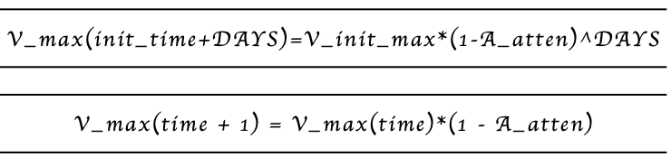
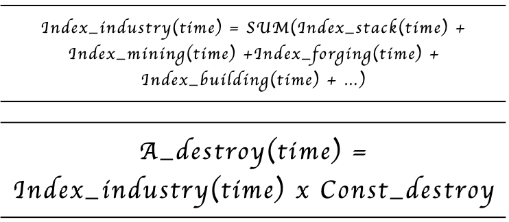

# Resource Attenuation Rate

Resource generation rate V(time): refers to the resource release rate of the current time of the Land.  

The maximum resource generation rate is V_max(time): refers to the upper limit of the Land's release rate. 

The initial maximum rate of resource generation V_init_max refers to the maximum rate and the initial rate of resource generation with the continent's opening. 

Resource attenuation rate A_atten: The maximum rate of resource generation V_max will decrease from The initial maximum rate of resource generation V_init_max according to the Resource attenuation rate A_atten. The resource decay rate will be taken at a prolonged rate, which is about 1/10,000 a day.

Resource recovery rate A_recover: The current resource generation rate V will be increased according to the resource recovery rate A_recover until the resource generation rate V_max is reached. The recovery is about 2/1,000 of a day.

Resource destruction deceleration rate A_destroy(time): The current resource generation rate V will be reduced according to the current resource destruction deceleration rate A_destory until it reaches zero. Resource destruction deceleration rate A_destroy(time) is linearly related to the player's industrial activity index. The constant Const_destroy. is about 2/1,000 to 5/1,000 per day.

Player industry activity index Index_industry (time): refers to the player's current industry activities such as stacking resources, mining, element generation, construction, and other industrial activities, and cumulative production of indicators, will directly affect the resource damage negative acceleration rate A_destroy ( Time). Mining workers excavating resources from Land, mining, resource accumulation, construction, and construction placement will affect the rate of resource generation, which can be epitomized by the general indicators of industrial and agricultural activity.

Resource generation rate V(time) calculation formula:

Mining rate of miners V_mining(time): refers to the speed of resource exploitation of all miners on this land. More miners or adding props to miners can increase the mining rate, which is capped at the resource generation rate. 

Although there are random factors designed according to topographical geography and other factors, in the sense of probability and statistics, the universal release model of each continent and each land follows the following laws:

- A. The total value of the significant continents' essential resources is almost the same, although the distribution of resources between the significant continents is different. For each continent, the initial rate of total resource generation is the same, and the subsequent rate of resource generation is significantly different from the degree of development. The resource generation rate varies from continent to continent. (The principle of fair competition between the big continents) 
- B. On different lands with the same attributes, the elements' release rate should be the same (although in the latter application, the user may use the props to give their land attribute enhancement). The number of essential resources on the different lands and the rate of release and disappearance may or may not be the same. 
- C. Over time, the resource release attribute will be weakened at a prolonged rate, manifested by the attenuation of the resource release rate. 
- D. After placing a building on the Land, it will destroy the natural state and attributes of the Land to a certain extent, which affects the release rate of the essential resources.

Unlike the token RING, the release of resources will be attenuated, but the supply is not fixed. On the one hand, it is affected by the natural state of the Evolution Land lands, and on the other, the demand for resources in the open market will also affect its release or destruction. This market-based token model will form a market economy and improve the playability of the game.