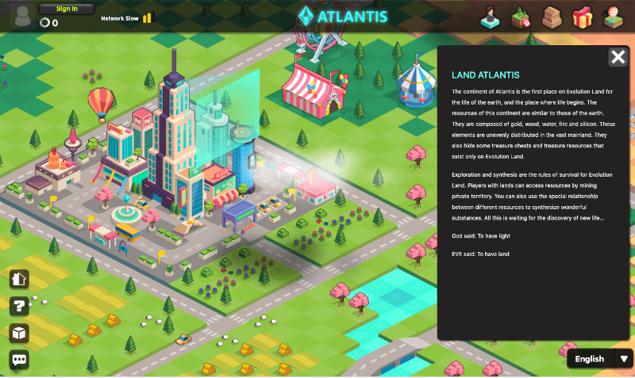
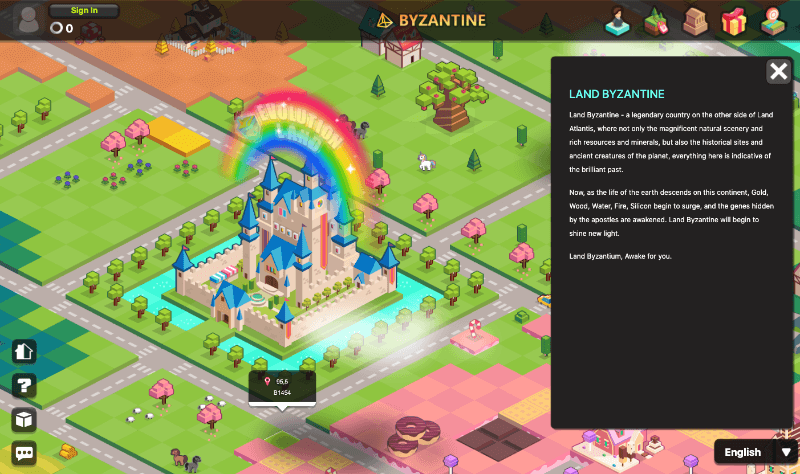

# 大陆

## **什么是大陆？**

进化星球逻辑上分成26块大陆，每一块大陆部署在不同的区块链网络上。大陆一块一块推出，目前已经有2块大陆：**亚特兰蒂斯大陆**（部署于以太坊网络）和**拜占庭大陆**（部署于波场网络）。

## 亚特兰蒂斯大陆

亚特兰蒂斯大陆大陆总共有2025个地块。其中：官方保留109个地块，部分用于奖励发放；金矿山，森林，湖泊，火山，土山等地形地块共182块；其余1734个创世普通地块将以拍卖的方式进行出售。

这块大陆的资源和地球出奇的相似，由金、木、水、火、土构成，这些元素不均匀的分布在广袤的大陆，还隐藏着一些宝箱地块和仅存于进化星球的珍惜资源。探索与合成，是这个星球的生存法则。拥有地块的玩家可通过开采私人领地，获取资源。还可以利用不同资源之间的特殊关系，合成奇妙物质。这一切，都在等待着新人类的发掘。  

Evolution Land is logically divided into 26 continents, each of which is deployed on a different blockchain. Each continent will have around 2025 [lands](land.md). Total resource reserves are determined randomly when a continent is created and will not change afterward.

Continents will evolve into a separate but related economic entity, somewhat like countries. In-game currency tokens, resources, and props shall be moved between continents as inter-continent trade, although the continent governance council may charge inter-continent trade tariffs. This inter-continent transaction is technically cross-chain transactions. Evolution Land will rely on Darwinia Network's Heterogeneous Cross Chain bridges to accomplish this.

To access each continent, you will need a proper toolset, such as wallets supporting the continent's underlying blockchain environment.

The continents will be launched one by one. Two continents exist today, they are:

* **the** [**Atlantis**](https://www.evolution.land/land/1) \(Ethereum\) 
* **the** [**Byzantine**](https://www.evolution.land/land/2) \(TRON\) 

New continents are being planned. These are the candidate blockchains that we are evaluating according to their **user base**, **dapp prosperity**, **smart contract compatibility,** and **gas fee**.

* Binance Smart Chain
* Darwinia Crab Network
* Darwinia Network
* EOS

If you have an excellent public blockchain you think suitable to host another continent, let us know.

