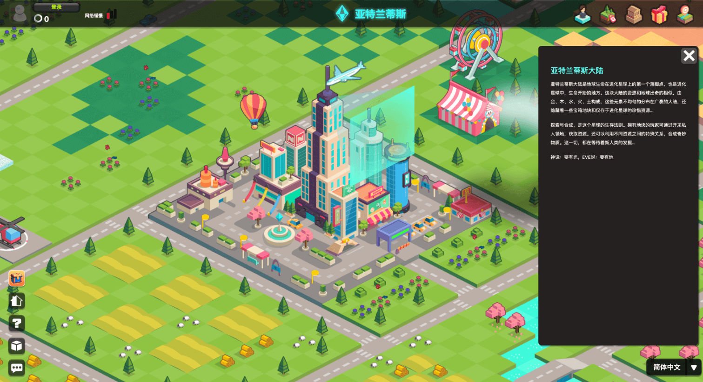
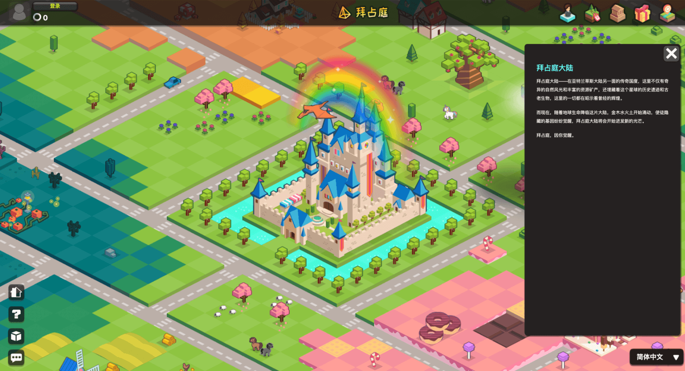
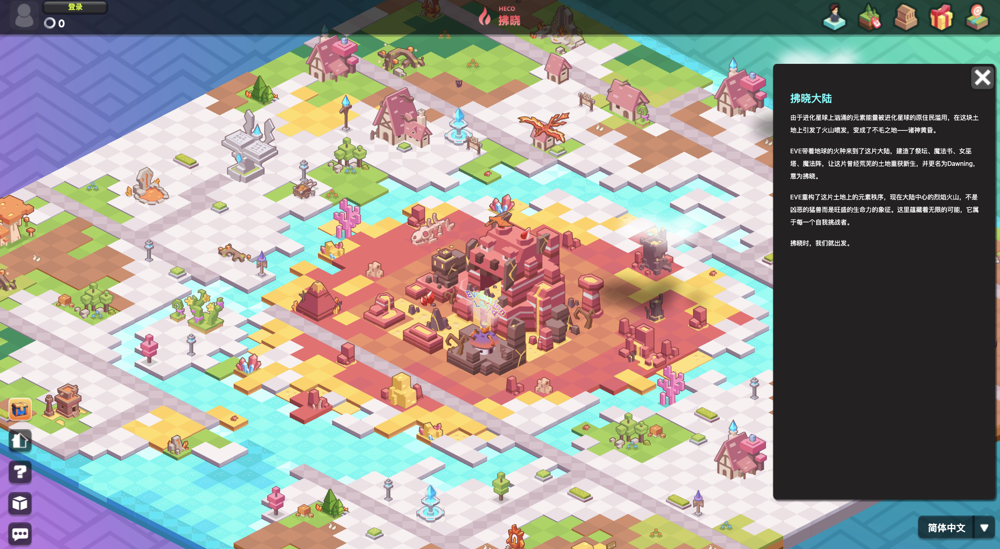

# 大陆

## 什么是大陆？

进化星球逻辑上分成 26 块大陆，每一块大陆部署在不同的区块链网络上。大陆一块一块推出，目前已经有 3 块大陆：**亚特兰蒂斯大陆**（部署于以太坊网络），**拜占庭大陆**（部署于波场网络）和 **拂晓大陆**（部署于火币生态链）。每个大陆约有 2025 个[地块](land.md)，地块蕴藏的资源总储量在大陆形成时随机确定，随后不变。

## 大陆

每个大陆大陆总共有 2025 个地块。

这块大陆的资源和地球出奇的相似，由金、木、水、火、土构成，这些元素不均匀的分布在广袤的大陆，还隐藏着一些宝箱地块和仅存于进化星球的珍惜资源。探索与合成，是这个星球的生存法则。拥有地块的玩家可通过开采私人领地，获取资源。还可以利用不同资源之间的特殊关系，合成奇妙物质。这一切，都在等待着新人类的发掘。

大陆是各自独立但又相互关联的经济实体，有点像现代国家。游戏中，货币通证、资源和道具会作为跨境贸易在各大洲之间流通，大陆治理委员可能会因此收取大陆间的贸易关税。这种跨境交易在技术上其实是跨链交易，进化星球将依靠达尔文网络的异构跨链桥来实现这一点。

要访问各大陆，你需要配备合适的工具箱，例如支持该大陆底层区块链环境的钱包等。

大陆将逐一部署。目前已有两个大陆，分别是：

* [**亚特兰蒂斯**](https://www.evolution.land/land/1)（以太坊）
* [**拜占庭**](https://www.evolution.land/land/2)（波场）
* [**拂晓**](https://www.evolution.land/land/2)（火币生态链） 

新大陆正在不断开发中。以下是我们根据**用户基数**，**DApp 繁荣程度**，**智能合约兼容性**以及**燃料费**评估出的候选区块链。

* Binance Smart Chain
* Darwinia Crab Network
* Darwinia Network
* Polygon
* Solana
* Avalanche

如有适合部署大陆的优秀公共区块链项目，请联系我们。

