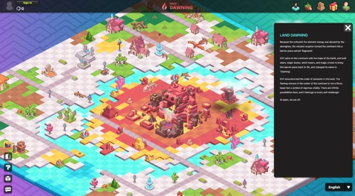

# Continent

Evolution Land is logically divided into 26 continents, each of which is deployed on a different blockchain. Each continent will have around 2025 [lands](land.md). Total resource reserves are determined randomly when a continent is created and will not change afterward.

Continents will evolve into a separate but related economic entity, somewhat like countries. In-game currency tokens, resources, and props shall be moved between continents as inter-continent trade, although the continent governance council may charge inter-continent trade tariffs. This inter-continent transaction is technically cross-chain transactions. Evolution Land will rely on Darwinia Network's Heterogeneous Cross Chain bridges to accomplish this.

To access each continent, you will need a proper toolset, such as wallets supporting the continent's underlying blockchain environment.

The continents will be launched one by one. Four continents exist today, they are:

* **the** [**Atlantis**](https://www.evolution.land/land/1) (Ethereum)&#x20;
* **the** [**Byzantine**](https://www.evolution.land/land/2) (TRON)&#x20;
* **the** [**Dawning**](http://www.evolution.land/land/4) (Heco)
* **the** [**Eden**](http://www.evolution.land/land/5) **** (Polygon)

New continents are being planned. These are the candidate blockchains that we are evaluating according to their **user base**, **dapp prosperity**, **smart contract compatibility,** and **gas fee**.

* Binance Smart Chain
* Darwinia Crab Network
* Darwinia Network
* Polygon
* Solana
* Avalanche

If you have an excellent public blockchain you think suitable to host another continent, let us know.
