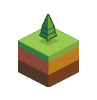
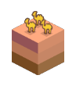
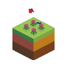
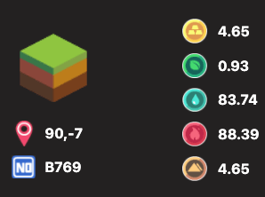
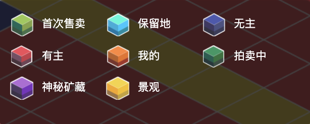

# 土地

     

每个地块的大小为 100m x 100m，高度没有限制（假设也是100m）。那么每个陆地都是一个三维的欧几里德空间。玩家可以在地块上建造建筑。建筑是由若干个 1m x 1m 的基本单元「方块」组成。

每个地块上只能放下不超过其尺寸的建筑。地块上可以放多个建筑, 只要任意两个建筑之间没有重叠，并且可以通过平移来分隔开。

地块下有 5 种可开采的[资源](resource/)，可开采量用最大资源衰减率（MRAR）表示。这意味着在全速状态下，每天可以开采的资源量达到最大。这种资源每天以大约 1/10000 的速度自然衰减。

在上示的地块详情页中, `90,-7` 是这个地块的坐标， `B769` 代表 B 大陆（拜占庭）, `地块 id` 是 `769`。

在右侧，列出了五个资源 MRAR，分别是[金](resource/)、[木](resource/)、[水](resource/)、[火](resource/)、[土](resource/)。储量越高，越容易开采，可挖上限也就越高。

## 所有权

地块其实相当于一个 NFT（非同质化通证，ERC721）。当你购买地块时，地块 NFT 将从市场转到你的钱包地址中（比如智能合约拍卖）。

交易完成后，你是这片土地的唯一拥有者。你可以把地块给其他玩家，作为礼物，或作为第三方交换。所有这些操作都需要在你的许可下在钱包进行操作。

## 挖矿工具

从 DeFi 用户的角度来看，每一个地块都是一个拥有独特储量的采矿池，玩家通过部署使徒和开采设备来挖掘尽可能多的资源。

你得到的回报就是资源。资源除了可以交易，同时也是其他玩家在打造装备或进行建造活动中所需的资源，可用于方方面面，具有很高的价值。

## 切换陆地景观

在地图的左下方有一个 `？` 图标，点击即可切换陆地景观。

## 每块大陆上有多少地块土地？

每块大陆上土地数量不一，大致是 2000 块左右。少量土地有官方保留用以今后的重要商务合作。其他的地块通过荷兰式拍卖发售。

## 地块有什么用？

矿藏资源埋藏在地块之下，你需要地块来进行开采。目前 v1 版本你还可以在地块上上传图片来做点广告。大陆边缘的地块将来还将承担港口职能。

## 地块上的矿藏是无限的么？

不是。每块地块上蕴含的矿藏数量是确定的，而且是以极慢的速度（每日万分之一）自然耗损。地块上元素旁显示的数字是当前资源最大开采率，也就是每天能采集的最高产量。

## 地块不同的颜色代表着什么？

目前亚特兰蒂斯大陆地块有 7 个种类，以不同颜色表示： 

**首次售卖**（浅绿色）：拍卖中的创世地块，由官方成功上架的地块，玩家可出价参与竞拍。

**保留地**（天蓝色）：官方预留的地块及特殊地形地块。

**无主**（墨蓝色）：未上架的地块，待官方开放拍卖。

**有主**（红色）：玩家拍得的地块，或拍得后尚未领取的地块，该颜色地块不参与竞拍。

**我的**（橙色）：自己成功拍得，并已领取的地块。

**拍卖中**（深绿色）：拍卖中的二手地块，由地块主人成功上架的地块，玩家可出价参与竞拍。

**神秘矿藏**（紫色）：地块的元素处于隐藏状态，在玩家拍得之后才会公开。玩家很有可能用普通地块的价格购买到元素产量媲美保留地的地块哦～

**景观**（黄色）：由马路，湖泊，植物，建筑物等构成的地块，无法进行买卖。

## 什么是神秘地块/保留地块？

**神秘地块：**在地图上显示为紫色的地块即为神秘地块，该种类地块的元素处于隐藏状态，在玩家拍得之后才会公开。玩家有可能用普通地块的价格购买到元素产量媲美保留地的地块。

**保留地块：**亚特兰蒂斯大陆中心部分的 99 块地将作为保留地，为进化星球官方预留，后期会用于商业合作，或者开放拍卖，需要使用 KTON 购买。

## v1 版本如何分辨创世地块和二手地块？

（注意：有一些调皮的玩家会上传特殊图片，混淆地块属性，要擦亮眼睛哦）

* 最简单的分辩方式为根据颜色辨认。
* 有些调皮的玩家会上传与创世地块一样的图片，此时要分辨创世地块和二手地块可以点击地块，查看地块详情，如果看到此时的地块所有者是 EVE，同时该地块没有交易记录，那么它就是「真·创世地块」。

## 如何购买地块？

1. 点击正在拍卖中的地块
2. 出价
3. 签名确认（支持 Metamask / TronLink / Itering ID / imToken / 麦子钱包）
4. 出价成功（30 分钟后无人继续竞拍）
5. 购买成功

注：购买成功后，可在「我的地块」>>「未领取」中查看并领取。

**教程**

* 亚特兰蒂斯大陆（以太坊网络）：[如何购买/出售/赠送地块](/tutorials/atlantis-ethereum/how-to-buy-sell-gift-lands-and-related-operations.md)

* 拜占庭大陆（波场网络）：[如何购买/出售/赠送地块](/tutorials/byzantine-tron/how-to-buy-sell-gift-lands-and-related-operations.md)

