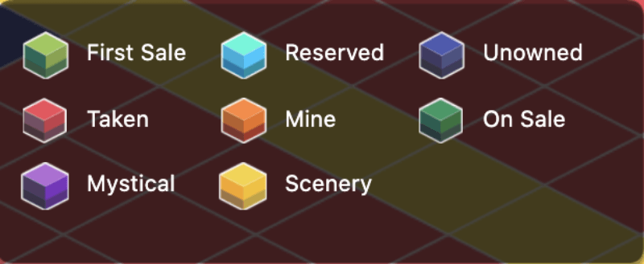

# 土地

     

The size of each land is 100m x 100m, and there is no limit on the height \(assuming it is also 100m\). Then each land is a three-dimensional Euclidean Space. In this land space, the player can construct buildings. The building is made up of a number of basic units called “square blocks”, each of which is 1m x 1m. Each land can only be placed in a building that does not exceed its size. Multiple buildings can be placed on the top of the block, as long as there is no overlapping area between any two of them, and can be separated by smooth movement.

LAND has five [resource](resource/) reserves that can be mined indicated as a number called Max Resource Attenuation Rate\(MRAR\). It means at full speed, the max amount of resources can be mined daily. The resource decays daily at a rate of about 1/10,000 every day.

In the Land diagram above, `90,-7` are the coordinates of this land, `B769` stands for continent B \(Byzantine\), `land id` is `769`. On the right side, fives resource MRAR is listed. They are [GOLD](resource/), [WOOD](resource/), [HHO](resource/), [FIRE](resource/), [SIOO](resource/). The higher the reserve, the easier you can mine, and the higher the ceiling you might reach.

## Ownership

The Land is an NFT \(non-fungible token, ERC721\). When you purchased a Land, the Land NFT token is transferred to your wallet address from the marketplace \(a smart-contract auction, for example\). From now on, you are the sole owner of this Land. You can transfer it to another player as a gift or a third-party exchange. All these actions need to be initiated from your wallet with your permission.

## Mining Pool

From the perspective of a DeFi user, each Land is a mining pool with a unique reserve. You work on it by deploying Apostles, Equipment to mine as many resources from it. The reward you get is resources. Apart from trading those resources, they are useful and demanded by other game players who need them to forge pieces of equipment or construct buildings.

## Switch Land Views

At the left bottom of the map, there's an `question mark` icon that allows you to switch the land view.

## 每块大陆上有多少地块土地？

每块大陆上土地数量不一，大致是2000块左右。少量土地有官方保留用以今后的重要商务合作。其他的地块通过荷兰式拍卖发售。

## 地块有什么用？

矿藏资源埋藏在地块之下，你需要地块来进行开采。~~目前你还可以在地块上上传图片来做点广告~~。大陆边缘的大陆将来还将承担港口职能。

## 地块上的矿藏是无限的么？

不是。每块地块上蕴含的矿藏数量是确定的，而且是以极慢的速度（每日万分之一）自然耗损。地块上元素旁显示的数字是当前资源最大开采率，也就是每天能采集的最高产量。

## 地块不同的颜色代表着什么？

目前亚特兰蒂斯大陆地块有7个种类，以不同颜色表示： 

* **保留地**（天蓝色）：官方预留的地块及特殊地形地块。
* **无主**（墨蓝色）：未上架的地块，待官方开放拍卖。
* **有主**（红色）：玩家拍得的地块，或拍得后尚未领取的地块，该颜色地块不参与竞拍。
* **我的**（橙色）：自己成功拍得，并已领取的地块。
* **神秘矿藏**（紫色）：地块的元素处于隐藏状态，在玩家拍得之后才会公开。玩家很有可能用普通地块的价格购买到元素产量媲美保留地的地块哦～
* **拍卖中的二手地块**（深绿色）：由地块主人成功上架的地块，玩家可出价参与竞拍。
* **拍卖中的创世地块**（浅绿色）：由官方成功上架的地块，玩家可出价参与竞拍。
* **景观**（黄色）：由马路，湖泊，植物，建筑物等构成的地块，无法进行买卖。

## 什么是神秘地块/保留地块？

* **神秘地块：**在地图上显示为紫色的地块即为神秘地块，该种类地块的元素处于隐藏状态，在玩家拍得之后才会公开。玩家有可能用普通地块的价格购买到元素产量媲美保留地的地块。
* **保留地块：**亚特兰蒂斯大陆中心部分的99块地将作为保留地，为进化星球官方预留，后期会用于商业合作，或者开放拍卖，需要使用KTON购买。

## ~~如何分辨创世地块和二手地块？~~

~~（注意：有一些调皮的玩家会上传特殊图片，混淆地块属性，要擦亮眼睛哦）~~

* ~~最简单的分辩方式为根据颜色辨认。~~
* ~~有些调皮的玩家会上传与创世地块一样的图片，此时要分辨创世地块和二手地块可以点击地块，查看地块详情，如果看到此时的地块所有者是EVE同时该地块没有交易记录，那么它就是“真·创世地块”。~~

## 如何购买地块？

点击正在拍卖中的地块——出价——签名确认（支持Metamask/TronLink/Itering ID/imToken/麦子钱包）——出价成功30分钟后无人继续竞拍——购买成功

注：购买成功后，可在「我的地块」&gt;&gt;「未领取」中查看并领取。

亚特兰蒂斯大陆（以太坊网络）：[如何购买/出售/赠送地块](/tutorials/atlantis-ethereum/how-to-buy-sell-gift-lands-and-related-operations.md)

拜占庭大陆（波场网络）：[如何购买/出售/赠送地块](/tutorials/byzantine-tron/how-to-buy-sell-gift-lands-and-related-operations.md)

