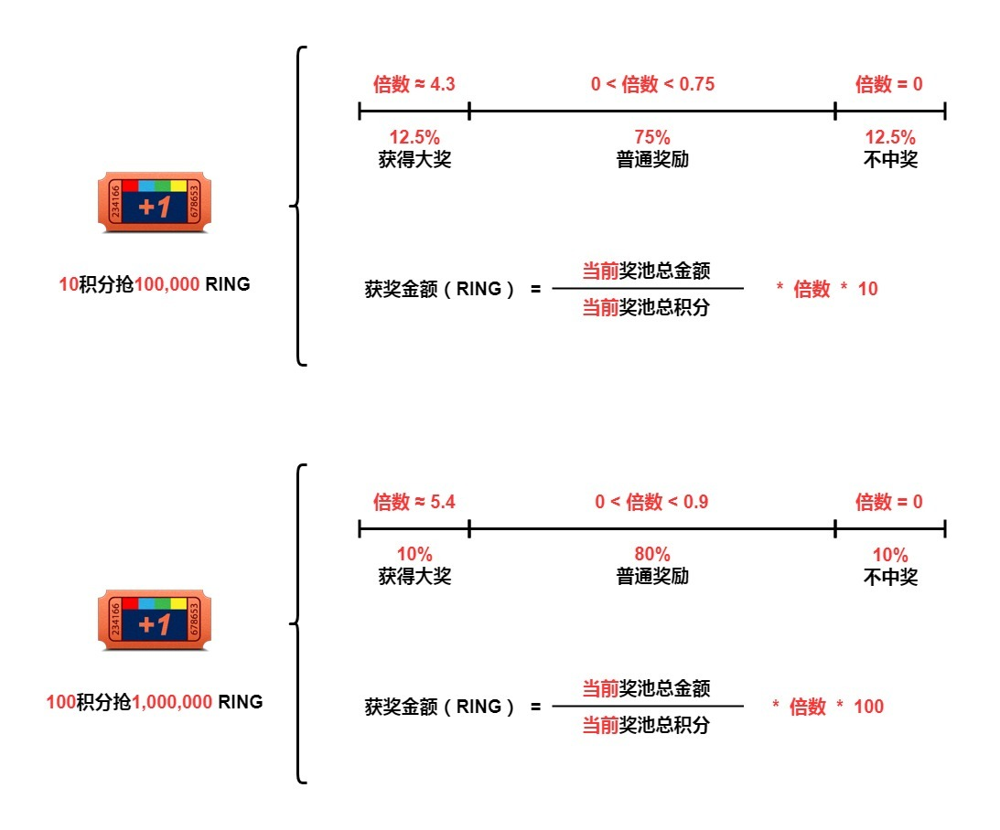

# 积分和抽奖

游戏收入的 10% 将注入到[交易奖励池](../../advanced/evolution-land-dao/revenue-model.md#trading-reward-pool)，用于奖励在游戏内参与消费的玩家。

当一个玩家进行消费（形式为 RING），游戏净收入的一部分会流向奖励池。玩家根据花费的 RING 数按 1:1 的比例获得相应的积分点数。也就是说，当一个玩家为系统收入贡献了 10 个 RING，便得到 10 个积分。玩家可以用积分进行抽奖。

## 抽奖中奖概率

参与抽奖，大部分情况下都能获得奖励。你可以选择消耗 10 积分或 100 积分参与抽奖。但只有下注 100 积分才有可能获得大奖。

查看下图了解详细的中奖几率。

抽奖玩法的“庄家上风”性质，让玩法变得可持续，这意味着每一次抽奖的预期利润是负的。玩家可以把它当作一种娱乐方式，类似于消费之后得到一个变量的现金退款。

