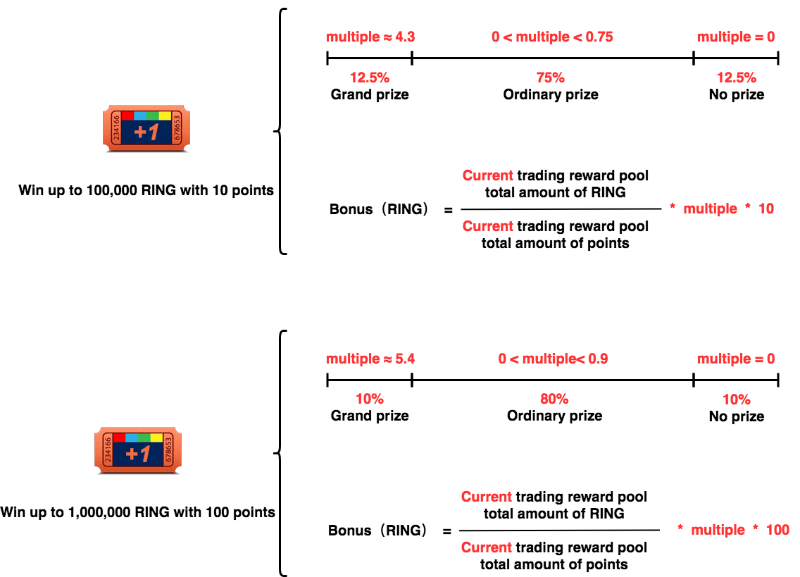

# Points & Lottery

10% of game revenue goes to the "[Trading Reward Pool](/advanced/evolution-land-dao/revenue-model.md#trading-reward-pool)", this money is used to reward those spenders. When a player spends some money \(in the form of RING token\), a portion of the net revenue goes to the pool. The player gets some Points according to the amount he spends on a 1:1 basis. Therefore, he contributes 10 RINGs to the system revenue; he gets 10 Points. Using these Points, he can participate in the Lottery.

## Lottery Winning Probability

Participate in the lottery will reward you most of the time. Every time you can either bet 10 Points or 100 Points. Only betting 100 Points may award you the grand prize.

Check out the charts below for detailed paying odds.

The lottery gameplay has a house edge to make it sustainable, which means each bet's expectation profit is negative. Treat it as gameplay for fun, and it's a kind of cash refund for your spending, with a variable refund amount.

