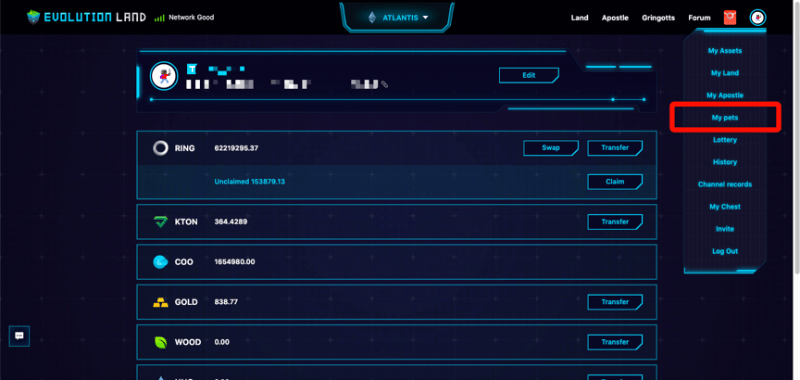
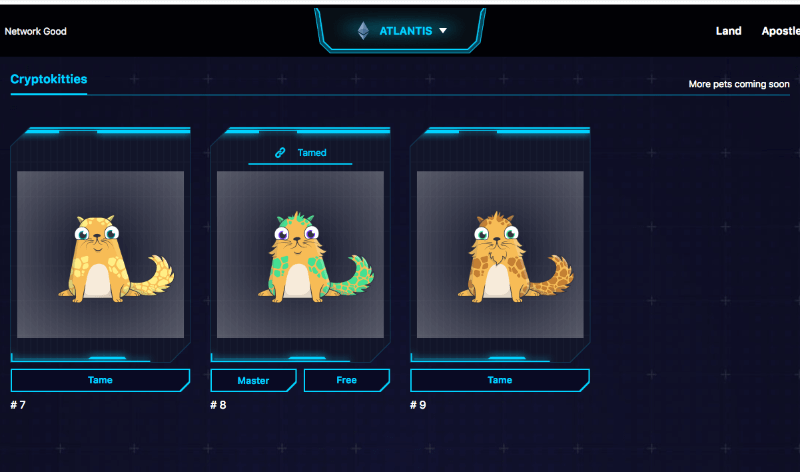
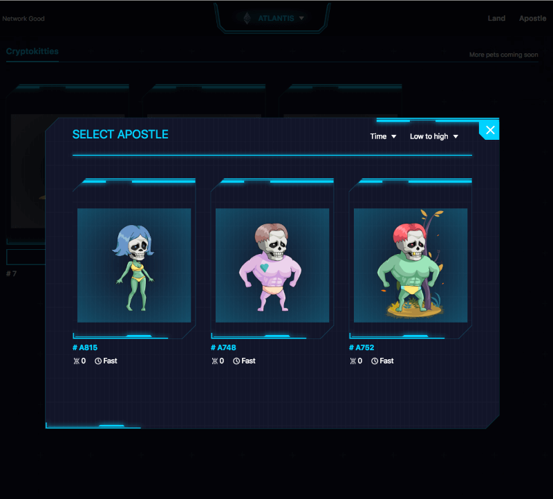
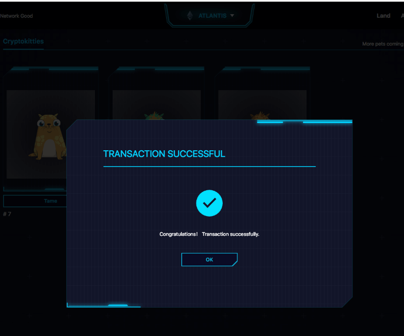
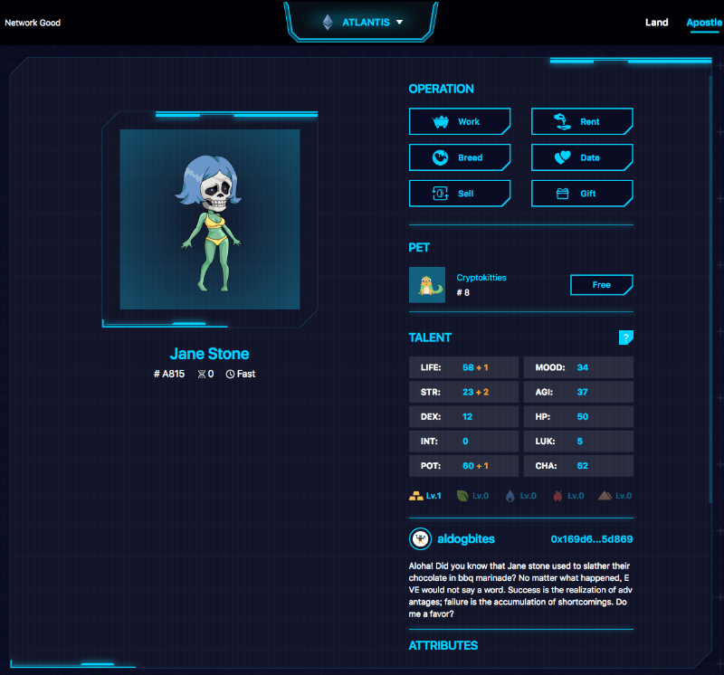

# Pet

## What is Pet?

EvolutionLand introduces a feature called "Pet." It allows the Player to import ERC721 assets in foreign dApps into EvolutionLand as "Pet." The Player can use his Apostle to tame Pet. The Pet will be bound with the Apostle physically and spiritually to enhance Apostle's ability in various activities. Right now, the Apostle's mining ability will be enhanced. In future releases, Apostles' fighting skills, healing skills, etc., will be improved by carrying a pet.

The very first Pet will be from CryptoKitties. More ERC721 sources will be added so that players have more choices. Player go to "My Pets" section, and only CryptoKitties owned by Player's address will be displayed, and the Player can perform further "Tame" action. Tame, in a technical sense, is that the Player signs a transaction in which a mirror Crypto Kitty is generated and bind to the Player's Apostle at choice. This process verifies Player who signs the Tx is the Crypto Kitty's owner. It means you won't be able to tame other people's kitties.

EvolutionLand contract system will operate on this mirrored kitty instead of the original kitty except in one situation: if the Player is going to sell, it's reflected kitty using an auction. EvolutionLand will require the Player to transfer ownership of the original kitty to an auction contract to prevent mirrored, and the original kitty ends up with a different owner. Selling/buying Pet is not enabled and will be introduced at a later time.

The Player also can "let go" the bound Pet to revert the operation or simply trying to re-tame using a different Apostle.

## How to Tame a Pet？

Below are simple screenshots of how to using the "Pet" system.

Select "My Pets" from menu to access

Select Pet Source and Kitty. Only kitties owned by player's signed in address will be shown. Click on the kitty to tame.

Select a Apostle Master to bound the selected kitty to.

Waiting for transaction to be confirmed

Kitty Tamed! Kitty's status is updated.

Apostle with Pet in list view.

Apostle with Pet in detail view.

Mining Ability Enhanced. Apostle with pet has better minging output than without.

