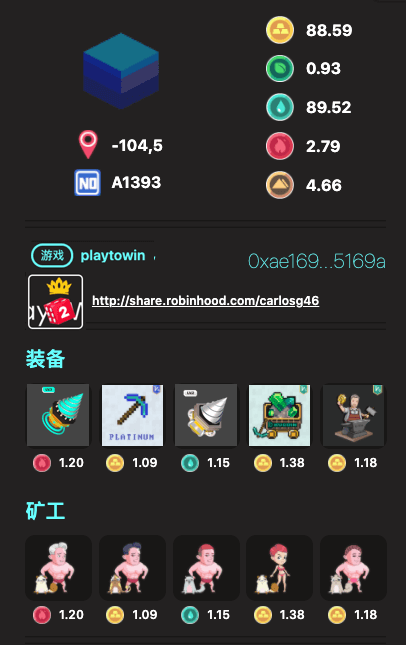

# 资源

**进化星球有五种基本元素：金（GOLD）、木 \(WOOD\)、水 \(HHO\)、火 \(FIRE\)、土 \(SIOO\)。**

进化星球的每块地块都会不停的产出这些元素。

但是由于地块属性不同，各种元素的产出速率和数量不同：靠近矿山的产生金多一些，靠近森林的产生木多一些，靠近河流的产生水多一些，靠近火山的产生火多一些，靠近山的产生土多一些。

多一些的含义是产生速度相对快，也是总量的相对多。

这五种元素也是五种代币，在地上盖房子，建道具需要消耗金木水火土中的一种或几种，不同的道具五元素的配比不同。

通过将基本元素通过一定数量的配比可合成更高级的复合物，复合物组合可以生成更高级的复合物。高级道具的制作及使用需要同等级难度的元素。随着游戏的深入，可以引入更多的基本元素以及相应的组合图谱。 

# Resource

There are five primary resources on Evolution Land: **GOLD, WOOD, HHO, FIRE, and SIOO**. These resources are deep under the Lands. Each Land has random resource reservers that decay at a rate of 1/10,000 daily as time goes by.

Resource reserves follow the continent terrain layout. That is, Lands close to X terrain will have better odds to have rich Y:

* Mine: GOLD
* Forest: WOOD
* River: HHO
* Volcano: FIRE
* Mountain: SIOO

## Resource Attenuation Rate

Resources will be released using a model of attenuation supply with random factors. Resource release will be determined by the Land's attributes \(the five resources' release rate\) and the player's mining indicators. The initial maximum rate of resource generation at the Land's birth is the full resources you can mine daily. This rate decays by 1/10,000 every day.

If the collecting rate or mining power is less than the current release rate of the resource from the Land, the un-mined resources will vanish, never be mined. It's like being burned on the other perspective.

Check out a detailed explanation about [Resource Attenuation Rate](attenuation.md).

## Mining

You can mine resources by deploying the Apostles or mining Equipment such as DRILLs to the land. The mining productivity depends on the number and quality of the Apostles and/or Equipment.

## Usage

The five primary resources are the fundamental elements for building complex substance in Evolution Land. Buildings, Equipment, and other props will require resources or sometimes resource LP \(Liquidity Provider\) tokens to make or mint.

When breeding a new Apostle, you have the chance to add/feed resource to the baby so that it might have resource specialty when born. When Apostles have resource specialty, they have extra power when dealing with specific resources, such as mining that type of resource or waving weapons mint with that type of resource.

These five resources are also five tokens. Building a house or props will consume one or several kinds of these five resources.

## Specifications

Check out [resource token specifications](../../tokens/resource.md).

