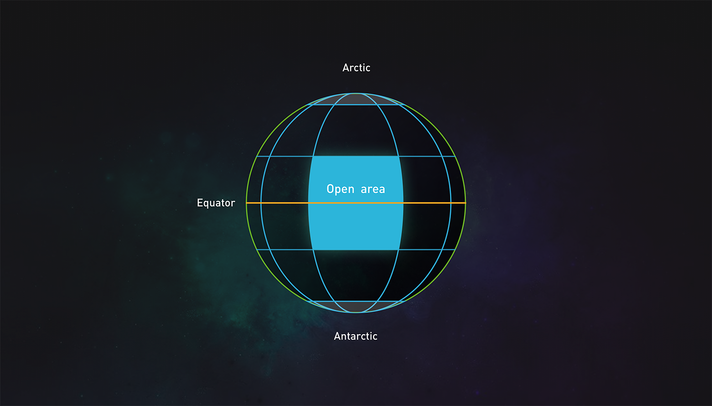

# 世界

进化星球是宇宙行星之一，其半径为 5279.58 米，赤道为 3.6 万米，气候条件与地球相似。进化星球上有河流、陆地、山谷、平原和各种各样的地貌。

简图和地图摘要：进化星球上共有 26 块[大陆](continent.md)，其中的 24 个大陆包含 2025（即 45 x 45）个[地块](land.md)，两个特殊的大洲包含 7921（22 x 360 + 1）个地块，每个陆地为 100 m x 100 m。平面坐标为（x, y）的陆地可对应纬度和经度\(except latitude x, longitude y, north and south poles, no flat surface coordinates\).

当部 26 个大陆全部完成部署，则地块总数为 360 ×（135+44）+ 2 = 64442。由于地貌因素的存在，可拍卖土地的数量将少于土地本身的总数量。

各大陆的编号由两种方式确定，一种方法是按照地理位置的顺序，从北到南，从西到东，编号为1 - 26。另一种编号方式是根据大陆开放的时间先后使用 A - Z 的字母表顺序进行编号。

