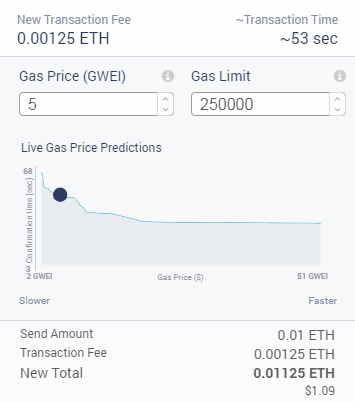
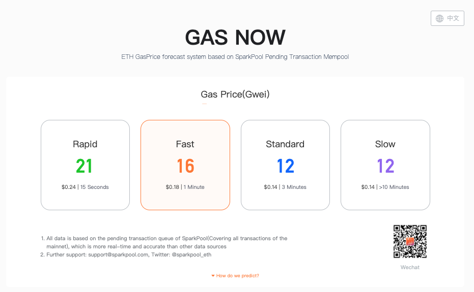

# 燃料费 Gas

当你想要出价购买土地、进行使徒繁育，或者想要创建一笔拍卖时，你发起的请求会被发送给区块链网络上进行计算和交易确认工作的矿工（感谢矿工的辛勤工作！）发起交易请求的用户需要为矿工的服务支付手续费（请注意，所有的手续费都是支付给矿工的而非项目方）。这笔费用，有时候显示为「Tx fee」，其具体金额是由交易的「Gas Price」和执行操作消耗的「Gas Limit」这两个因素决定的。

Gas Price \(Gwei\) 是指为了让矿工打包该笔交易，用户愿意为每个 Gas 支付的价格（ETH 的数量）。一般 Gas Price 的单位为 Gwei，1 ETH = 1,000,000,000 Gwei，所以将 Gwei 转换为 ETH 是很简单的，只需要将 Gwei 数值的小数点向左移动 9 位。例如：5 Gwei = 0.000000005 ETH。

Gas Limit 是指用户愿意为执行确认交易操作支付的最大 Gas 数量。基本上，Gas Limit 是为你在给定交易中花费多少 Gas 设定一个上限，以保证合理的手续费。

## 我应该付多少 Gas 费?

Gas Price 高低的设定取决于用户本人——氪金战士请随意。对于普通玩家来说，设定的 Gas Price 越高，交易处理得越快。因此，对于重要的交易，建议可以将 Gas Price 体设定得高一点。比如，假设你在竞拍一块资源储量不错的土地，又担心被其他玩家横刀夺爱，可以选择把 Gas Price 调高，以加快交易确认的时间。如果只是想进行使徒繁育，你也可以选择把 Gas Price 调低一些，但交易确认所需时间会更长。

[Gas Now](https://gasnow.org) 是一个可以帮助你手动设定 Gas Price 的工具。使用 Gas Now 推荐的「Gas Pride Standara」，可以确保交易确认能够快速完成（通常是几分钟）。对于那些你愿意等待的重要性较低的交易，可以选择「Gas Price Slow」（通常在 10 分钟左右，取决于网络流量）。Gas Now 还能够显示在特定的 Gas Price 下，一笔交易确认大约需要花多长时间，让你可以根据自身的需求时间来调整 Gas Price。

请注意，你实际支付的交易燃料费（即手续费）一般都会低于预测最高值，这很棒！ 一旦矿工打包你的交易，Gas Limit 中未被消耗的 ETH 将退还给你（不会被收取）。但是如果你的 Gas Limit 设置的太低，矿工需要消耗的费用超过你的设定值，你的交易会被取消，同时之前设置的燃料费不会被退还，这就不太令人愉快了。鉴于以上情况，请确保选择一个充足的 Gas Limit 来保证你的交易能够顺进行。记住，MetaMask 会始终根据当时的网络情况建议一个合理的燃料费，所以没有特殊需求不建议调整默认的燃料费。

