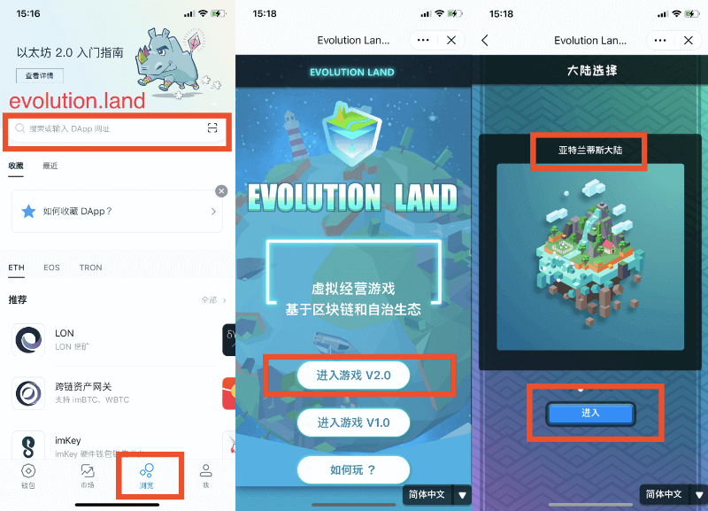
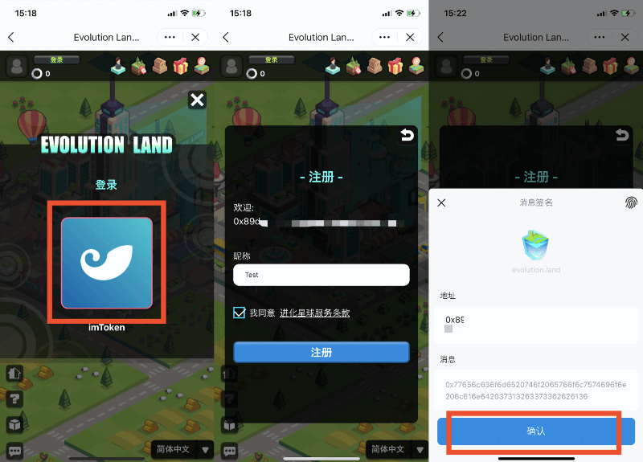
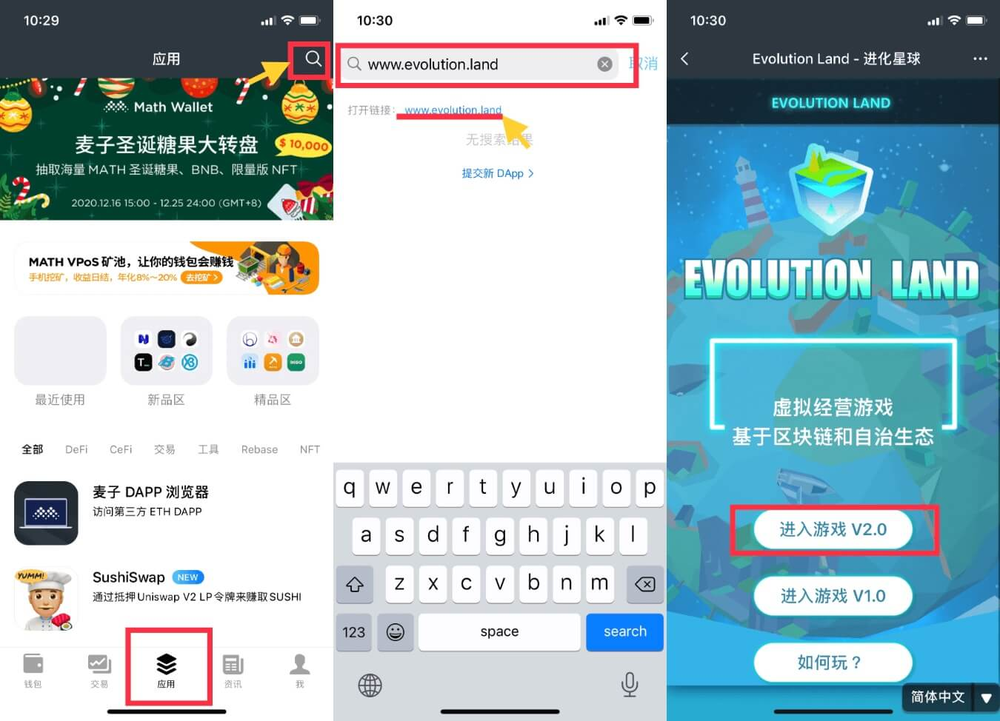
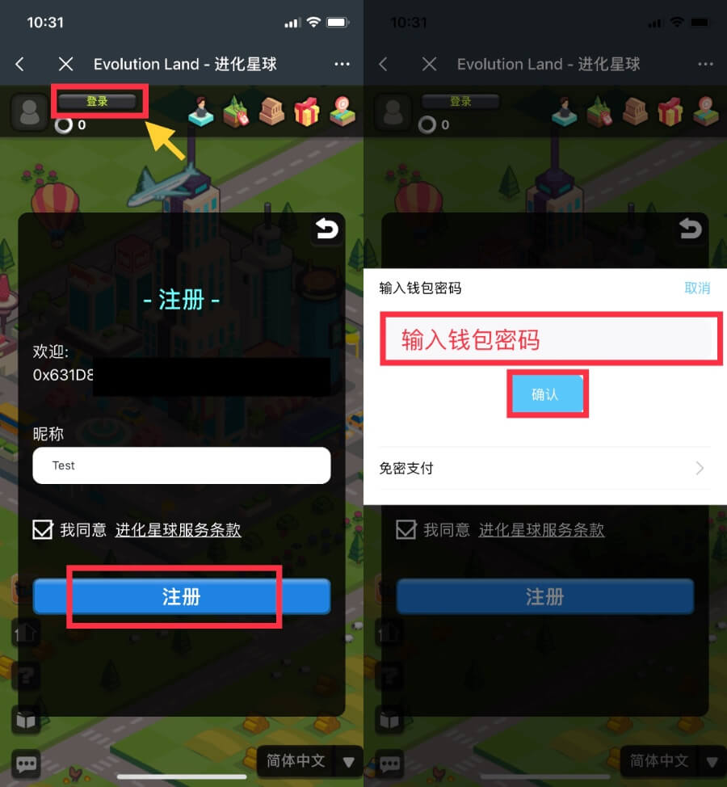

# 怎样注册进化星球？

进化星球的 D 大陆，即拂晓大陆，是构建在火币生态链上的。火币通证，即 HT，是进化星球拂晓大陆（D大陆）使用的数字货币，以太币和任何其他货币一样，其价值随市场波动。

玩家需要将货币（美元、加元、英镑等）兑换为 HT，以在火币生态链上支付燃料费用——如购买 RING、购买土地等操作。

玩家不可以直接使用法定货币购买 RING 或进化星球其他资产——货币需要先被兑换为 HT。（在火币等场外交易所玩家之间可以进行发币和 RING 等数字货币的交易）

玩家可以通过火币交易所将 RING 直接提现至 Heco 地址，或者玩家可以从支持购买加密货币的钱包或交易所购买 HT，然后将 HT 从交易所转入注册进化星球的钱包地址。

注册进化星球 Dawning 大陆有两种方式，分为网页端和手机端。请选择自己喜欢和合适的方式进行注册。

## 网页端：使用 MetaMask 注册

**用谷歌/火狐浏览器下载 MetaMask，并创建一个火币钱包地址。**

* MetaMask 是一款加密数字钱包。
* 钱包使用的教学文档可参考：[https://www.hecochain.com/zh-cn/wallet](https://www.hecochain.com/zh-cn/wallet)
* **用 MetaMask 登录希望注册进化星球的地址，在进化星球首页点击注册，选择 MetaMask，在 MetaMask 中进行签名。**

  MetaMask 正常会弹出确认弹窗，若未自动弹出，请注意小狐狸头像上是否出现数字，若出现数字请点击查看。

* **完成授权签名后即注册成功。**

  此时玩家需要向注册的地址中打入一定的 HT 就可以正式踏入进化星球的土地，开始神奇旅程。

  参与游戏中的土地拍卖、积分抽奖等交易均需要授权与签名，在 MetaMask 弹窗中授权签名即可（链上交易将花费少量 HT 作为 Gas）。

## 手机端方法一：使用 imToken 进行注册

1. 下载并注册 imToken 2.0 钱包
   * imToken 2.0 钱包[下载地址](https://token.im/)​
   * imToken 2.0 钱包[注册教程](https://zhuanlan.zhihu.com/p/42128796)
2. 在 imToken 2.0 钱包内注册进化星球步骤，如下图所示

## 手机端方法二：使用麦子钱包进行注册

麦子钱包下载地址：[http://www.mathwallet.org/cn/](http://www.mathwallet.org/cn/)

在麦子钱包的主界面，点击屏幕下方「应用」，然后在搜索栏搜索「进化星球」或输入网址 www.evolution.land，选择「进入游戏 v2.0」，选择「拂晓大陆」。

点击左上角的「登录」进行注册，按照提示输入您的昵称。之后输入您的钱包密码，点击「确认」，即注册成功。

