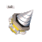
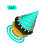

# 通证

Evolution Land is a wonderland full of tokens. All properties are represented by tokens owned by players. They are categorized into two groups:

* **FT** \(fungible tokens aka. ERC20/TRC20\) 
* **NFT** \(non-fungible tokens aka. ERC721/TRC721\).

## FT \(Fungible Tokens\)

| Token Icon | Token Name |
| :---: | :--- |
|  | [RING](ring.md) |
|  | [KTON](kton.md) |
|  | [GOLD](resource.md) |
|  | [WOOD](resource.md) |
|  | [HHO](resource.md) |
|  | [FIRE](resource.md) |
|  | [SIOO](resource.md) |

## NFT \(Non-Fungible Tokens\)

Below are some sample categories of NFTs.

| Token Icon | NFT Class |
| :---: | :--- |
|  | [LAND](../game-entities/land.md) |
|  | [APOSTLE](../game-entities/apostle/) |
|  | [APOSTLE](../game-entities/apostle/) |
|  | DRILL lv1 |
|  | DRILL lv2 |
|  | DRILL lv3 |

