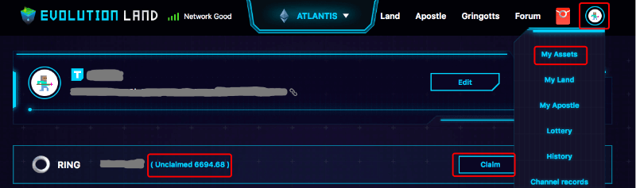

# RING

## Usage

In Evolution Land, RING is used as currency to pay for service fees, trading taxes. Likewise, trading various resources, lands, buildings, and props will also use the RING as the accounting unit. Game revenue sharing is also distributed in RING. In short, the RING is the money; players use it to pay for services and taxes, buy goods, and receive payroll.

## Background of RING 

RING is the native token of the Darwinia Network. Evolution Land, as the flagship dApp, is using RING as an in-game currency. RING resides in various blockchain networks in different token specifications. On Ethereum, RING follows ERC20 spec, on TRON, RING follows TRX20 spec, and on Darwinia Network, RING stays as a native token. The initial supply of RING is 2 billion (all RING on various blockchain network sum up). Due to the Darwinia Network's nature being a cross-chain bridge hub chain, RING and other tokens can move between blockchains in a decentralized fashion.  Check out this doc for [more information](https://docs.darwinia.network/docs/en/wiki-us-tokens) about RING on Darwinia Network's documentation site.

RING is inflated at a rate of around 5% by the Darwinia Network to pay validators and nominators for validating and producing blocks. RING has a hard cap of 10 billion to be reached in 50 years at the current rate. 

## RING Specification

- Ethereum (the Atlantis Continent)
  - Spec: `ERC20`
  - Precision: `18`
  - Smart Contract Address (Ethereum): `0x9469d013805bffb7d3debe5e7839237e535ec483`
- Tron
  - Spec: `TRC20`
  - Precision: `18`
  - Smart Contract Address (Tron): `TL175uyihLqQD656aFx3uhHYe1tyGkmXaW`
- Darwinia Mainnet
  - Spec: Native
  - Precision: 9
  - Smart Contract Address: n/a

## FAQ

### IS RING on different continents universal?

Yes, RING on various blockchain networks is of the same value. They are all backed by native token on Darwinia Network. Using Darwinia Network's decentralized bridge (Cryptocurrency Backing Model), native RING can go over the bridge to other blockchain networks and back. Due to the progressive release of the bridges between blockchains, the current landscape is as following:

- Ethereum -> Darwinia Network Bridge: Open
- Darwinia Network -> Ethereum Bridge: Soon
- Ethereum <-> Tron Bi-directional Bridge: Open (PoA model)

### How to buy/sell RING?

You can buy or sell RING through these channels:

#### Gringott Bank

Gringott Bank is the in-game bank that allows you to buy or sell RING using the network's native token, such as ETH or TRX, according to the continent you are on, whether it's Atlantis (ETH) or Byzantine (TRX). Behind the scene, Gringott Bank links to a liquidity pool, Uniswap (Atlantis) and Justswap (Byzantine), to provide the liquidity.

- [Gringott Bank on the Atlantis Continent (Ethereum)](https://www.evolution.land/land/1/bank/buy-ring)
- [Gringott Bank on the Byzantine Continent (Tron)](https://www.evolution.land/land/2/bank/buy-ring)

#### DEX

DEX stands for Decentralized Exchange, you can use your cryptocurrency wallet to buy or sell directly.  

On Atlantis Continent (Ethereum):

- Uniswap(v2): [RING/ETH](https://info.uniswap.org/token/0x9469d013805bffb7d3debe5e7839237e535ec483)
- 1inch Exchange: [RING/ETH](https://1inch.exchange/#/RING/ETH)

On the Byzantine Continent (Tron):

- Justswap: [RING/TRX](https://justswap.io/#/scan/detail/trx/TL175uyihLqQD656aFx3uhHYe1tyGkmXaW)

#### CEX

CEX stands for Centralized Exchnge.  You can also buy or sell RING at many CEX, the following list shows a few, you can check out [coinmarketcap](https://coinmarketcap.com/currencies/darwinia-network/markets/) for more information.

- [Huobi Global](https://www.hbg.com/en-us/exchange/ring_usdt)
- [BKEX](https://www.bkex.com/trade/RING_USDT)
- [MXC.com](https://www.mxc.com/trade/easy#RING_USDT)
- [Hotbit](https://www.hotbit.io/exchange?symbol=RING_USDT)
- [Gate.io](https://gate.io/trade/ring_usdt)
- [CoinEX](https://www.coinex.com/trading?currency=usdt&dest=ring&tab=limit)
- [Poloniex](https://poloniex.com/exchange#usdt_ring)
- [Hoo](https://hoo.com/spot/ring-usdt)

### What is the unclaimed RING ?

In "My Assets," you can find "Unclaimed XXX." The RING here represents the reward you are entitled to, yet you haven't claimed. The XXX may be KTON dividend, RING/Treasure Chest airdrops, bonuses, etc., which can be viewed in the "Channel Records."

Click "Claim" to issue a transaction to claim your RING or other rewards to your wallet.

### 

