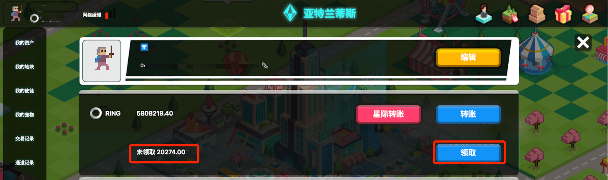

# RING

## 使用价值

RING 是进化星球中的系统通证，游戏内的主要计价单位，充当基本货币使用，将会被用于支付进化星球系统和网络中的操作手续费和智能合约燃料费。

各种元素资源、地块、建筑和道具的交易和购买也将使用 RING 作为计价单位，是游戏内流动性最强的货币。通俗的说法，就是游戏里的钱。玩家可以通过打工或者出售资源获得 RING，也可以用 RING 去采购需要的物资。游戏系统收入都使用 RING 进行分配。

## RING 背景介绍

RING 是达尔文网络的原生代币。

进化星球作为旗舰级 DApp，将 RING 作为游戏内货币。RING 以不同的通证规格部署在不同的区块链网络中。在以太坊网络上，RING 遵循 ERC20 的规范；在波场网络上，RING 遵循 TRX20 的规范；在达尔文网络上，RING 作为原生代币。

RING 的初始供应量为 20 亿（各区块链网络上所有 RING 的总和）。由于达尔文网络的本质是一个跨链枢纽，RING 和其他代币可以分散的方式在区块链之间移动。在达尔文网络的文档站点上查看 [doc](https://docs.darwinia.network/docs/en/wiki-us-tokens) 以获取有关 RING 的更多信息。

RING 被达尔文网络设定为以大约 5% 的速率膨胀，以支付验证人和提名人验证和生成区块的费用。按照目前的速度，RING 将在 50 年内达到 100 亿的硬上限。

##  RING 规格

* 以太坊（亚特兰蒂斯大陆）
  * 规格：`ERC20`
  * 精度：`18`
  * 智能合约地址（以太坊）：`0x9469d013805bffb7d3debe5e7839237e535ec483`
* 波场（拜占庭大陆）
  * 规格：`TRC20`
  * 精度：`18`
  * 智能合约地址（波场）：`TL175uyihLqQD656aFx3uhHYe1tyGkmXaW`
* 达尔文主网
  * 规格：Native
  * 精度：9
  * 智能合约地址：n/a

## 常见问题

### 不同大陆上的 RING 是通用的吗？

是的，各种区块链网络上的 RING 具有相同的价值，在达尔文主网均有对应的资产背书。使用达尔文桥（加密货币支持模型），原生 RING 可以跨链到其他区块链网络并返回。区块链之间的桥逐步释放，目前的情况如下：

* 以太坊 -&gt; 达尔文桥：[已开启](https://docs.darwinia.network/docs/zh-CN/wiki-tut-wormhole-e2d/)
* 达尔文 -&gt; 以太坊桥: [已开启](https://docs.darwinia.network/docs/zh-CN/wiki-tut-wormhole-d2e/)
* 以太坊 &lt;-&gt; 波场双向桥：已开启（PoA 模型）

### 我该如何购买/出售 RING？

购买和出售 RING 的渠道很多，大致可以分为：

* 游戏内置古灵阁银行
* 去中心化交易所
* 中心化交易所

不同大陆 RING 的购买/出售方式略有不同，具体请参考以下教程：

* 亚特兰蒂斯大陆（以太坊网络）：[如何购买/出售 RING](../../tutorials/atlantis-ethereum/how-to-buy-sell-ring.md)
* 拜占庭大陆（波场网络）：[如何购买/出售 RING](../../tutorials/byzantine-tron/how-to-buy-sell-ring.md)

### 什么是可领取的 RING？

点击头像，在「我的资产」中，玩家会发现在 资产 RING 旁边有蓝色「未领取：XXXX」。

这里的 RING 代表系统发放给你的奖励，来源可能是氪石分成、空投、奖励等等，可在「通道记录」中查看详情。

点击右侧领取，即可发送交易领取相应数量的 RING。

