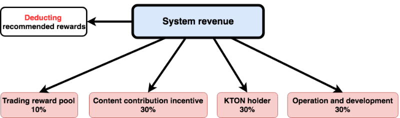
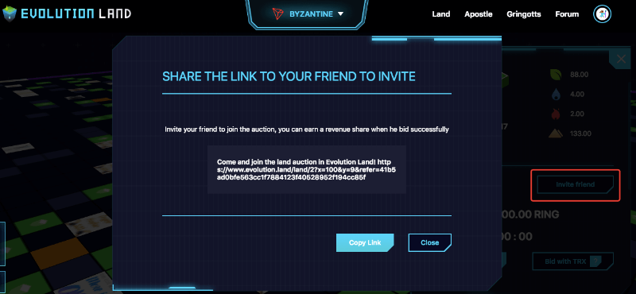

# 引荐计划


## 什么是推荐奖励？

（1）每个玩家在登陆之后都会有一个自己的拍地专属推荐链接。


（2）其他玩家通过你的链接进入拍地，并竞价成功，你都能得到一定的奖励。

（3）你得到的奖励数额是官方收取手续费的 20%。

## 奖励分析

（1）玩家A第一次出价 1000 RING

（2）玩家B通过玩家C分享的链接参与拍地，并成功出价，出价金额 1100 RING

（3）玩家B出价成功之后我们来看下TxHash中Tokens Transfered的信息：


Tokens Transfered中共有5笔交易，由上至下依次是：

交易1、玩家B to 合约：1101 RING

交易2、合约 to 玩家B：1 RING

交易3、合约 to 地块持有者：48 RING

交易4、合约 to 玩家A：1048 RING

交易5、合约 to 玩家C：0.8 RING


关于交易1、交易2两笔交易的解释：

玩家B to 合约给了1101 RING，因为在实际交易中，为了让玩家能够出价成功，系统要求的价格为10分钟之后的价格，多出的部分会退给玩家，就是交易2中合约 to 玩家B的 1 RING。

Evolution Game is a player-owned blockchain game. There's a referral incentive mechanism built-in at the smart contract level that is not controlled by the dev team. A certain percentage of revenue earned from in-game transactions will be paid to the referrer before distributed to the rest of the revenue pools.



The referral program is permissionless and free. You can join by these means:

* Personal Referral Link
* Smart Contract Referral

## Personal Referral Link

Personal Referral Link is the easiest way for the average player. Any player can generate a unique referral link for free.



If any players participating in the auction through your link, you would get a reward when their bidding is successful. The amount of bonus you receive is 20% of the fee referee is charged.

### Case Study

\(1\) Player A is the first one who bid on the land. He/she cost 1000 RING.

\(2\) Player B participates in the auction through the link shared by Player C and successfully bids with 1100 RING.

\(3\) After Player B bid successfully, let's look at the Tokens Transferred information:


There are five transactions in Tokens Transferred, from top to bottom:

* Transaction 1:   Player B to Contract: 1,101 RING
* Transaction 2： Contract to player B: 1 RING
* Transaction 3： Contract to landholder: 48 RING
* Transaction 4： Contract to player A: 1048 RING
* Transaction 5： Contract to player C: 0.8 RING

Explanation of transaction 1 and transaction 2:

Player B sent 1,101 RING to the contract \(fund in excess with a certain slippage tolerance level\). The extra part is refunded to the player \(Transaction 2\), the contract to the player B 1 RING.

In this example, 0.8 RING is the referral reward sent to Player C.

## Smart-Contract Based Referral

Developers can build their own UI or tools to interact with the smart contracts, as long as they can attract players to play. They don't need permission to share revenue from the Evolution Land dev team. The incentive mechanism is sealed at the smart-contract level.

Below is the function interface snippets extracted from the optimized Dutch Auction smart contract \([ClockAuctionV2.sol](https://github.com/evolutionlandorg/market-contracts/blob/master/contracts/auction/ClockAuctionV2.sol)\). When interacting with the auction smart-contract, an `address referer` parameter is supported. Any initiator can fill in this parameter as it sees fit. In Evolution Land, we respect the player's referral link and use the referrer's address. While through any other third-party developed UI, the developer can use their address to receive the incentive for providing an alternative interface.

```text
/// @dev Bids on an open auction, completing the auction and transferring
///  ownership of the NFT if enough Ether is supplied.
/// @param _tokenId - ID of token to bid on.
/// @dev bid with eth(in wei). Computes the price and transfers winnings.
/// Does NOT transfer ownership of token.
function bidWithETH(uint256 _tokenId, address _referer)

// @dev bid with RING. Computes the price and transfers winnings.
function _bidWithToken(address _from, uint256 _tokenId, uint256 _valueInToken, address _referer)
```

