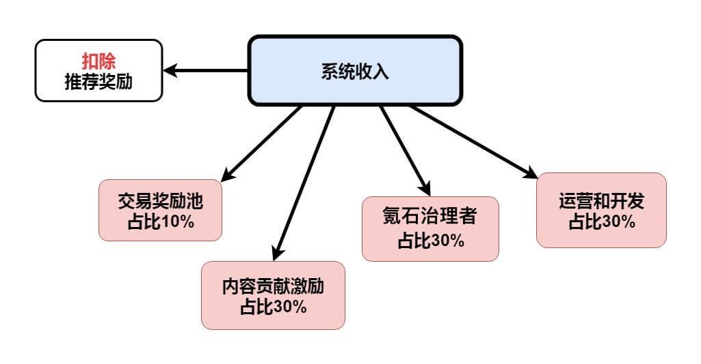
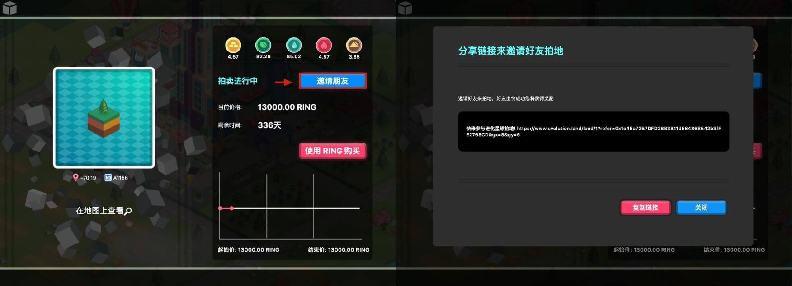
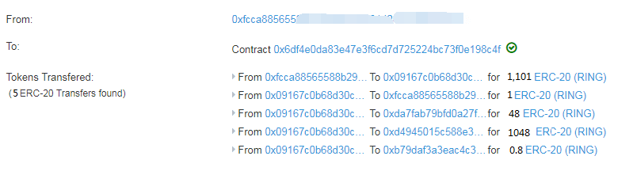
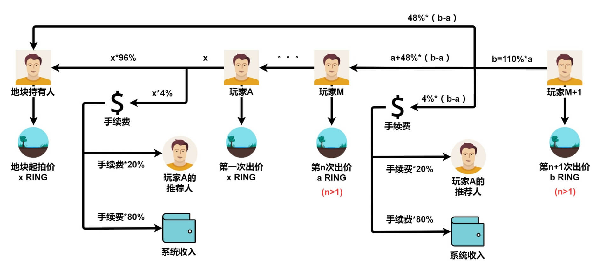

# 引荐计划



进化星球是由玩家主导的区块链游戏。奖励机制部署于智能合约，不受开发团队的控制。游戏内的交易收入将按一定比例，在分配给其他收入池之前，支付给引荐人。

## 通过生成个人邀请链接引荐

每个玩家在登陆之后都会有一个自己的拍地专属推荐链接。



* 如果有玩家通过你的链接进入拍地，并竞价成功，你都能得到一定的奖励。
* 你得到的奖励数额是官方收取手续费的 20%。

### 奖励分析

1. 玩家A 第一次出价 1000 RING
2. 玩家B 通过玩家C 分享的链接参与拍地，并成功出价，出价金额 1100 RING
3. 玩家B 出价成功之后我们来看下 TxHash 中 Tokens Transfered 的信息：



Tokens Transfered 中共有 5 笔交易，由上至下依次是：

* 交易1、玩家B to 合约：1101 RING
* 交易2、合约 to 玩家B：1 RING
* 交易3、合约 to 地块持有者：48 RING
* 交易4、合约 to 玩家A：1048 RING
* 交易5、合约 to 玩家C：0.8 RING



关于交易1、交易2 两笔交易的解释：

玩家B to 合约给了 1101 RING，因为在实际交易中，为了让玩家能够出价成功，系统要求的价格为 10 分钟之后的价格，多出的部分会退给玩家，就是交易2 中合约 to 玩家B 的 1 RING。

## 基于智能合约的引荐

开发者可以构建自己的 UI 或工具来与智能合约进行交互，只要能够吸引玩家来参与游戏。他们无须进化星球开发团队的许可就可以分享收成。奖励机制在智能合约层面上是封闭的。

下面是从优化的荷兰拍卖智能合约（[ClockAuctionV2.sol](https://github.com/evolutionlandorg/market-contracts/blob/master/contracts/auction/ClockAuctionV2.sol)）中提取的函数接口片段。与拍卖智能合约交互时支持 address referer 参数。任何发起者都可以根据需要填写此参数。在进化星球，我们尊重玩家的引荐链接并使用引荐者的地址。而通过任何其他第三方开发的 UI，开发人员可以使用他们的地址来获得提供替代接口的奖励。

```text
/// @dev Bids on an open auction, completing the auction and transferring
///  ownership of the NFT if enough Ether is supplied.
/// @param _tokenId - ID of token to bid on.
/// @dev bid with eth(in wei). Computes the price and transfers winnings.
/// Does NOT transfer ownership of token.
function bidWithETH(uint256 _tokenId, address _referer)

// @dev bid with RING. Computes the price and transfers winnings.
function _bidWithToken(address _from, uint256 _tokenId, uint256 _valueInToken, address _referer)
```

