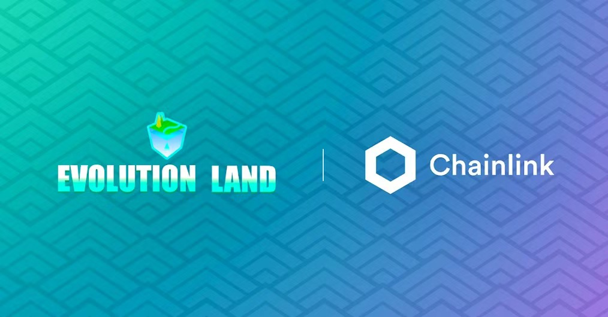
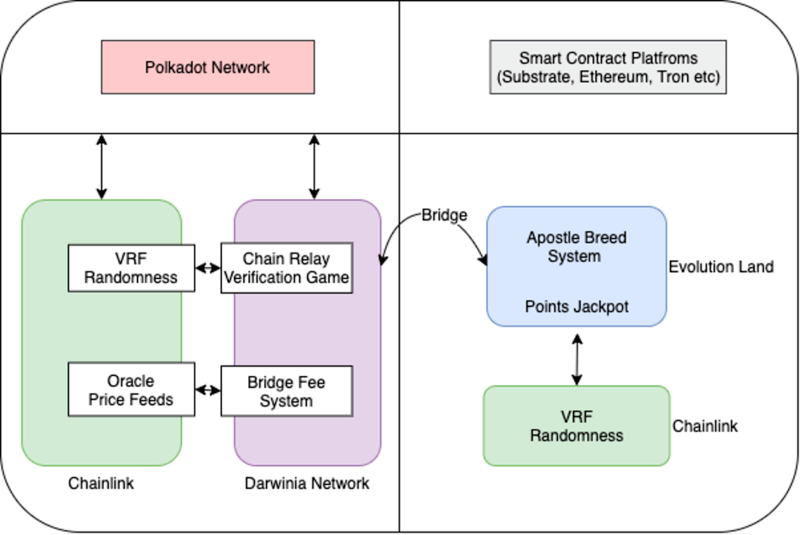
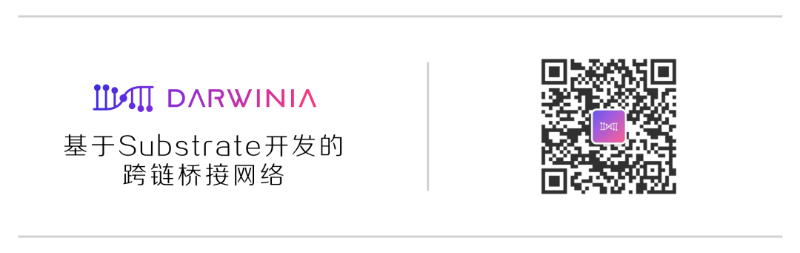

# 进化星球宣布由去中心化预言机 Chainlink VRF 支持的新使徒繁育和游戏奖励机制

我们高兴地宣布，Darwinia Network 的生态跨链游戏 Evolution Land 将整合 Chainlink VRF（可验证随机函数）为解决方案，以生成安全的，不可篡改的随机性。Evolution Land 将使用 Chainlink VRF 快速有效地铸造具有随机选择属性的 NFT，并在玩家打开宝藏盒或繁殖使徒时将这些 NFT 作为随机奖励分发。

Evolution Land 进化星球是世界上第一个具有游戏场景的跨链代币经济系统。以太坊，Tron 和其他区块链上的玩家可以在不同的区块链 “大陆” 上，挖矿，建造建筑物上买卖土地，并繁殖“使徒”（NFT\)，相互作战。Evolution Land 还具有独特的加密经济激励机制，每个链的大陆之间会争夺资源。

与 Chainlink VRF 的这种集成将使 Evolution Land 进化星球能够在我们的结构化游戏元素之上向玩家分配随机奖励，让 Evolution Land 进化星球玩家总能享受到惊喜的奖励。

## **选择 Chainlink VRF 的理由**

长期以来，获得真正的随机性一直是区块链应用（包括基于区块链的游戏）面临的挑战。区块链的确定性导致要生成一个秘密，比如不被第三方事先发现的随机数，是相当困难的。依赖于区块链特性（例如区块哈希）的解决方案也可能被矿工操纵。对于基于区块链的游戏而言，围绕产生随机性的这种困难尤为严重，因为这些游戏依赖于随机性来结合许多传统游戏中常见的有趣和令人兴奋的元素。  

借助 Chainlink VRF，Evolution Land 进化星球可以整合专门为智能合约而构建的真正的随机数源。Chainlink VRF 提供了具有高性价比的随机性解决方案，因此游戏开发人员无需采取额外措施来防止各种链上攻击，而可以专注于打造更好的游戏体验。Chainlink VRF 还使得玩家能够在链上验证依赖 VRF 的游戏内结果是否具有可证明的公平和防篡改随机性。这组独特的安全保证可以向玩家证明，没有人甚至是 Evolution Land 进化星球的游戏开发商都不会篡改结果。

Chainlink VRF 的加入将增强我们的游戏功能，进化星球致力于创造丰富而动态的游戏体验，成为领先的跨链游戏，VRF 的结合是绝佳的选择。我们期待与 Chainlink VRF 联手来确保广泛获得安全且可证明的公平随机奖励！

## **如何集成 Chainlink VRF**

Evolution Land 将集成 VRF 以生成输入随机性，以确定给予对游戏有经济贡献的玩家 NFT 的奖励。这可以包括打开 Evolution Land 战利品盒子，带有游戏点数的幸运抽奖以及为实现 Evolution Land 游戏内里程碑而分配的奖品。

Evolution Land 中需要随机数的用例主要有两个，包括：

* **使徒繁殖**。使徒是进化星球中的游戏角色。每个使徒都有一个独特的基因属性，可确定其特征和状态。此外，两个使徒可能会繁殖一个新的使徒-后代使徒的基因是由父母的基因和 Chainlink VRF 提供的链上随机数组合而成的。
* **使用消费点抽取乐透奖励**。当用户购买商品并在 Evolution Land 中消费时，奖励系统将返  还记录在链上的积分。用户可以使用这些积分从积分奖励乐透池中购买门票，该积分基于大陆总消费费用。Chainlink VRF 将用于随机和可证明地选择乐透奖励获奖者。

这两个用例将在 Evolution Land 进化星球有趣且引人入胜的游戏玩法之上，为玩家增加一层经济激励。我们很高兴能够部署 Chainlink VRF，为支持这些新功能提供安全的随机性！

## **更多未来应用场景**

此外，达尔文桥接协议引入了博弈验证游戏作为系统中的子协议，以构建亚线性链中继。在验证游戏过程中，会定期发送一种强制的错误，验证者必须为此提供一个解决方案。那些认真参与的验证者最终肯定能找到这些错误并处理。相应地，正确报告并处理了强制错误的验证者将获得可观的奖励。根据系统的设计，验证者是无法预测何时会发生强制错误的，因此这会激励他们仔细检查所有任务。为了使这种强制错误随机地分布，Darwinia Network 达尔文网络正在研究使用 Chainlink VRF，并将其部署在 Darwinia 上或将其作为 Polkadot 平行链/平行线程跨链服务提供。

达尔文联合创始人 Denny Wang 说：“我们很高兴将 Chainlink VRF 引入 Evolution Land 进化星球，并相信这种随机性的整合将有助于我们创造复杂，经济体验丰富的游戏体验，使用户可以独立验证它的真实无偏见。”

## **关于 Chainlink**

如果您智能合约开发人员，并且想使用 Chainlink VRF 功能，请访问我们的开发者文档并加入Discord 上的技术讨论。如果您希望安排一个电话会议来更深入地讨论集成，请在此处联系。

Chainlink 是开源的区块链抽象层，开发并运行去中心化的预言机网络，为智能合约安全可靠地输入和输出数据。Chainlink 预言机服务的对象包括 Synthetix、Aave 和 Bancor 等领先 DeFi 应用；以太坊、Polkadot 和 Tezos 等众多区块链；以及谷歌、甲骨文和 SWIFT 等大型企业。

## **关于进化星球**

Evolution Land 是 Darwinia Network 的一种生态跨链游戏应用程序，Darwinia Network 是一种基于 Substrate 构建的分散式异构跨链桥协议。

Evolution Land 是一款虚拟模拟跨链区块链游戏，在以太坊和 Tron 上部署了两个大陆。更多的大洲将被部署在各种区块链网络上。玩家使用其私钥以 web3 方式登录。玩家可以在大陆上购买/出售土地，挖掘资源并建造建筑物。使徒是基于具有多种属性的基因的角色，这些属性使它们适合进行各种工作或战斗。所有这些游戏内元素都是基础区块链上的 NFT。玩家可以跨大洲转移资产以进行 “洲际贸易” 。各大洲正在发展成为独立而又具有竞争力的经济实体。

玩家使用 RING 作为货币，使用 KTON 来投票表决诸如税率之类的治理参数并获得游戏中的收益红利。游戏规则将由 DAO 社区的所有成员决定，以使游戏本身能够自行发展。

Evolution Land 在纯粹的数字世界中展示了 DAO 治理的游戏化，跨链代币化的自由市场经济系统。游戏仍在不断发展。它继续展示 Darwinia 去中心化异构跨链技术。

