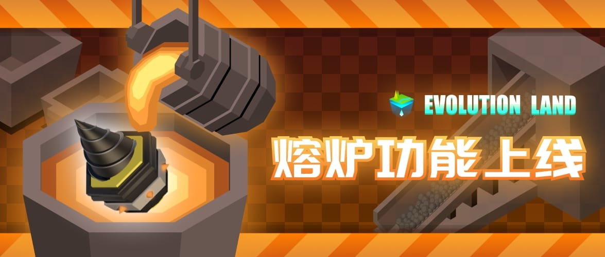
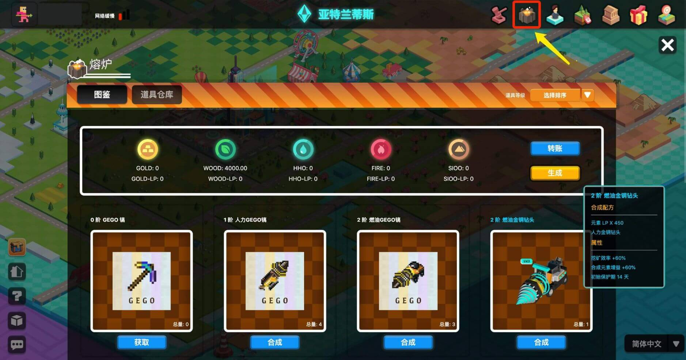
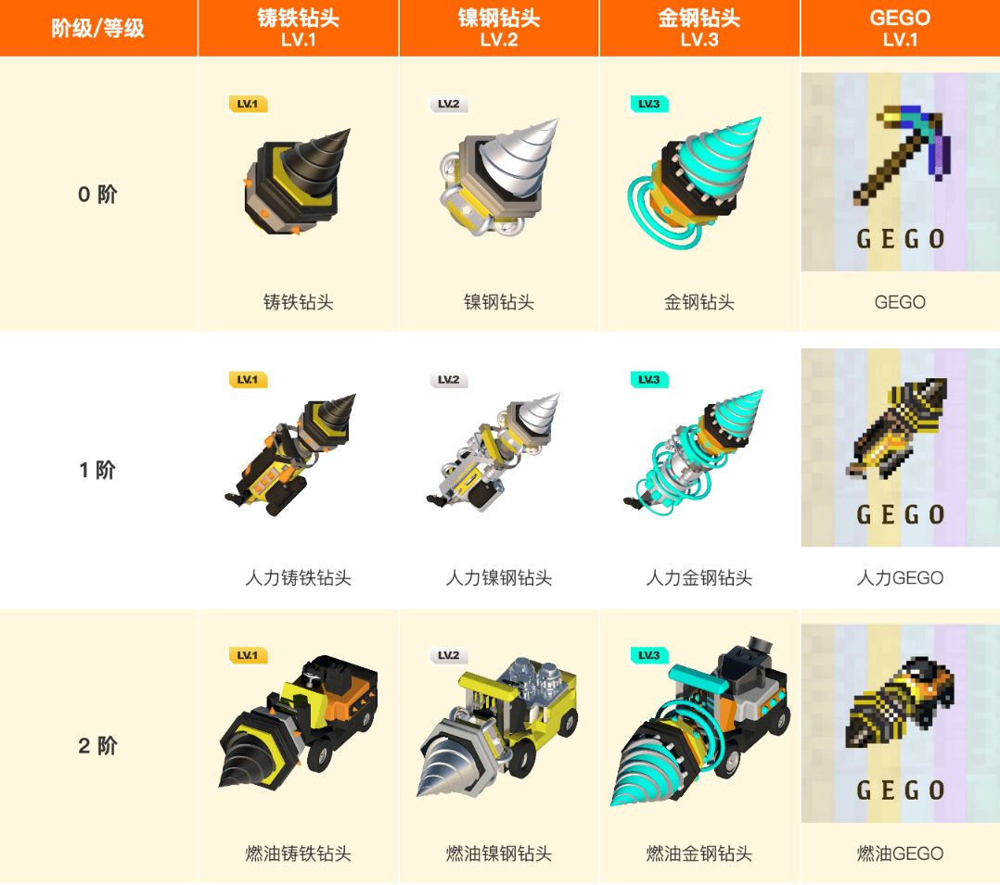
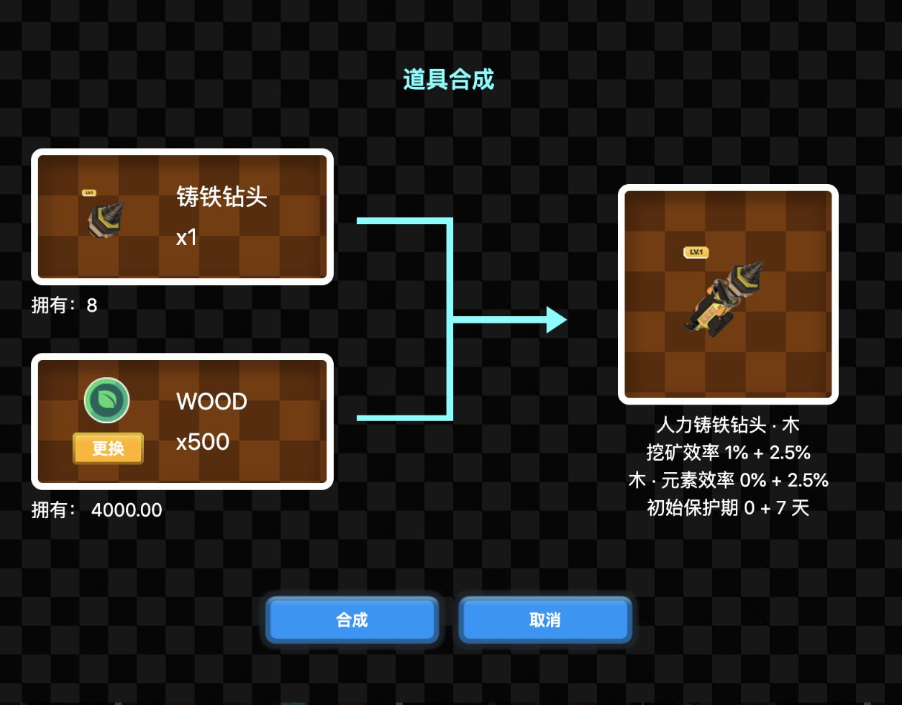
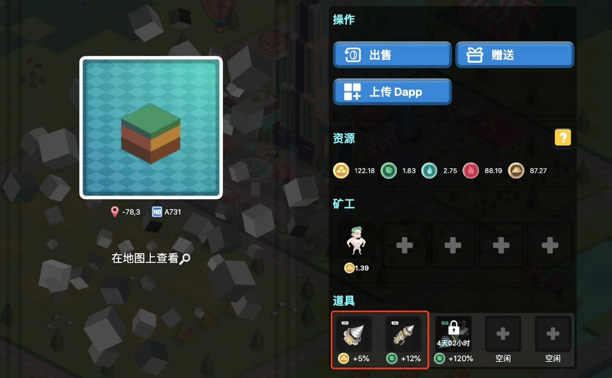
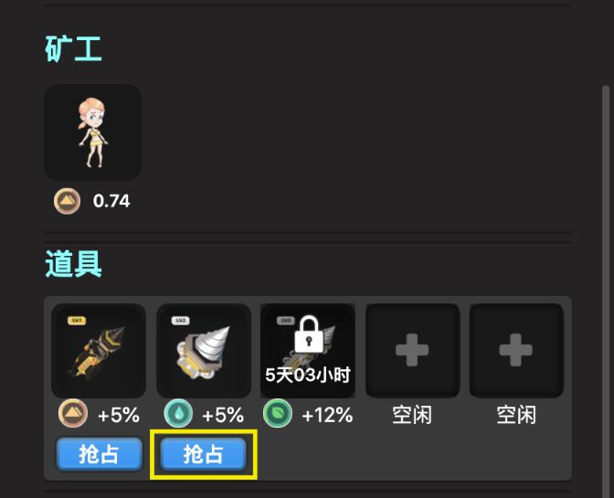
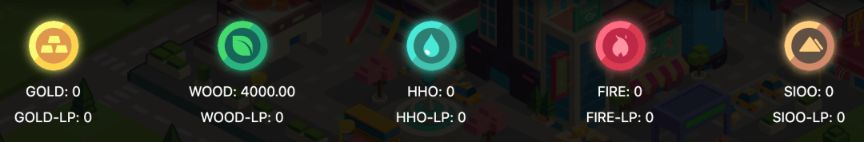
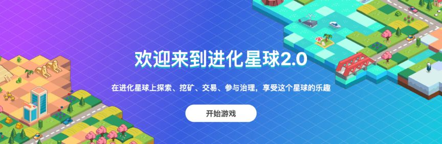

# 进化星球游戏熔炉开启！元素初始流动性池已构建！

达尔文生态跨链游戏「进化星球」推出的跨链游戏场景 NFT + Defi 应用「熔炉」马上就要正式和大家见面啦！

到熔炉系统升级钻头，加入高效率挖矿行列！除了可以为自己地块上的使徒打工人提高挖矿效率，**还能在别人的地块挖矿哦！**

本小可爱先冲了！ヾ(≧▽≦*)o

## 钻头一览

钻头等级从低到高为 1 级、2 级、3 级（LV.1/2/3），**等级为钻头先天属性，低等级钻头无法向高等级转换。但低等级钻头可以通过熔炉合成高阶钻头，显著提升钻头功率，实现逆袭！**

进化星球同时赋予外部 NFT 功能加成，如拥有 GEGO 的玩家可以将其引入进化星球，并和进化星球的原生钻头同样地进行升阶、挖矿！

## 如何获得高阶钻头

将所需要的道具放置**在熔炉系统中，按照图纸进行合成操作，即可提升道具的阶**，阶的提升可以显著提升道具的加成效果，并且在挖掘合成使用的元素时有翻倍的效率加成，为挖矿 POWER 加成！

## 钻头怎么用

**将钻头放置在地块的新增道具栏中，选择对某一种元素进行挖掘，钻头就会自动为你工作。**与使徒不同的是，钻头并不能自己获得元素，需要依赖地块上正在工作的使徒，以使徒获得元素的收益为基数，获得加成部分的收益；此外，**钻头也可以放置在其他人的地块上。**

也就是说：

钻头道具不仅可以部署在自己的地块上，也可以放置在他人的地块上工作，挖别人的地，让别人无地可挖！**即使你没有持有地块，也可以用钻头挖出元素啦！**地主将取收益的 5% 作为租金（可治理）

另外，通过升级**合成高阶钻头，可以用于抢占低阶钻头的道具位**，抢车位玩法，梦回童年紧张刺激读秒抢占车位的夜！

## 发掘资源价值

金木水火土 5 种基本资源，是构建进化星球的基本要素。基本资源在道具的升阶中不可或缺。

高阶道具的进一步升阶则需要 LP（流动性提供者）来制造或升级。在后续的建筑、对战玩法中，资源也将是建造建筑、打造武器的重要组成单元。

这 5 种资源也是 5 种游戏通证，目前已提供了 5 种基本资源和 RING 的流动性池，玩家也可以将其兑换成 RING 直接获得收益。

**全球首个将流动性挖矿融入游戏的 GameFi！**
娱乐的同时体验 DeFi 的独特魅力！

**合理利用新颖的功率机制，可助玩家收益最大化！**
逆转地主不再只是梦想！

同时，元素玩法火热来袭！构建元素和 RING 的流动性池，**为元素赋予流动性，繁荣进化星球生态经济！**

