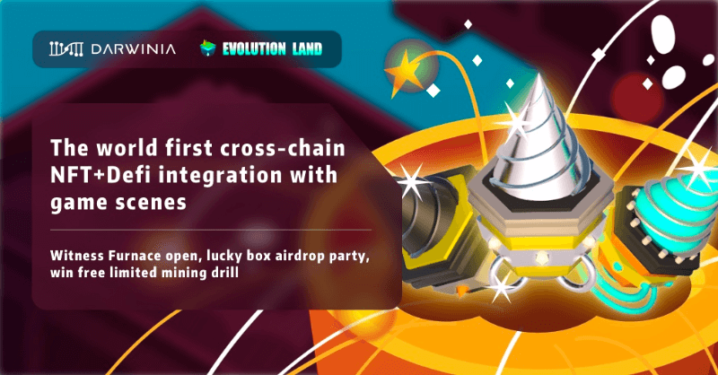
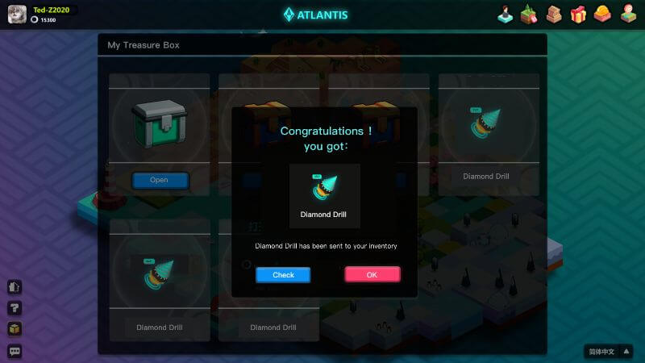
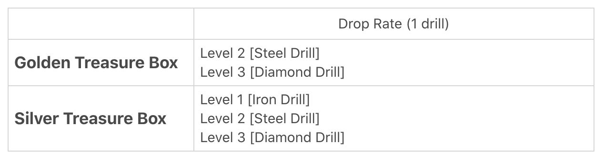
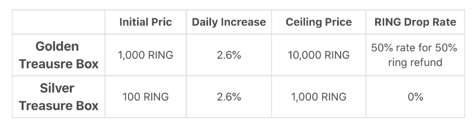

# Treasure box lucky drop. Win free limited mining drill!

Darwinia ecosystem cross-chain game \[Evolution Land\] will launch the world’s first NFT+Defi integrated application: the Furnace Gamefi!

The furnace is the NFT synthesis system in Evolution Land. In the furnace system, users can combine various assets, including NFT and FT, into new synthetic NFT assets \(synthetic NFT can be used for mining\), according to the \[formula\].

11.11 Let us witness the grand opening of the Evolution Land Furnace system, participate in the treasure box airdrop party, and win free limited mining drills!

## Why grab the \[Limited Time Free Treasure Box\]? What’s amazing about it? 

Treasure boxes have \[Golden Treasure Box\] and \[Silver Treasure Box\]. Rewards inside are different, and the drop rate of varying levels of drills is different.

Open the treasure boxes to get drills of different levels.

There are three levels of the drill, from low to high, they are level 1 \[Iron Drill\], level 2 \[Steel Drill\], and level 3 \[Diamond Drill\].

## What’s the use of the drills?

In Evolution Land, users can mine resources from the land. Resources that can be mined from the lands are: GOLD, WOOD, HHO, FIRE, and SIOO. Resources are required for creating higher-class synthetic NFT for mining and buildings.

Resource liquidity pools will be opened on Uniswap soon. The WOOD pool is already open on Uniswap.

Initially, only \[Apostles\] are deployed on the land to do the mining job. Users can now deploy drills obtained from free treasure boxes or synthesize with resources or other NFTs for a new mining tool: drilling rig, which can add POWER to mining.

The drill can be used for mining directly, and it is the primary raw material for the synthesis of “drilling rigs”.

The higher the drill level is, the more powerful the mining is, and your mining rewards and benefit would be more amazing!

The synthesis of high-end drilling rigs is mainly drill + resources.

Third-party NFT props will be added for synthesis, and the formula of NFT synthesis will be posted soon.

Please stay tuned!

Where are the high-level \[mining drills\]? In the golden treasure boxes!

Where are the treasure boxes?

Follow [Darwinia](https://twitter.com/@DarwiniaNetwork) Twitter and find answers!

## How to get a free treasure box airdrop? 

Complete simple tasks:

✅ Follow @DarwiniaNetworrk

✅ RT & tag 3 friends

✅ Join telegram [EvolutionLand](https://t.me/evolutionland9) or [Darwinia Official](https://t.me/DarwiniaNetwork)

✅ Fill in the [form](https://forms.gle/1Dff9AKbV3atcw6R6)

You will win a free limited silver treasure box. We will also draw 5 lucky users among retweeters and win 2,000 $RING each!

## Darwinia Fans exclusive rewards: Hodlers to win!

Darwinia has taken a snapshot at 2020.11.11 00:00, and the treasure box airdrop rewards are based on the RING or KTON balance

* RING balance 0–10,000 or KTON balance 0–10, win 1 silver treasure box.
* RING balance &gt; 10,000 or the KTON balance &gt;10, win 1 golden treasure box.

## My money, my call!

## Freestyle to win: how to buy one treasure box?

Feel free to purchase a treasure box directly to get a better chance for advanced drills. During the airdrop event, the treasure boxes are sold at a fixed initial price. After the airdrop event, the cost of the treasure box increases by 2.6% every day. After 30 days, it will reach its ceiling price and remain fixed.

We have imagined the creative mining wave in Evolution Land! What kind of creative sparks will come out of different NFT materials, additions, and casting?

Evolution Land also shows the charm of blockchain game props reuse, the interaction between different game worlds, and innovative gameplay:

Support DEGO as a mining tool, Crypto kitties as pets of apostles!

The Darwinia Community Ambassador’s exclusive NFT badge will also be used as a mining item in the later stage! To apply for an ambassador:

Looking forward to your creativity and enthusiasm to create the world’s first Gamefi \[mining NFT\]!

In the future, Evolution Land will also open the NFT auction market.

Gamefi mining, the income, and gameplay are so exciting; the treasure box is free for you!

The final interpretation right of the event belongs to Darwinia Foundation.

