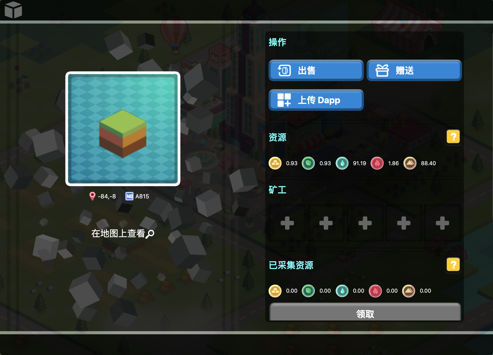
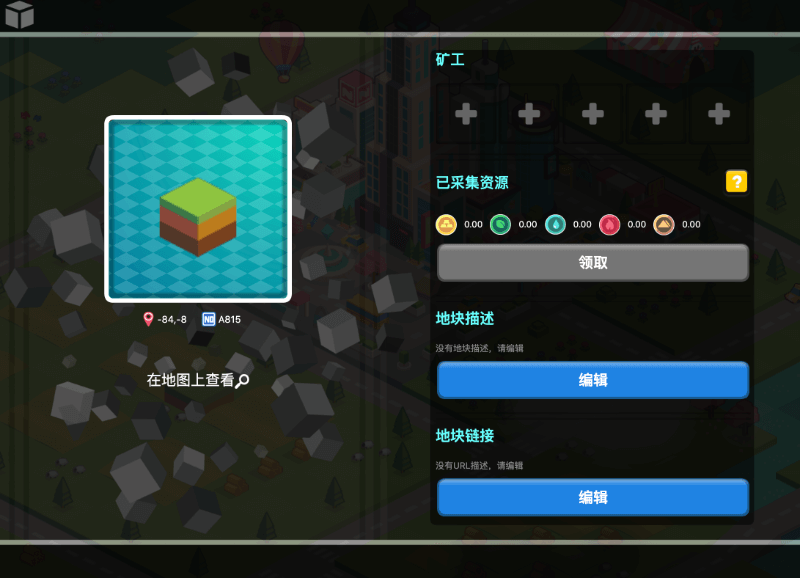

# 购买/出售/赠送地块以及地块的相关操作

## **如何购买地块？**

1. 目前亚特兰蒂斯大陆地块已经开放售卖，登录进化星球点击大陆——亚特兰蒂斯大陆——选择进入，玩家将看到亚特兰蒂斯大陆的全部地块。目前亚特兰蒂斯大陆创世地块的释放速度是每4小时释放一块。

2. 玩家点击想要购买的地块后，右侧会弹出该地块的详细信息（包括价格、资源情况、出售者等，其中金木水火土资源量为该地块该资源每日最大可挖掘量）。确认信息后（地块状态为拍卖中，即绿色地块为可购买地块），玩家可以点击弹窗中的「使用RING购买」并等待交易确认。

3. 此时玩家拍到的地块将显示在「已出价」中，若30分钟内没有其他玩家以更高的价格拍下该地块，则地块成交，成交后的地块会显示在「未领取」中。

PS：地块是可以旋转的哦。

* Mac系统电脑按住command，同时用鼠标拖动地块，可以旋转地块，进行视角的调整；
* Windows系统电脑按住control，同时用鼠标拖动地块，可以旋转地块，进行视角的调整。

## **我拍到的地块去哪里查看？**

1. 玩家初次拍到的地块将显示在「出价」中；
2. 若30分钟内没有其他玩家以更高的价格拍下该地块，则地块成交，此时地块将显示在「未领取」中；
3. 领取后的地块将显示在「我的地块」中。对应网页：[https://www.evolution.land/land/1/list](https://www.evolution.land/land/1/list)

## **拍到地之后为什么还要领取？**

参与拍卖出价成功获得的地块将显示在「未领取」中，玩家需要点击”领取“将地块与自己的以太坊地址绑定。

## **地块的操作**

点击地块，会看到可以对地块进行的操作，如图所示**：**

### **出售**

显示在「我的地块」中的地块是可以进行出售的。点击「**管理**」&gt;&gt;「**出售**」，输入期望的起始价、结束价及期限时间后，点击「发布」。当玩家在Metamask/IteringID/imToken签名成功后，该地块的状态将变为拍卖中，此时玩家可以在「我的地块」&gt;&gt;「售卖」中查看该地块。

####  

### **赠送**

您的地块是ERC-721资产，是可以赠送给朋友的。您可以点击「**我的地块**」&gt;&gt; 「**管理**」&gt;&gt;「**赠送**」，填写想要转到的以太坊地址，点击「**转账**」并等待交易确认。

### ~~**上传图片**~~

~~点击“上传图片”，选择需要上传的图片（&lt;20k）即可，该操作无需花费gas费用。~~

~~如需删除图片，点击“删除图片”即可。~~

### **地块描述和地块链接**

如需添加地块描述/地块链接，点击“编辑”填写相关内容即可（地块链接需以http://或https://开头）。

