# 怎样注册进化星球？

进化星球的 A 大陆，即亚特兰蒂斯大陆，是构建在以太坊网络上的。以太币，即 ETH，是进化星球亚特兰蒂斯大陆（A大陆）使用的数字货币，以太币和任何其他货币一样，其价值随市场波动。

玩家需要将货币（美元、加元、英镑等）兑换为以太币，以在以太坊网络上支付燃料费用——如购买 RING、购买土地等操作。

玩家不可以直接使用法定货币购买 RING 或进化星球其他资产——货币需要先被兑换为 ETH。（在 otcmaker.com 等场外交易所玩家之间可以进行发币和 RING 等数字货币的交易）

玩家可以从支持购买加密货币的钱包或交易所购买 ETH，然后将 ETH 从交易所转入注册进化星球的钱包地址。

**注册进化星球亚特兰蒂斯大陆有两种方式，分为网页端和手机端。**请选择自己喜欢和合适的方式进行注册。

## 网页端

### 方法一： 使用 Itering ID 注册

1. **手机下载 Itering ID**。

   Itering ID 是一款安全易用的空气隔离授权工具，使用它可以对第三方应用进行签名授权。

   * ios 用户至海外 AppStore 下载正式版，注册海外账户请参考 [https://shimo.im/docs/v8XxUxtHekkwrFlM](https://shimo.im/docs/v8XxUxtHekkwrFlM)
   * Android 用户可至 [id.itering.com](http://id.itering.com/) 下载最新版本，新增资产管理、DApp 等功能，欢迎大家沟通交流。

2. **在 Itering ID 中创建和导入钱包。**

   视频教学链接：[https://www.bilibili.com/video/av33954908](https://www.bilibili.com/video/av33954908)

3. **使用 Itering ID APP 扫描进化星球登录/注册的二维码，选择需要登录的账号进行签名。**

**说明：**

如果该钱包地址之前已经注册过进化星球，将直接登录到该钱包地址对应的进化星球账号；

如果该钱包地址还未注册过进化星球，将使用 Itering ID 的昵称与邮箱快速注册并登录；

如果提示昵称或邮箱已被其他进化星球用户占用，手动修改即可完成注册。

注册完成之后玩家需要向注册的地址中打入一定的以太币（ETH）就可以正式踏入进化星球的土地，开始神奇旅程。

参与游戏中的土地拍卖、积分抽奖等交易均需要授权与签名，在弹窗中用 Itering ID 扫描二维码进行授权签名即可（链上交易将花费少量 ETH 作为 Gas）。  

### 方法二：使用 MetaMask 注册

1. **用谷歌/火狐浏览器下载 MetaMask，并创建一个以太坊钱包地址。**

   MetaMask 是一款加密数字钱包。

   请注意：加密币钱包请谨慎对待，请务必记住您的密码和助记词。

   具体教学文档可参考论坛文章：[https://forum.evolution.land/topics/53](https://forum.evolution.land/topics/53)

2. **用 MetaMask 登录希望注册进化星球的地址，在进化星球首页点击注册，选择 MetaMask，在 MetaMask 中进行签名。**（MetaMask 正常会弹出确认弹窗，若未自动弹出，请注意小狐狸头像上是否出现数字，若出现数字请点击查看）。

3. **完成授权签名后即注册成功。**
   此时玩家需要向注册的地址中打入一定的以太币（ETH）就可以正式踏入进化星球的土地，开始神奇旅程。参与游戏中的土地拍卖、积分抽奖等交易均需要授权与签名，在 MetaMask 弹窗中授权签名即可（链上交易将花费少量 ETH 作为 Gas）。

## 手机端

### 方法一：使用 imToken 进行注册

1. 下载并注册 imToken 2.0 钱包
   * imToken 2.0 钱包下载地址：[https://token.im/](https://token.im/)
   * imToken 2.0 钱包注册教程：[https://zhuanlan.zhihu.com/p/42128796](https://zhuanlan.zhihu.com/p/42128796)
  
2. 在 imToken 2.0 钱包内注册进化星球步骤，如下图所示：

### 方法二：使用麦子钱包进行注册

* 麦子钱包下载地址：[http://www.mathwallet.org/cn/](http://www.mathwallet.org/cn/)

  * Android 用户点击「Android App」直接下载安装包安装。
  * ios 用户点击「iPhone APP」>>「公测版下载」，然后点击「下载 TestFlight」。

1. 下载 TestFlight 并打开，点击「继续」，页面会出现安装 MathWallet Pro 的提示。请按顺序安装并打开 MathWallet Pro。
  
   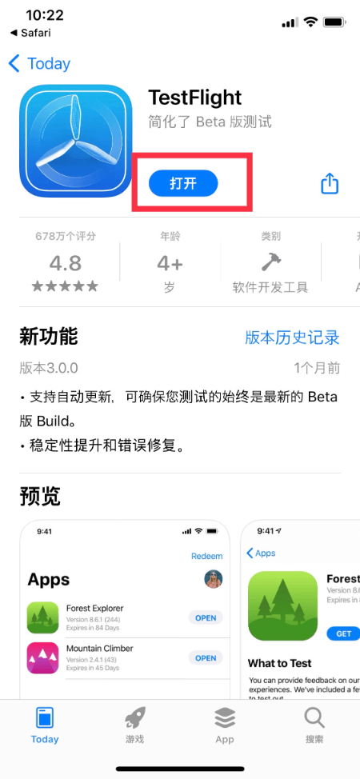

2. 打开「MathWallet Pro」之后，点击「Ethereum」>>「创建钱包」，按步骤输入钱包名称、密码，然后点击「创建钱包」并确认。
  
   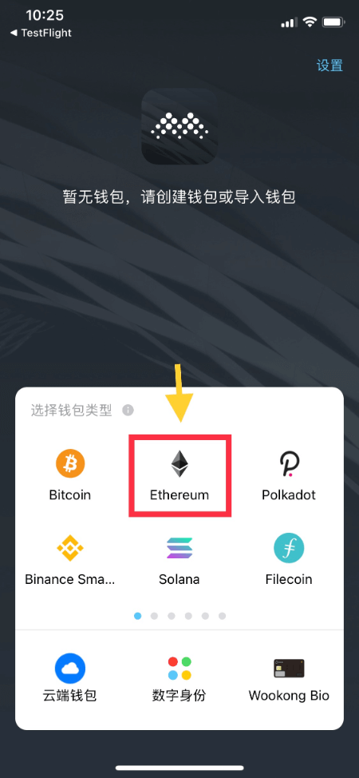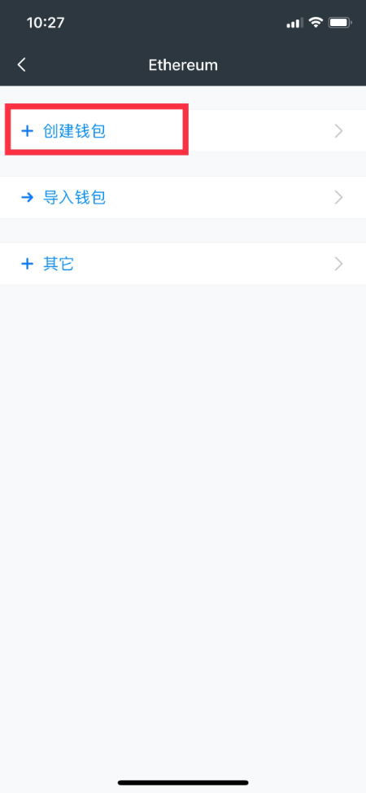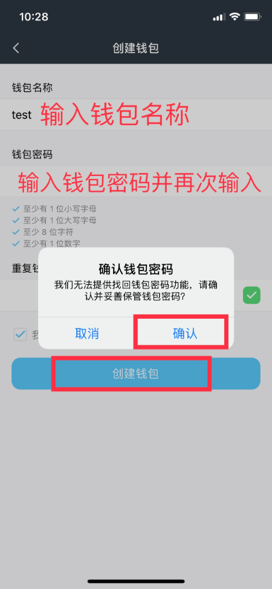

3. 系统会帮你自动生成 12 个助记词，备份下来并按顺序点击您的助记词。按顺序点击完您的助记词后，钱包就会生成。
   * **注意：请备份并妥善保管您的助记词。**

  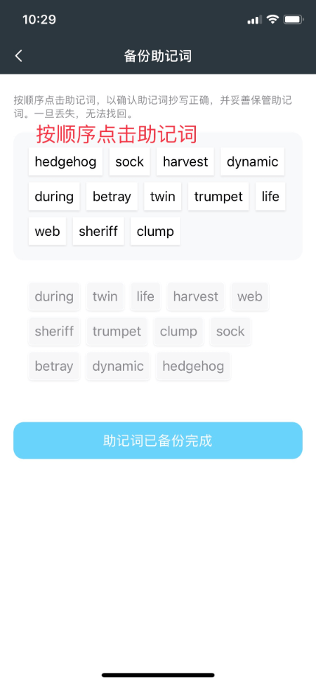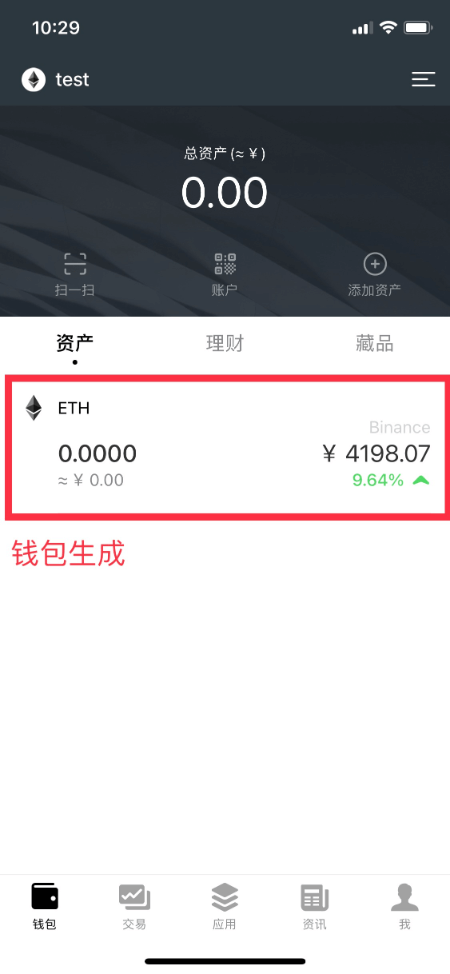

4. 在麦子钱包的主界面，点击屏幕下方「应用」，然后在搜索栏搜索「进化星球」或输入网址 [www.evolution.land](www.evolution.land)，选择「进入游戏 v2.0」，选择「亚特兰蒂斯大陆」。
  
   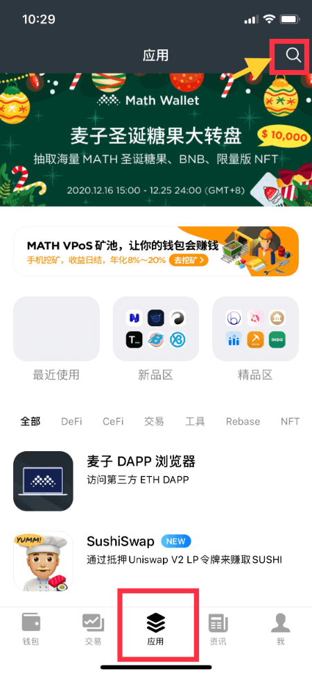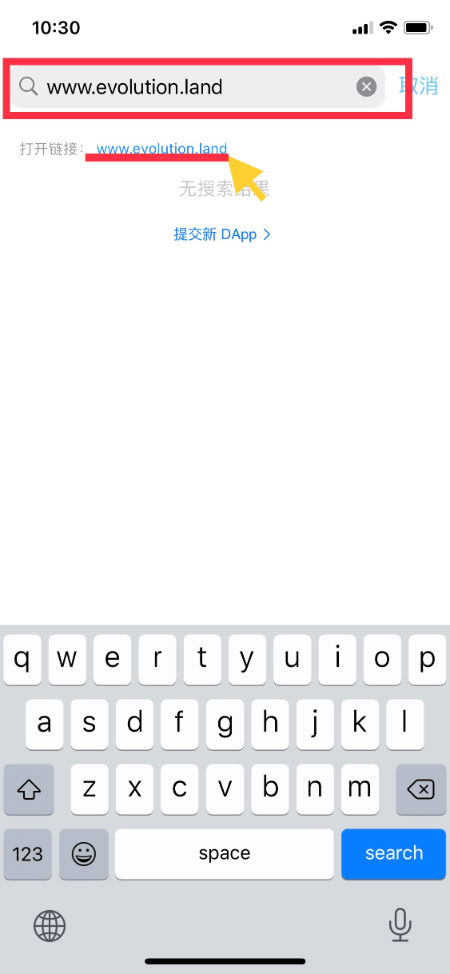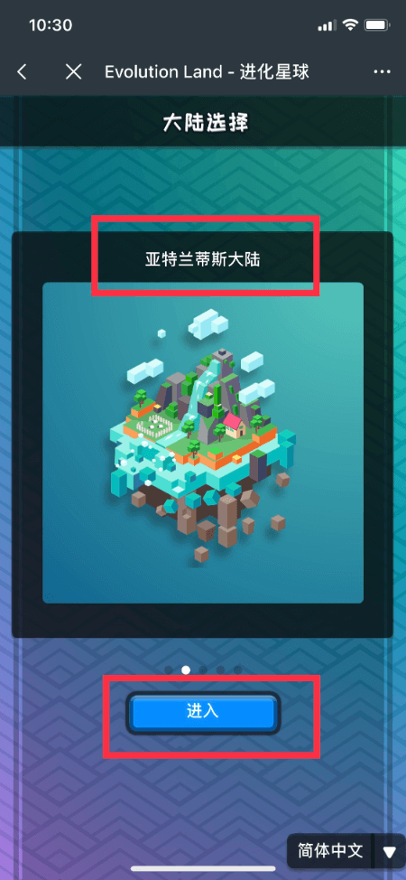

5. 点击左上角的「登录」进行注册，按照提示输入您的昵称。之后输入您的钱包密码，点击「确认」，即注册成功。
   
   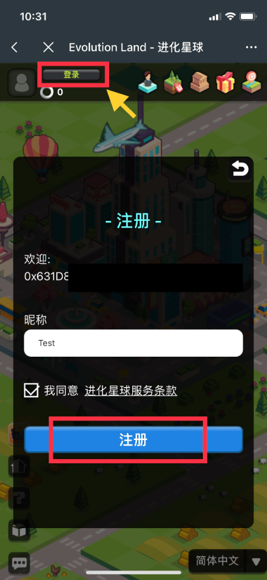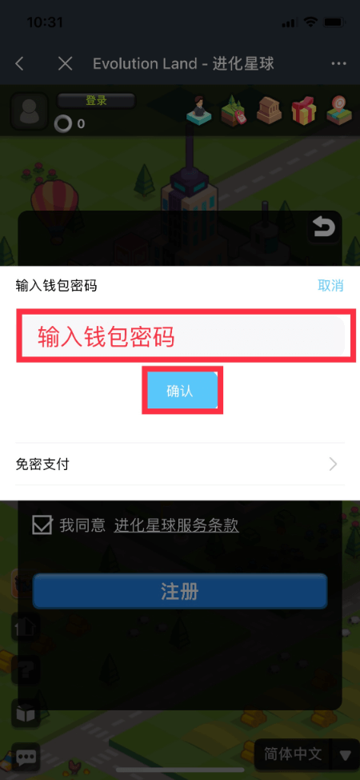

