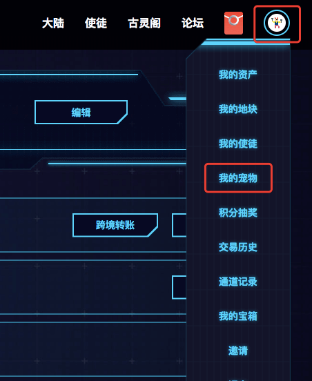
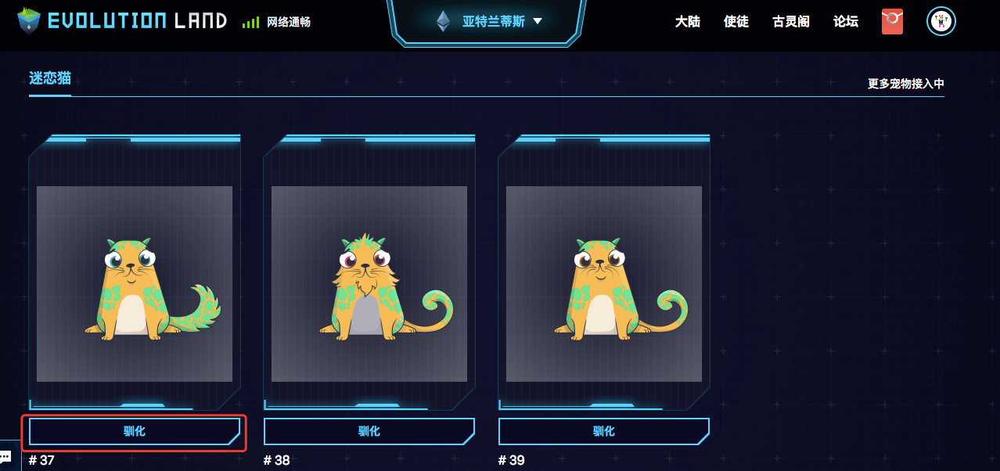
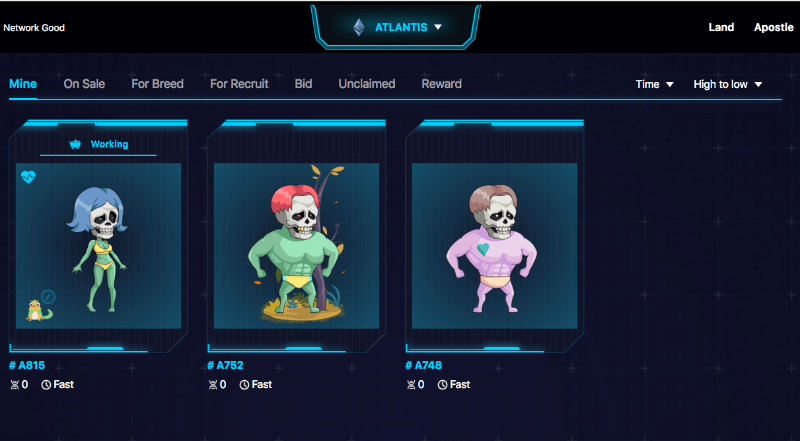
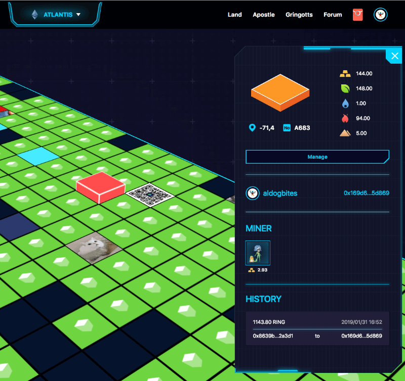

# 如何驯服一只谜恋猫作为宠物


本指南适用于 游戏 V1.0 的 UI 界面。游戏 V2.0（最新）的 UI 界面操作与 V1.0 稍有不同，但基本一致。


1. 点击进入「我的宠物」
   

2. 选择想要驯化的宠物。（只有当前登陆地址所拥有的谜恋猫会在此处显示）点击「驯化」。
   

3. 选择一个使徒与谜恋猫绑定 how-to-tame-a-pet
   

4. 等待交易确认
   

5. 成功绑定！谜恋猫的状态已经更新
   

6. 列表预览中的使徒和谜恋猫
   

7. 细节预览中的使徒和谜恋猫
   

[**挖矿能力增强**](../../getting-started/game-entities/apostle/skills.md#productivity)

使徒绑定宠物后，其挖矿能力将比没绑定之前有所增强。

