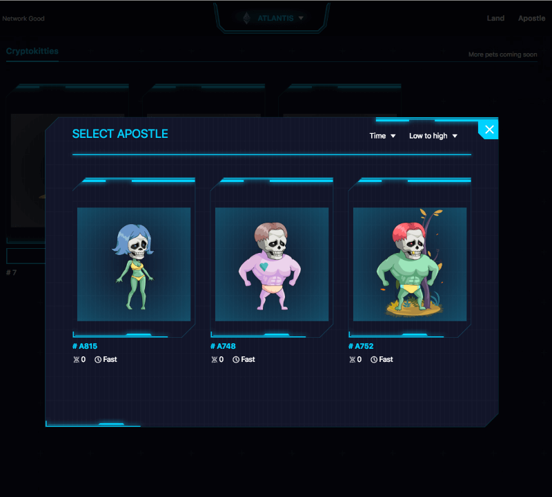
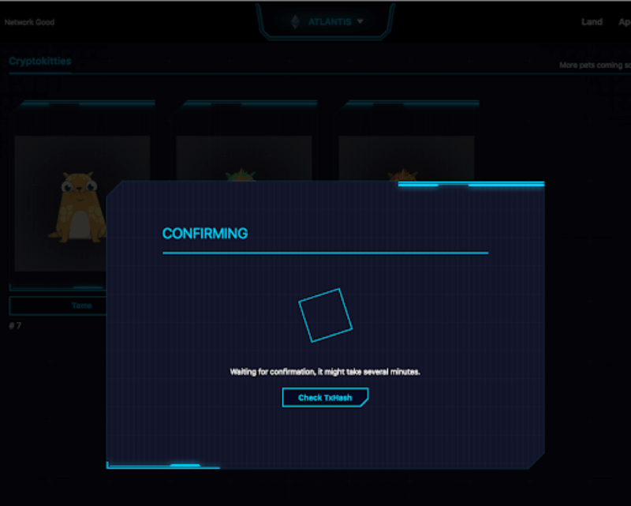
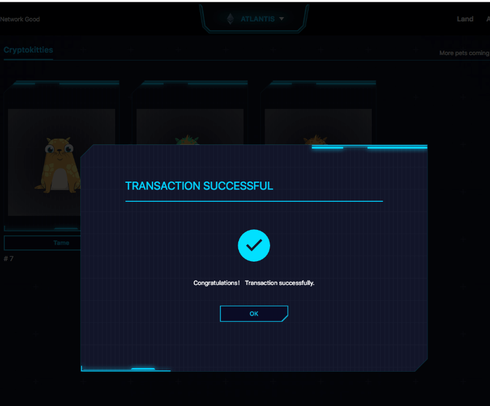
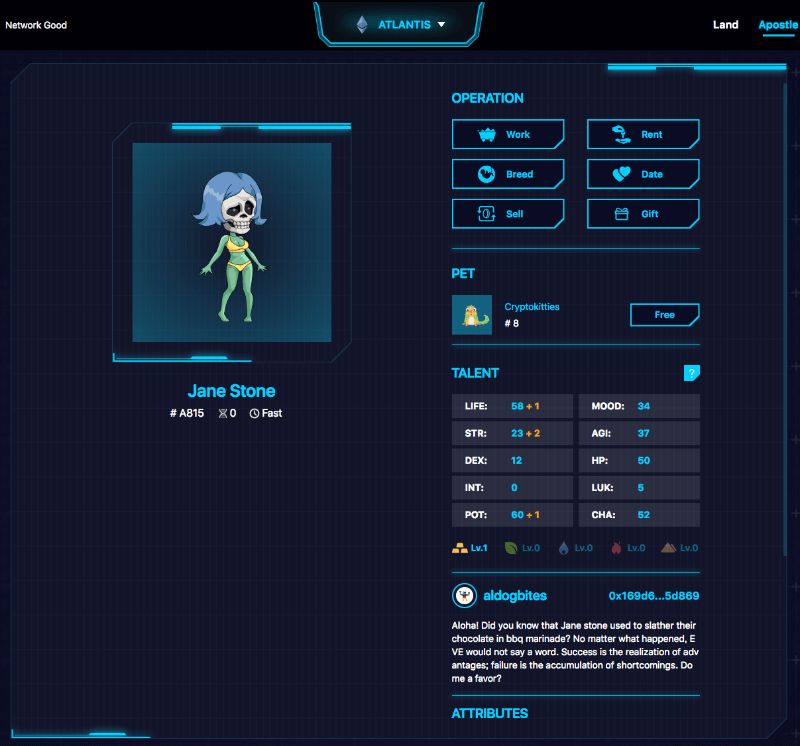

# How to tame a pet


This guide covers the v1 UI interface. In v2 \(latest\) UI interface, the guide should work too with a slight change.


Below are simple screenshots of how to using the "Pet" system.

Select "My Pets" from the menu to access

Select Pet Source and Kitty. Only kitties owned by the player's signed-in address will be shown. Click on the kitty to tame.

Select an Apostle Master to bound the selected Kitty.

Waiting for the transaction to be confirmed

Kitty Tamed! Kitty's status is updated.

Apostle with Pet in list view.

Apostle with Pet in detail view.

[Mining Ability Enhanced](../../getting-started/game-entities/apostle/skills.md#productivity). Apostle with a pet has better minging output than without.

