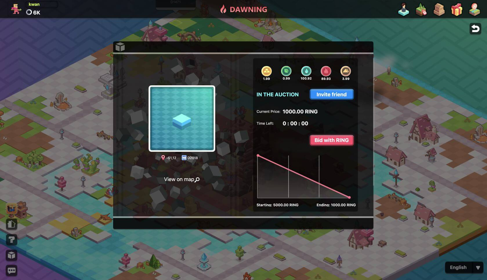

# How to buy/sell/gift 【lands】 and related operations

## How to buy land?

At present, the land on DAWNING has been opened for sale. Log in and click on "START GAME V2.0", then choose to enter DAWNING, you will see all the lands on DAWNING.

The fourth continent of Evolution Land, Dawning continent; based on the Huobi ECO Chain, will have a total of **2025** lands.

Evolution Land will reserve **298** Lands. In addition to the core area resource lands, there are also gold mines 🏗 , forests 🌲 , lakes 🌊 , volcanoes 🌋 , hills⛰️, and other lands, which will be used for rewards distribution.

**1000** Lands will be reserved for rewarding our supporters during the Crab and Darwinia Network Parachain Lease Offerings over the course of the lease time \(two years.\)

The remaining **727** Lands will be sold by auction.

After you click on the land you want to purchase, the detailed information of the land will be popped up on the right side \(including price, resource status, seller, etc., where the amount of GOLD/WOOD/HHO/FIRE/SIOO resources is the maximum for digging every day\).

After confirming the information \(the land must be in the auction, that is, the color of the land is green\), you can click “Bid with RING” in the pop-up window and wait for the transaction confirmation.

At this moment, the land bidden by you will be displayed in “Bid”. If no other player bid the land at a higher price within 30 minutes, the land will be yours. Then the land will be displayed “Unclaimed”.

## Where is my land?

1. The land bidden by the player for the first time will be displayed in the “Bid”;
2. If no other player bid the land at a higher price within 30 minutes, the land will be displayed in “unclaimed”;
3. The land bought and claimed successfully will be displayed in “Mine”.

Corresponding webpage: [https://www.evolution.land/land/1/list](https://www.evolution.land/land/4/list)

## Why do I have to claim the land?

If you bid the land and no other player bid at a higher price within 30 minutes, the land will be displayed in “unclaimed”, and you need to click on the "claim" to claim it.

## The operations about land

Click on "Mange" of the land you have and you will see what you can do with the land.

**【 Sell 】**

The land displayed in "Mine" is available for sale. Click "Manage" --- "Sell". After entering the desired starting price, closing price and time limit, click "Sell". After the signature \(Metamask/IteringID/imToken\) is successful, the status of the land will become the "on sale", and you can see the land in "my land"---"on sale".

**【 Transfer 】**

Your land is ERC-721 asset and it can be given to a friend. You can choose the land you want to give and click on the "Transfer". Then fill in the Ethereum address you want to transfer to, click “Transfer” and wait for the confirmation.

**【 Upload pic 】**

Click "Upload pic" and select the image you want to upload \(<20k\). This operation will not cost gas.

To delete an image, just click "Delete pic".

**【 Land description 】and 【 URL 】**

To add a land description/URL, click "Edit" to fill in the relevant content \(URL needs to start with http:// or https://\).

