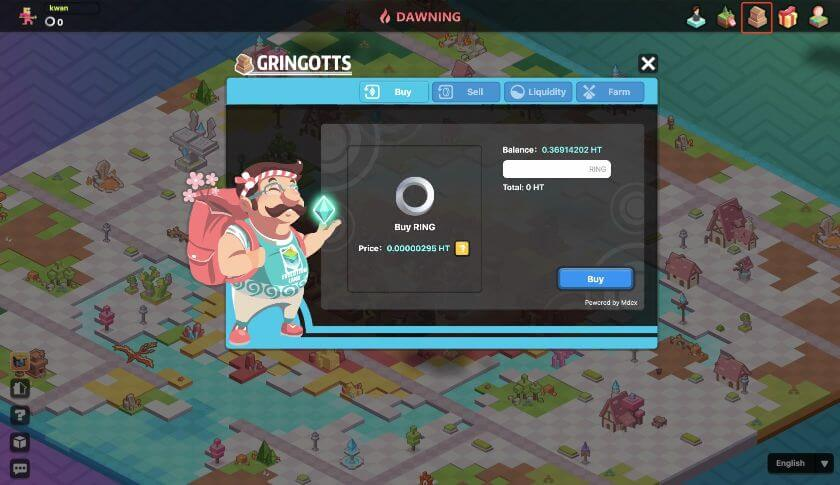

# How to buy/sell RING?

You can buy or sell RING through these channels:

- In-game Grintgott Bank
- Decentralized Exchange
- Centralized Exchange

## Gringott Bank

You can exchange RING and HT through Mdex in Gringott Bank. The current price of RING is determined by the latest transaction price of Mdex and the amount of player's order. RING's exchange will cost HT as gas fee, and Evolution Land will not charge an additional gas fee.

## DEX

DEX stands for Decentralized Exchange. You can use your cryptocurrency wallet to buy or sell directly.

On Atlantis Continent \(Ethereum\):

* Uniswap\(v2\): [RING/ETH](https://info.uniswap.org/token/0x9469d013805bffb7d3debe5e7839237e535ec483)
* 1inch Exchange: [RING/ETH](https://1inch.exchange/#/RING/ETH)

On the Byzantine Continent \(Tron\):

* Justswap: [RING/TRX](https://justswap.io/#/scan/detail/trx/TL175uyihLqQD656aFx3uhHYe1tyGkmXaW)

On the Dawning Continent (Heco):
* Mdex：[MDEX.COM](https://ht.mdex.com/#/swap)

## CEX

CEX stands for Centralized Exchange. You can also buy or sell RING at many CEX. The following list shows a few. You can check out [Coinmarketcap](https://coinmarketcap.com/currencies/darwinia-network/markets/) for more information.

* [Huobi Global](https://www.hbg.com/en-us/exchange/ring_usdt)
* [BKEX](https://www.bkex.com/trade/RING_USDT)
* [MXC.com](https://www.mxc.com/trade/easy#RING_USDT)
* [Hotbit](https://www.hotbit.io/exchange?symbol=RING_USDT)
* [Gate.io](https://gate.io/trade/ring_usdt)
* [CoinEX](https://www.coinex.com/trading?currency=usdt&dest=ring&tab=limit)
* [Poloniex](https://poloniex.com/exchange#usdt_ring)
* [Hoo](https://hoo.com/spot/ring-usdt)

