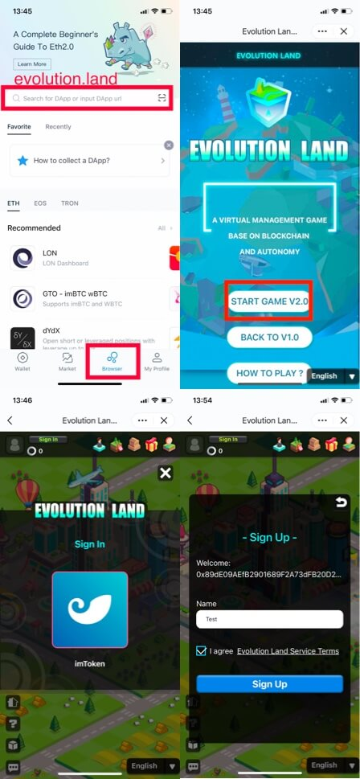

# How to register?

DAWNING Continent, the fourth Continent on the Evolution Land, is based on the Huobi ECO Chain. HT is the cryptocurrency used in the DAWNING, and its value fluctuates with the market.

Players need to convert fiat money (US dollars, Canadian dollars, Pounds, etc.) into HT to pay for gas in the DAWNING - such as buying RING, buying land, etc.

Players cannot use fiat money to purchase RING or other assets on the Evolution Land - the fiat money needs to be converted to HT first.

Players can withdraw RING to Heco address through Huobi exchange, or purchase HT from the exchange that supports the purchase of cryptocurrency and then transfer HT from exchange to address which used to register Evolution Land.

There are two ways to register the DAWNING on the Evolution Land: Web and Mobile. Please choose your preferred and appropriate way to register:

## WEB

### Use "Metamask"

* Search for Metamask in the Chrome Store and install it, and then create a Huobi Wallet address.
* Metamask supports the creation and import of accounts. For users without wallets, you can create an address. Users with existing wallets can import them via a private key.
* After creating/importing the wallet, log in to the Evolution Land \( [https://www.evolution.land/ ](https://www.evolution.land/)\), click on Metamask, select Register or Login.

## MOBILE

### 1. Use "imToken 2.0"

Download link：[https://token.im/?locale=en-us](https://token.im/?locale=en-us)

* Download the imToken2.0
* Register an ETH address or import one. The private key must be saved, and it cannot be recovered once it is lost.
* Find "Evolution Land" in "Browser" and click to register.

### 2. Use"Mathwallet"

Download link： [http://www.mathwallet.org/en/](http://www.mathwallet.org/en/)

* Download the mathwallet IOS version for the first time, you need to trust the wallet in “Settings”, “General”, “Device Management”, “TT-LTD, TOV”.  The Android version does not need to be set.
* Register an ETH address or import one. The private key must be saved, and it cannot be recovered once it is lost.
* Find "Evolution Land" in "Dapps" and click to register.

