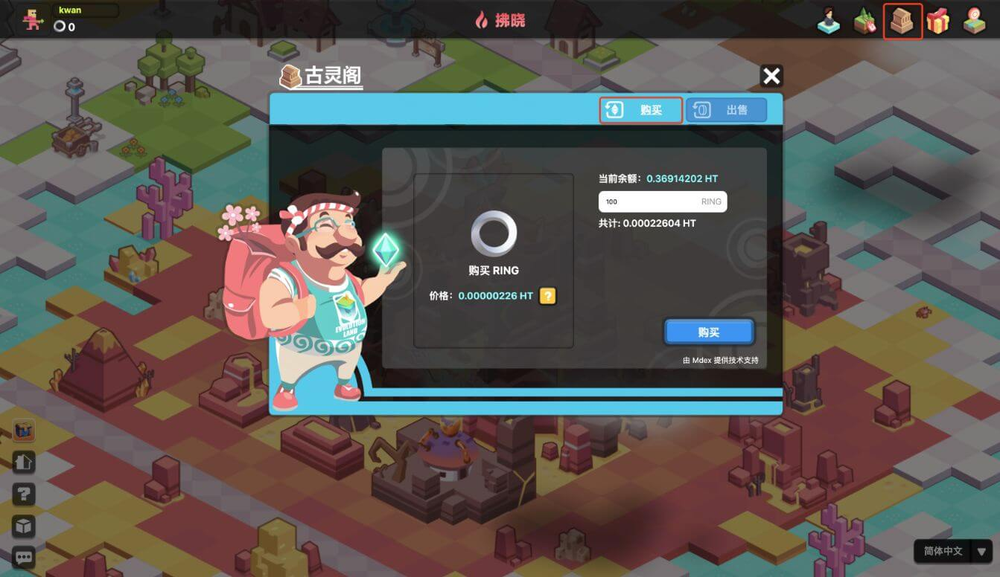

# 如何购买/出售RING？

购买和出售 RING 的渠道很多，大致可以分为：

* 游戏内置古灵阁银行
* 去中心化交易所
* 中心化交易所

## 在进化星球古灵阁进行交易

你可以在进化星球古灵阁通过 MDEX 进行 RING 与 HT 的双向兑换， RING 的当前价格由 MDEX 最新的成交价格和玩家的订单金额决定，RING 的兑换将花费 HT 作为燃料费用，进化星球不收取额外的手续费。

* [亚特兰蒂斯大陆上的古灵阁（以太坊）](https://www.evolution.land/land/1/bank/buy-ring)
* [拜占庭大陆上的古灵阁（波场）](https://www.evolution.land/land/2/bank/buy-ring)
* [拂晓大陆上的古灵阁（火币生态链）](https://www.evolution.land/land/4/bank/buy-ring)

## 去中心化交易所

在去中心化交易所，你将直接从钱包中进行交易，而无需进行资产托管。

**亚特兰蒂斯大陆（以太坊网络）**:

* Uniswap\(v2\): [RING / ETH](https://info.uniswap.org/token/0x9469d013805bffb7d3debe5e7839237e535ec483)
* 1inch Exchange: [RING / ETH](https://1inch.exchange/#/RING/ETH)

**拜占庭大陆（波场网络）**:

* Justswap: [RING / TRX](https://justswap.io/#/scan/detail/trx/TL175uyihLqQD656aFx3uhHYe1tyGkmXaW)

**拂晓大陆（火币生态链）**：

* [MDEX](https://mdex.com/#/)

## 中心化交易所

在中心化交易所，流动性一般比较充裕，但需要进行代币的充值后进行交易。这里列出了一些，你可以查询 [Coinmarketcap](https://coinmarketcap.com/currencies/darwinia-network/markets/) 了解更多支持 RING 的交易所。

* [Huobi Global](https://www.hbg.com/en-us/exchange/ring_usdt)
* [BKEX](https://www.bkex.com/trade/RING_USDT)
* [MXC](https://www.mxc.com/trade/easy#RING_USDT)
* [Hotbit](https://www.hotbit.io/exchange?symbol=RING_USDT)
* [Gate.io](https://gate.io/trade/ring_usdt)
* [CoinEX](https://www.coinex.com/trading?currency=usdt&dest=ring&tab=limit)
* [Poloniex](https://poloniex.com/exchange#usdt_ring)
* [Hoo](https://hoo.com/spot/ring-usdt)

